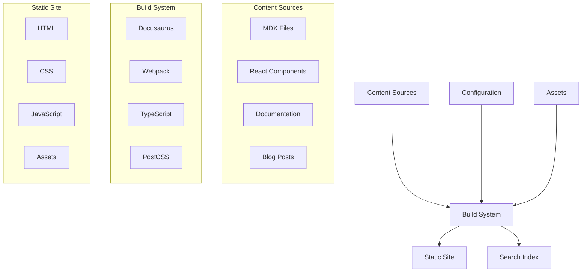
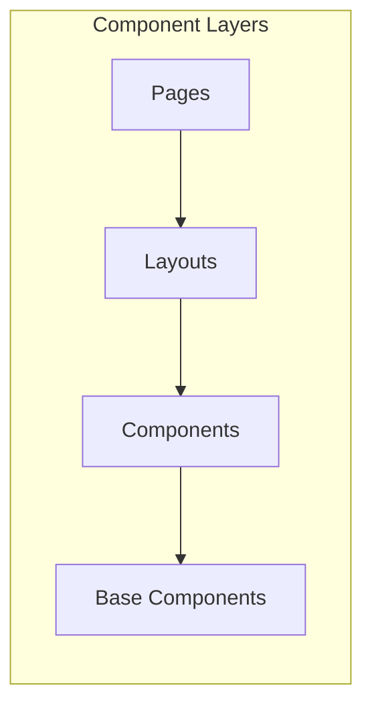
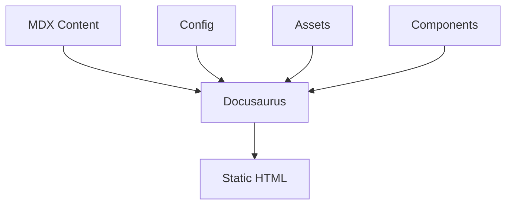
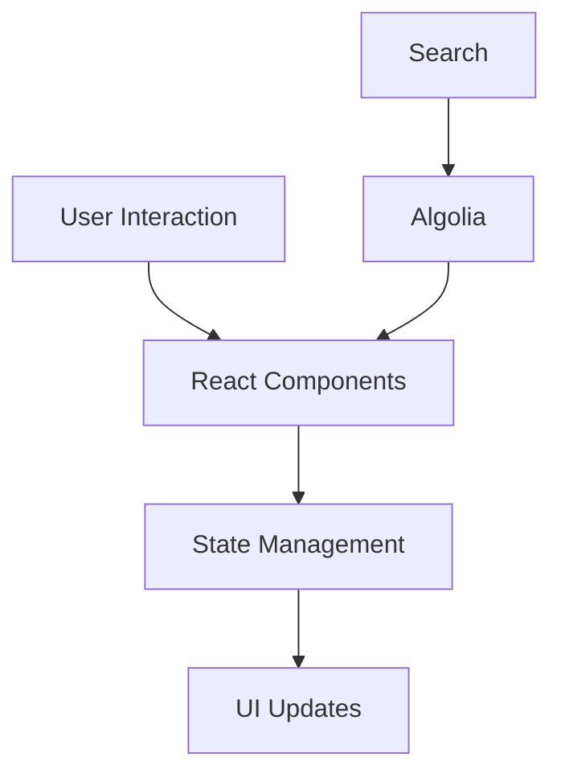

# Standard Operating Procedure (SOP) - OLake Documentation Repository

## Document Control

**Last Updated**: October 6, 2025  
**Review Frequency**: Quarterly

## Table of Contents

1. [Introduction](#introduction)
2. [Repository Overview](#repository-overview)
3. [Development Environment Setup](#development-environment-setup)
4. [Project Architecture](#project-architecture)
5. [Content Management](#content-management)
6. [Deployment Procedures](#deployment-procedures)
7. [Maintenance and Updates](#maintenance-and-updates)
8. [Troubleshooting](#troubleshooting)
9. [Monitoring and Analytics](#monitoring-and-analytics)
10. [Compliance and Auditing](#compliance-and-auditing)
11. [Appendices](#appendices)

## 1. Introduction

### 1.1 Document Purpose

This Standard Operating Procedure (SOP) establishes the authoritative guidelines for managing and maintaining the OLake documentation repository. The repository serves as the central source for OLake's documentation, blogs, and technical content, built using Docusaurus v3.8.1.

### 1.2 Scope

This SOP covers:

- Documentation repository management
- Content creation and maintenance workflows
- Development and deployment procedures
- Security protocols and compliance requirements
- Quality assurance processes
- Monitoring and analytics

### 1.3 Target Audience

This document is intended for:

- Internal Team
- External Contributors

### 1.4 Prerequisites

Readers should have:

- Basic understanding of Git version control
- Familiarity with Markdown/MDX
- Basic knowledge of React and Typescript

### 1.5 Document Conventions

#### Formatting Conventions

- `code` - Commands, file names, directories
- **Bold** - Important notes, warnings
- _Italic_ - Emphasis, new terms
- > Blockquotes - Examples, quotes

#### Command Syntax

```bash
command [required_parameter] {optional_parameter}
```

### 1.6 Objectives

1. **Quality Assurance**
   - Maintain consistent documentation standards
   - Ensure technical accuracy
   - Implement comprehensive review processes
   - Maintain version control

2. **Efficiency**
   - Streamline content deployment
   - Optimize development workflows
   - Automate routine tasks
   - Reduce technical debt

3. **Collaboration**
   - Facilitate team coordination
   - Standardize contribution processes
   - Enable effective communication
   - Support knowledge sharing

4. **Compliance**
   - Ensure security standards
   - Maintain audit trails
   - Follow industry best practices
   - Protect sensitive information

## 2. Repository Overview

### 2.1 Repository Structure

```bash
olake-docs/
├── blog/                  # Blog posts and articles
│   ├── authors.yml       # Author information
│   ├── tags.yml         # Blog tag definitions
│   └── YYYY-MM-DD-*.mdx # Blog post files
│
├── docs/                 # Main documentation
│   ├── getting-started/ # Onboarding guides
│   ├── core/           # Core concepts
│   ├── features/       # Feature documentation
│   ├── connectors/     # Connector guides
│   ├── tutorials/      # Step-by-step guides
│   ├── shared/        # Shared MDX components
│   └── writers/       # Documentation writer guides
│
├── iceberg/             # Iceberg-specific documentation
│   ├── authors.yml        # Author information
│   └── tags.yml    # tags
│
├── src/                 # Source code
│   ├── components/     # React components
│   │   ├── site/      # Website components (Hero, Features, etc.)
│   │   ├── common/    # Reusable UI components
│   │   └── layouts/   # Layout components
│   │
│   ├── pages/         # Static pages (React)
│   │   ├── index.tsx      # Homepage
│   │   ├── about.tsx      # About page
│   │   └── contact.tsx    # Contact page
│   │
│   ├── theme/         # Docusaurus theme customizations
│   │   ├── MDXComponents.tsx   # Custom MDX components
│   │   ├── Layout/            # Layout overrides
│   │   ├── Navbar/            # Navbar customizations
│   │   └── Footer/            # Footer customizations
│   │
│   └── utils/         # Utility functions
│       ├── helpers.ts      # Helper functions
│       └── constants.ts    # Constants and config
│
├── styles/              # Global styles
│   └── index.css       # Global CSS and Tailwind imports
│
├── utils/              # Utility scripts
│   ├── helpers.js      # Utility helper functions
│   └── config.tsx      # Configuration utilities
│
├── static/              # Static assets
│   ├── img/           # Images
│   │   ├── blog/     # Blog images
│   │   └── docs/     # Documentation images
│   │   └── authors/     # authors images
│   │   └── community/     # Community images
│
├── kubernetes/          # Kubernetes configurations
│   ├── configmaps/    # Configuration maps
│   ├── secrets/       # Secret definitions
│   └── deployments/   # Deployment manifests
│
├── airflow/             # Airflow configurations
│   ├── dags/          # DAG definitions
│   └── plugins/       # Custom plugins
│
├── docusaurus.config.js # Main Docusaurus configuration
│   # - Site metadata and settings
│   # - Theme configuration (navbar, footer, etc.)
│   # - Plugin configuration
│   # - Presets configuration
│   # - Algolia search configuration
│   # - Analytics and tracking
│   # - Redirects and URL rewrites
│
├── sidebars.js          # Documentation sidebar structure
├── sidebarsIcebergQE.js # Iceberg Query Engine sidebar
├── tailwind.config.js   # Tailwind CSS configuration
├── tsconfig.json        # TypeScript configuration
├── package.json         # Dependencies and scripts
└── postcss.config.js    # PostCSS configuration

```

### 2.2 Key Components

#### 2.2.1 Documentation (`/docs`)

- **Purpose**: Core product documentation
- **File Format**: MDX (Markdown + JSX)
- **Organization**:
  - Hierarchical structure based on topics
  - Each section has its own sidebar navigation
  - Shared components for reusability
- **Naming Convention**: `lowercase-with-hyphens.mdx`
- **Special Files**:
  - `intro.mdx`: Landing page
  - `sidebars.js`: Navigation structure

#### 2.2.2 Blog Posts (`/blog`)

- **Purpose**: Technical articles, updates, tutorials
- **File Format**: MDX
- **Naming Convention**: `YYYY-MM-DD-post-title.mdx`
- **Required Frontmatter**:
  ```yaml
  ---
  title: Post Title
  authors: [author_id]
  tags: [tag1, tag2]
  description: Brief description
  image: ./img/blog/YYYY/MM/cover.webp
  ---
  ```
- **Image Organization**:
  - Cover images: `static/img/blog/YYYY/MM/post-title-cover.webp`
  - Content images: `static/img/blog/YYYY/MM/post-title-1.webp`

#### 2.2.3 Source Code (`/src`)

- **Purpose**: Custom React components and functionality
- **Key Directories**:
  - `components/`: Reusable React components
  - `theme/`: Docusaurus theme customizations
  - `pages/`: Custom static pages
  - `utils/`: Helper functions and utilities

#### 2.2.4 Static Assets (`/static`)

- **Purpose**: Images, fonts, downloads
- **Organization**:
  - Images organized by content type and date
  - Fonts in dedicated directory
  - Downloads versioned appropriately
- **Naming Convention**: `lowercase-with-hyphens.extension`
- **Supported Formats**:
  - Images: `.png`, `.jpg`, `.svg`, `.webp` (prefer webp for more performance)
  - Fonts: `.woff2`, `.woff`
  - Documents: `.pdf`, `.zip`

#### 2.2.5 Configuration Files

- **Root Level**:
  - `docusaurus.config.js`: Main configuration
  - `sidebars.js`: Documentation navigation
  - `package.json`: Dependencies and scripts
  - `tsconfig.json`: TypeScript configuration
  - `tailwind.config.js`: CSS framework config

### 2.3 Version Control

#### 2.3.1 Branch Structure

- `main`: Production-ready code
- `develop`: Development branch
- Feature branches: `feature/feature-name`
- Doc branches: `doc/truncated-doc-name`
- Blog branches: `blog/truncated-blog-name`
- Release branches: `release/vX.Y.Z`
- Hotfix branches: `hotfix/issue-description`

#### 2.3.2 Protected Branches

- `master`: Requires PR and approvals

### 2.4 Dependencies

#### 2.4.1 Core Dependencies

- Docusaurus v3.8.1
- React v18.3.1
- TailwindCSS v3.4.17
- TypeScript v5.0.0

#### 2.4.2 Development Dependencies

- ESLint
- Prettier

### 2.5 Build Artifacts

#### 2.5.1 Production Build

- Output directory: `/build`
- Static assets: `/build/static`
- Generated HTML: `/build/docs`, `/build/blog`
- Asset manifests: `/build/asset-manifest.json`

#### 2.5.2 Development Build

- Hot reloading enabled
- Source maps included
- Development server on port 3000

## 3. Development Environment Setup

### 3.1 System Requirements

#### 3.1.1 Hardware Requirements

- **CPU**: 4+ cores recommended
- **RAM**: 8GB minimum, 16GB recommended
- **Storage**: 10GB free space minimum
- **Network**: Broadband internet connection

#### 3.1.2 Software Requirements

- **Operating System**:
  - macOS 10.15 or later
  - Windows 10/11 with WSL2
  - Linux (Ubuntu 20.04+, Fedora 34+)
- **Browser**:
  - Chrome 90+ (recommended)
  - Firefox 88+
  - Safari 14+
  - Edge 90+

### 3.2 Required Software

#### 3.2.1 Node.js

- **Version**: 18.x LTS or later
- **Installation**:

  ```bash
  # macOS (using nvm)
  curl -o- https://raw.githubusercontent.com/nvm-sh/nvm/v0.39.0/install.sh | bash
  nvm install --lts
  nvm use --lts

  # Windows (using nvm-windows)
  # Download and install from: https://github.com/coreybutler/nvm-windows
  nvm install lts
  nvm use lts

  # Ubuntu/Debian
  curl -fsSL https://deb.nodesource.com/setup_18.x | sudo -E bash -
  sudo apt-get install -y nodejs
  ```

#### 3.2.2 Git

- **Version**: 2.30.0 or later
- **Installation**:

  ```bash
  # macOS
  brew install git

  # Windows
  # Download and install from: https://git-scm.com/download/win

  # Ubuntu/Debian
  sudo apt-get update
  sudo apt-get install git
  ```

#### 3.2.3 Code Editor

- **Recommended**: Visual Studio Code
- **Required Extensions**:
  - ESLint
  - Prettier
  - MDX
  - Tailwind CSS IntelliSense
  - GitLens

### 3.3 Initial Setup

#### 3.3.1 Repository Setup

```bash
# Clone the repository
git clone https://github.com/datazip-inc/olake-docs.git

# Navigate to project directory
cd olake-docs

# Install dependencies
npm install
```

### 3.4 Development Workflow

#### 3.4.1 Starting Development Server

```bash
# Start development server
npm start

# Start with specific port
PORT=4000 npm start

# Start with debugger
npm run start:debug
```

#### 3.4.2 Common Development Commands

```bash

# Build for production
npm run build

# Serve production build
npm run serve
```

### 3.5 Troubleshooting

#### 3.5.1 Common Issues

1. **Node Version Mismatch**

   ```bash
   # Check Node version
   node -v

   # Switch to correct version
   nvm use
   ```

2. **Dependencies Issues**

   ```bash
   # Clear npm cache
   npm cache clean --force

   # Remove node_modules
   rm -rf node_modules

   # Reinstall dependencies
   npm install
   ```

3. **Port Conflicts**

   ```bash
   # Find process using port 3000
   lsof -i :3000

   # Kill process
   kill -9 <PID>
   ```

#### 3.5.2 Build Issues

1. **TypeScript Errors**
   - Check `tsconfig.json` settings
   - Run `npm run typecheck` for detailed errors
   - Update type definitions: `npm install @types/* --save-dev`

2. **MDX Compilation Errors**
   - Verify MDX syntax
   - Check component imports
   - Validate frontmatter format

3. **Memory Issues**
   ```bash
   # Increase Node memory limit
   export NODE_OPTIONS=--max-old-space-size=8192
   ```

### 3.6 Best Practices

#### 3.6.1 Code Editor Configuration

```json
// .vscode/settings.json
{
  "editor.formatOnSave": true,
  "editor.codeActionsOnSave": {
    "source.fixAll.eslint": true
  },
  "typescript.tsdk": "node_modules/typescript/lib"
}
```

#### 3.6.2 Git Workflow

1. Create feature branch
2. Make changes
3. Run tests and linting
4. Commit with conventional commits
5. Push and create PR

#### 3.6.3 Performance Optimization

- Use `npm ci` for clean installs
- Enable caching in development
- Optimize images before commit
- Use code splitting where appropriate

## 4. Project Architecture

### 4.1 System Architecture

#### 4.1.1 High-Level Overview



#### 4.1.2 Component Architecture



### 4.2 Technology Stack

#### 4.2.1 Core Framework

- **Docusaurus v3.8.1**
  - Documentation framework
  - MDX support
  - Plugin system
  - i18n support
  - Search integration

#### 4.2.2 Frontend Technologies

- **React 18.3.1**
  - Component-based UI
  - Server Components
  - Concurrent Mode
  - Suspense
  - Error Boundaries

- **TailwindCSS 3.4.17**
  - Utility-first CSS
  - JIT compiler
  - Custom plugins
  - Responsive design
  - Dark mode support

#### 4.2.3 Build Tools

- **Webpack 5**
  - Module bundling
  - Code splitting
  - Asset optimization
  - Development server

- **TypeScript 5.0**
  - Static typing
  - Type checking
  - Code intelligence
  - Modern JavaScript features

#### 4.2.4 Development Tools

- **ESLint**
  - Code linting
  - Style enforcement
  - Best practices
  - Custom rules

- **Prettier**
  - Code formatting
  - Style consistency
  - IDE integration

### 4.3 Component Architecture

#### 4.3.1 Core Components

```typescript
// Base component structure
interface BaseComponentProps {
  className?: string;
  children?: React.ReactNode;
  // Common props
}

// Example component hierarchy
const Page = ({ children, ...props }) => {
  return (
    <Layout {...props}>
      <Main>{children}</Main>
    </Layout>
  );
};
```

#### 4.3.2 Component Categories

1. **Layout Components**
   - `Layout.tsx`: Base layout wrapper
   - `Header.tsx`: Site header
   - `Footer.tsx`: Site footer
   - `Sidebar.tsx`: Documentation sidebar
   - `Navigation.tsx`: Main navigation

2. **Content Components**
   - `MDXComponents.tsx`: MDX renderers
   - `CodeBlock.tsx`: Code highlighting
   - `TableOfContents.tsx`: Content navigation
   - `Pagination.tsx`: Page navigation

3. **Interactive Components**
   - `Search.tsx`: Search interface
   - `ThemeToggle.tsx`: Theme switcher
   - `CopyButton.tsx`: Copy functionality
   - `Tabs.tsx`: Content tabs

4. **Utility Components**
   - `SEO.tsx`: Meta tags management
   - `Analytics.tsx`: Usage tracking
   - `ErrorBoundary.tsx`: Error handling
   - `Loading.tsx`: Loading states

5. **HomePage**

- olake-docs/src/components/site

### 4.4 Data Flow

#### 4.4.1 Build-time Data Flow



#### 4.4.2 Runtime Data Flow



### 4.5 Configuration Management

#### 4.5.1 Docusaurus Configuration

```javascript
// docusaurus.config.js
module.exports = {
  title: 'OLake Documentation',
  tagline: 'Modern Data Lake Solution',
  url: 'https://docs.olake.io',
  baseUrl: '/',
  onBrokenLinks: 'throw',
  onBrokenMarkdownLinks: 'warn',
  favicon: 'img/favicon.ico',
  organizationName: 'datazip-inc',
  projectName: 'olake-docs',

  // Theme configuration
  themeConfig: {
    // Navigation
    navbar: {},

    // Search
    algolia: {},

    // Footer
    footer: {}
  },

  // Presets
  presets: [
    [
      '@docusaurus/preset-classic',
      {
        docs: {},
        blog: {},
        theme: {},
        pages: {}
      }
    ]
  ],

  // Plugins
  plugins: []
}
```

#### 4.5.2 TypeScript Configuration

```json
// tsconfig.json
{
  "compilerOptions": {
    "target": "es2020",
    "lib": ["dom", "dom.iterable", "esnext"],
    "allowJs": true,
    "skipLibCheck": true,
    "strict": true,
    "forceConsistentCasingInFileNames": true,
    "noEmit": true,
    "esModuleInterop": true,
    "module": "esnext",
    "moduleResolution": "node",
    "resolveJsonModule": true,
    "isolatedModules": true,
    "jsx": "preserve",
    "incremental": true,
    "baseUrl": ".",
    "paths": {
      "@/*": ["src/*"]
    }
  },
  "include": ["**/*.ts", "**/*.tsx"],
  "exclude": ["node_modules"]
}
```

### 4.6 Plugin Architecture

#### 4.6.1 Core Plugins

- `@docusaurus/plugin-content-docs`
- `@docusaurus/plugin-content-blog`
- `@docusaurus/plugin-content-pages`
- `@docusaurus/plugin-sitemap`
- `@docusaurus/plugin-google-analytics`

#### 4.6.2 Custom Plugins

```javascript
// Example custom plugin
module.exports = function (context, options) {
  return {
    name: 'custom-plugin',

    // Lifecycle hooks
    async loadContent() {},
    async contentLoaded({ content, actions }) {},

    // Configuration
    getThemePath() {},
    getTypeScriptThemePath() {},

    // Client modules
    getClientModules() {}
  }
}
```

### 4.7 Performance Optimization

#### 4.7.1 Build Optimization

- Code splitting
- Tree shaking
- Asset optimization
- Caching strategies
- Compression

#### 4.7.2 Runtime Optimization

- Lazy loading
- Image optimization ( prefer webp with less than 100kb)
- Font loading
- CSS optimization
- JavaScript optimization

#### 4.7.3 Monitoring

- Lighthouse scores
- Web Vitals
- Bundle analysis
- Performance metrics

### 4.8 Third-Party Integrations

The project integrates with several third-party services and plugins to enhance functionality. These are primarily configured in `docusaurus.config.js`.

#### 4.8.1 Algolia Search

- **Purpose**: Provides the search functionality for the documentation and blog.
- **Configuration**: Algolia is configured in the `themeConfig.algolia` section of `docusaurus.config.js`. This includes the App ID, API Key, and Index Name.

#### 4.8.2 Analytics

- **Purpose**: Google Analytics is used for tracking website traffic, user engagement, and content performance.
- **Configuration**: While not directly configured with a tracking ID in `docusaurus.config.js`, the necessary DNS prefetch links for Google Analytics services are included in the `headTags`.

#### 4.8.3 Diagrams

- **Purpose**: The `@docusaurus/theme-mermaid` plugin is used to render Mermaid diagrams within Markdown files, allowing for the creation of flowcharts, sequence diagrams, and other visualizations from code-like text.

#### 4.8.4 Image Optimization

- **Purpose**: The `plugin-image-zoom` and `ideal-image` plugins are used to provide better user experience with images. They enable responsive image sizes and click-to-zoom functionality.

## 5. Content Management

### 5.1 Content Strategy

#### 5.1.1 Content Types

1. **Documentation**
   - Product documentation
   - API references
   - Getting started guides
   - Tutorials
   - Conceptual guides
   - Best practices

2. **Blog Posts**
   - Product updates
   - Technical deep dives
   - Case studies
   - Best practices
   - Community highlights

3. **Component Library**
   - UI components
   - Documentation components
   - Interactive examples
   - Code snippets

### 5.2 Documentation Management

#### 5.2.1 Documentation Structure

```
docs/
├── getting-started/     # Onboarding documentation
│   ├── introduction.mdx
│   ├── quick-start.mdx
│   └── installation.mdx
├── core/               # Core concepts
│   ├── architecture.mdx
│   └── concepts.mdx
├── features/          # Feature documentation
│   ├── feature-a.mdx
│   └── feature-b.mdx
├── tutorials/         # Step-by-step guides
│   ├── tutorial-1.mdx
│   └── tutorial-2.mdx
└── api/              # API documentation
    ├── overview.mdx
    └── endpoints.mdx
```

#### 5.2.2 Documentation Standards

1. **File Naming**
   - Use kebab-case: `feature-name.mdx`
   - Group related files in directories
   - Use descriptive names

2. **Frontmatter**

   ```yaml
   ---
   id: unique-id
   title: Page Title
   sidebar_label: Sidebar Label
   description: Page description for SEO
   keywords: [keyword1, keyword2]
   image: /img/docs/feature-image.png
   ---
   ```

3. **Content Structure**

   ```markdown
   # Title

   ## Overview

   Brief introduction

   ## Prerequisites

   Required knowledge/setup

   ## Steps

   1. Step one
   2. Step two

   ## Examples

   Code examples

   ## Troubleshooting

   Common issues and solutions
   ```

### 5.3 Blog Post Management

#### 5.3.1 Blog Post Structure

```
blog/
├── 2025/
│   └── 10/
│       ├── post-title.mdx
│       └── images/
│           ├── cover.png
│           └── diagram-1.png
├── authors.yml
└── tags.yml
```

#### 5.3.2 Blog Post Standards

1. **File Naming**

   ```
   YYYY-MM-DD-post-slug.mdx
   ```

2. **Frontmatter**

   ```yaml
   ---
   title: Post Title
   authors: [author_id]
   tags: [tag1, tag2]
   description: Brief description
   image: ./img/blog/2025/10/cover.png
   date: 2025-10-06
   draft: false
   ---
   ```

3. **Author Configuration**

   ```yaml
   # authors.yml
   author_id:
     name: Author Name
     title: Job Title
     url: https://github.com/author
     image_url: https://github.com/author.png
   ```

4. **Content Template**

   ```markdown
   # Introduction

   Brief overview

   ## Problem Statement

   What problem are we solving?

   ## Solution

   How we solved it

   ## Implementation

   Technical details

   ## Results

   Outcomes and benefits

   ## Conclusion

   Summary and next steps
   ```

### 5.4 Component Development

#### 5.4.1 Component Structure

```
src/
├── components/
│   ├── common/
│   │   ├── Button/
│   │   │   ├── index.tsx
│   │   │   ├── styles.module.css
│   │   │   └── types.ts
│   │   └── Card/
│   ├── docs/
│   │   └── CodeBlock/
│   └── blog/
│       └── PostCard/
```

#### 5.4.2 Component Standards

1. **File Structure**

   ```typescript
   // index.tsx
   import { ComponentProps } from './types'
   import styles from './styles.module.css'

   export const Component = ({ prop1, prop2 }: ComponentProps) => {
     // Implementation
   }
   ```

2. **Type Definitions**

   ```typescript
   // types.ts
   export interface ComponentProps {
     prop1: string
     prop2?: number
     children?: React.ReactNode
   }
   ```

3. **Styling**
   ```css
   /* styles.module.css */
   .container {
     /* styles */
   }
   ```

### 5.5 Content Workflow

#### 5.5.1 Documentation Workflow

1. **Planning**
   - Identify documentation needs
   - Create outline
   - Review with stakeholders

2. **Writing**
   - Follow style guide
   - Include examples
   - Add images/diagrams

3. **Review**
   - Technical review
   - Editorial review
   - Stakeholder review

4. **Publishing**
   - Update sidebar
   - Check links
   - Deploy changes

#### 5.5.2 Blog Post Workflow

1. **Proposal**
   - Topic suggestion
   - Outline review
   - Schedule planning

2. **Writing**
   - Draft content
   - Add media
   - Technical review

3. **Review**
   - Peer review
   - Technical accuracy
   - Editorial review

4. **Publishing**
   - Final approval
   - Schedule post
   - Social promotion

### 5.6 Quality Assurance

#### 5.6.1 Content Checklist

- [ ] Follows style guide
- [ ] Technical accuracy
- [ ] Grammar and spelling
- [ ] Links working
- [ ] Images optimized
- [ ] Mobile responsive
- [ ] SEO optimized

#### 5.6.2 Review Process

1. **Self Review**
   - Run spellcheck
   - Verify code samples
   - Check formatting

2. **Peer Review**
   - Technical accuracy
   - Code review
   - Content flow

3. **Editorial Review**
   - Grammar and style
   - Clarity
   - Consistency

### 5.7 Content Maintenance

#### 5.7.1 Regular Tasks

- Weekly link checks
- Monthly content reviews
- Quarterly updates
- Annual content audit

#### 5.7.2 Version Control

- Content versioning
- Change tracking
- Archive management
- Redirect handling

#### 5.7.3 SEO Management

- Keyword optimization
- Meta descriptions
- Image alt text
- URL structure
- Sitemap updates

## 6. Deployment Procedures

### 6.1 Deployment Overview

#### 6.1.1 Deployment Environments

1. **Development**
   - Local development
   - Feature testing
   - Integration testing

2. **Staging**
   - Pre-production testing
   - Performance testing
   - User acceptance testing

3. **Production**
   - Live environment
   - High availability
   - Monitoring and alerts

### 6.2 Standard Deployment

#### 6.2.1 Pre-deployment Checklist

- [ ] All tests passing
- [ ] No linting errors
- [ ] Build successful locally
- [ ] Documentation updated
- [ ] Change log updated
- [ ] Dependencies updated
- [ ] Security scan completed
- [ ] Performance benchmarks reviewed

#### 6.2.2 Build Process

```bash
# Clean previous build
npm run clean

# Install dependencies
npm ci

# Type checking
npm run typecheck

# Run tests
npm run test

# Build the site
npm run build

# Serve locally to verify
npm run serve
```

#### 6.2.3 Deployment Steps

```bash

# Deploy to GitHub Pages
npm run deploy

```

#### 6.2.4 Deployment Verification

1. **Manual Verification**
   - Check homepage loads
   - Verify search functionality
   - Test navigation
   - Check external links
   - Verify assets loading

#### 6.3.1 Build Optimization

- Asset compression
- Code splitting
- Tree shaking
- Cache optimization

#### 6.3.2 Runtime Optimization

- CDN configuration
- Browser caching
- Service worker
- Image optimization

## 7. Maintenance and Updates

### Regular Maintenance Tasks

1. Update dependencies regularly
2. Monitor and optimize build performance
3. Review and update documentation
4. Maintain redirects in docusaurus.config.js

### Version Control Guidelines

1. Branch naming:
   - Feature branches: `feature/description`
   - Blog posts: `blog/post-name`
   - Documentation: `docs/topic-name`

2. Commit messages:
   - Clear and descriptive
   - Reference issue numbers when applicable

### Content Updates

1. Review and update existing documentation quarterly
2. Maintain changelog in release notes
3. Update API documentation as needed
4. Keep blog content current and relevant

## 8. Troubleshooting

### Common Issues

1. Build failures
   - Check Node.js version
   - Verify dependencies
   - Review build logs

2. Content rendering issues
   - Validate MDX syntax
   - Check component imports
   - Verify image paths

### Support Resources

- Official Docusaurus documentation
- GitHub repository issues
- Internal documentation
- Community support channels

---

## Document Information

- **Last Updated**: October 6, 2025
- **Version**: 1.0
- **Maintainers**: OLake Documentation Team
