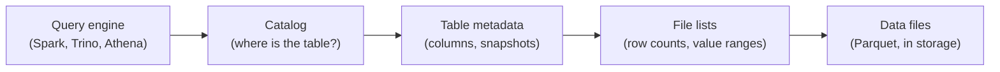

import quiz from '@site/src/data/quizzes/why-iceberg.json';

What is Apache Iceberg? It's an open table format. It records which files on cloud storage make up a table, plus the table's columns and history, so tools such as Spark, Trino and Flink can share that table.

<TLDR title='TL;DR'>

- Iceberg is a table format. It's not a database and not a query engine. The project says it [adds tables to engines](https://iceberg.apache.org/docs/latest/) such as Spark, Trino, Flink and Hive.
- The main takeaway: "supports Iceberg" is not one thing. Athena, Databricks, BigQuery and Snowflake each document different limits (their claims, not our tests), so run the five-question check below against your own engine before you commit.
- Its headline features, per the project docs: schema changes that don't rewrite data, hidden partitioning, time travel and version rollback.
- The newest release we found is 1.12.0, dated [September 29, 2026](https://iceberg.apache.org/releases/).
- Thoughtworks put it in the Adopt ring in April 2026, and the Iceberg site lists dozens of vendors that ship or support it.
- Our read: Iceberg may pay off for large analytic tables shared by several tools, and it adds upkeep. For small data in one database, you can usually skip it.

</TLDR>

That's the whole idea, and the rest of this guide unpacks it in plain words, with no data-engineering background assumed. Every fact comes from the Iceberg project's own pages, vendor docs or a named third party, read in October 2026, with the link beside the claim.

We did not install or test Iceberg ourselves, so this is a careful read of public documents, not a lab report. Last reviewed October 2026.

## What is Apache Iceberg, in plain words?

Picture a huge folder of files on cloud storage such as Amazon S3, which is Amazon's file storage service. Most of those files are in Parquet, a file format that says how the data inside one file is laid out. But a file format alone can't tell you which files belong together as "the orders table."

That's the gap Iceberg fills. The project's own docs call it "an open table format for huge analytic datasets". It "works just like a SQL table," and SQL (Structured Query Language) is simply the standard way to ask a table questions.

A library makes a good comparison for the three jobs in any data setup:

1. **Storage** is the shelves where the books (your data) sit. That's HDFS on your own servers, or cloud storage such as Amazon S3, Azure Blob or Google Cloud Storage.
2. **Processing** is the librarian who fetches the book you asked for. In data terms that's an engine such as [Apache Spark](https://spark.apache.org/), Presto or Trino.
3. **Metadata** is the card catalog that says where each book is. Iceberg is a card catalog built for data files.

The bigger the library, the more the catalog matters. Iceberg doesn't replace your shelves or your librarians. It sits between them.

Four terms get mixed up constantly, so here's a cheat sheet.

| Word | What it is | Example |
| --- | --- | --- |
| File format | How data is laid out inside one file | Parquet, Avro, ORC |
| Table format | A layer that tracks which files make up a table, plus its columns and history | Apache Iceberg |
| Catalog | A directory that tells tools where each table lives | AWS Glue, Snowflake Open Catalog |
| Query engine | Software that runs your questions against the tables | Spark, Trino, Athena, Snowflake |

The Iceberg specification says its tables use file formats such as [Parquet, Avro and Optimized Row Columnar (ORC)](https://iceberg.apache.org/spec/). So Parquet and Iceberg aren't rivals. They work as a pair.

## How does Iceberg keep track of your files?

Iceberg keeps a chain of small metadata files next to your data. A query engine asks the catalog for the table's current metadata. That points to a list of files, which carry counts and value ranges for each data file.

Those value ranges let an engine rule out files that can't hold what a query asks for. It's like a library index that tells you which shelf to check first.

It doesn't point to every matching row, and files whose ranges overlap with the query still get read.

## Does my tool work with Iceberg? Check these five things

"Supports Iceberg" is not one thing. Each engine picks which parts to support, and the vendors say so in their own docs. We report those pages as each vendor's claims and did not test any of them, so this section is the one to act on.

Here are four platforms we read, with the limit each page names.

| Platform | What its docs say | A limit it names |
| --- | --- | --- |
| [Amazon Athena](https://docs.aws.amazon.com/athena/latest/ug/querying-iceberg.html) | Read, write, time travel and DDL (table-structure commands) on Iceberg tables | Only tables in the AWS Glue catalog, Iceberg v2 tables only, and support for Iceberg 1.4.2, a library release |
| [Databricks](https://docs.databricks.com/aws/en/iceberg/) | Managed Iceberg tables with read and write | Parquet only; foreign Iceberg tables are read-only |
| [BigQuery](https://docs.cloud.google.com/bigquery/docs/biglake-iceberg-tables-in-bigquery) | Iceberg managed tables with SQL changes and schema evolution | Only one mutating statement (UPDATE, DELETE, MERGE) runs per table at a time; the rest queue |
| [Snowflake](https://docs.snowflake.com/en/user-guide/tables-iceberg) | Parquet-based Iceberg tables | For externally managed tables, writes work on spec versions 2 and 3 |

The Athena row is about a library release, not a table format version. The Iceberg project has since released 1.12.0, but the Athena page doesn't say what that gap means for your tables. Read it as a question to ask, not as a known problem.

A preflight checklist, in plain words, built only from those pages:

1. **Catalog.** Can the engine reach the catalog where your tables live? Athena's page says only tables created in the AWS Glue catalog are supported, and that Athena creates and operates on Iceberg v2 tables only.
2. **Table format version.** Which version of the Iceberg specification does it read and write? Snowflake names versions 2 and 3 for externally managed writes, and the spec page says versions 1 to 3 are complete.
3. **Read, write or both.** Databricks says foreign Iceberg tables are read-only. Also check the file format: Databricks and Snowflake both say Parquet.
4. **Deletes and updates.** Athena lists record-level insert, update and delete. BigQuery lists UPDATE, DELETE and MERGE, one at a time per table.
5. **Who coordinates commits.** Athena's docs say that modifying an Iceberg table with any lock implementation other than AWS Glue's will cause potential data loss and break transactions. BigQuery's page covers how it queues mutating statements inside BigQuery. That is a separate question from how outside writers commit to the same table, so ask it separately.

*Amazon Athena documentation, October 2026.*

The Athena warning is AWS's own words. It shows that reading a table and writing to it safely are separate questions, and why "works with Iceberg" is where your checking starts, not where it ends.

Before you rely on any of these pages, ask each vendor three things. Vendor docs change, so check the page date too.

- Which Iceberg release and spec version do you run today?
- How do outside writers commit to a table you also write to?
- What happens to my tables if I move to another engine?

## A short history: how we got here

### Hadoop and MapReduce

Apache Hadoop's version 0.1.0 is dated [April 1, 2006](https://archive.apache.org/dist/hadoop/common/) in the Apache archive.

Hadoop has two pieces: the Hadoop Distributed File System (HDFS) for storage spread across many servers, and MapReduce, a model for processing data in parallel batches. MapReduce jobs are written as programs, not as SQL queries.

### Hive brought SQL

Apache Hive let analysts write SQL that Hive turned into MapReduce jobs. Facebook's engineering blog says [Hive was open sourced in August 2008](https://engineering.fb.com/2009/06/10/web/hive-a-petabyte-scale-data-warehouse-using-hadoop/).

The Hive Metastore stores each table's schema and location, [per Wikipedia](https://en.wikipedia.org/wiki/Apache_Hive). Later, more data moved to cloud storage such as Amazon S3, and engines such as Presto and Spark became common for interactive queries.

### Many engines, one pile of data

Two goals pulled together. One was storing data in the cloud, and the other was letting several engines (batch, streaming, interactive) work on the same data.

Many organizations also had years invested in HDFS and Hive. That's the setting Iceberg grew up in.

### Then came Iceberg

Per [Wikipedia](https://en.wikipedia.org/wiki/Apache_Iceberg) (last edited August 20, 2026), work on Iceberg began at Netflix in 2017. The project went to the Apache Software Foundation in November 2018 and became a top-level Apache project in May 2020.

Its idea was to leave storage and engines alone and add a better metadata layer between them. The project docs name several engines that work with it, which is the point of that design.

## What does Apache Iceberg actually do for you?

Here's what the project's documentation home page promises, in plain language.

- **Schema evolution.** The docs say you can add, drop, rename or widen a column, and that these are [metadata changes](https://iceberg.apache.org/docs/latest/evolution/) so no data files need rewriting. We did not test that on any engine.
- **Hidden partitioning.** Partitioning means splitting a table into chunks so queries read less. The docs say you [don't need to know about it](https://iceberg.apache.org/docs/latest/partitioning/) to get fast queries, and a badly chosen layout can be fixed "without an expensive migration."
- **Time travel.** The docs say you can run a query against exactly the same snapshot of a table again, or look at what changed.
- **Version rollback.** The docs say that if a bad load lands, you can reset the table to a good state.
- **Safe sharing.** The docs list serializable isolation and say table changes are atomic and readers never see partial or uncommitted changes. Several writers can work at once using optimistic concurrency, which means a writer checks for a clash when it commits and retries if needed. The docs say the retries are meant to let compatible updates succeed, so a clash does not promise every change goes through.

"Atomic" is one part of ACID, short for atomicity, consistency, isolation and durability. It means a change either fully happens or doesn't happen at all. The docs page we read names atomic changes and serializable isolation, and how each engine handles clashes varies, so we claim no more than that.

Partition changes are the easiest feature to picture. Say a table was split by month, and now you want to split it by day.

Per the same evolution docs, data written with the earlier layout remains unchanged, and new data is written in the new layout. So the change applies going forward and doesn't reorganize old files.

*Apache Iceberg documentation, October 2026.*

On scale, the same page says Iceberg is "used in production where a single table can contain tens of petabytes of data." That's the project's own claim, and the page is undated, so we read it in October 2026.

The page also calls scan planning "fast." That's the project's word, and we did not measure it.

## What does it look like with Spark and S3?

Here's the usual picture. You keep your data in Amazon S3 for its scale and low cost, and you run Spark jobs on Kubernetes or Amazon EMR (Elastic MapReduce, Amazon's managed cluster service) for batch work and analytics. The Iceberg metadata sits next to the files in S3.

When a Spark job runs `SELECT * FROM orders WHERE region = 'US'`, the metadata's value ranges can tell Spark which files cannot hold `US` rows. Spark can skip those files instead of scanning the whole table. How many files that saves depends on how your data is laid out, and this guide doesn't put a number on it.

## What is Apache Iceberg used for?

Mostly, it turns files on cloud object storage into tables that several tools can share. That setup is often called a data lake or lakehouse.

Vendors list a few common jobs. AWS lists [tables that need frequent deletes](https://aws.amazon.com/what-is/apache-iceberg/), such as privacy-law requests, record-level updates and historical analysis with rollback. Confluent says Iceberg lets teams [use lower-cost object or file storage](https://www.confluent.io/learn/what-is-apache-iceberg/) and have several query engines use the same data at once.

Notice who's talking. AWS and Confluent both sell products that work with Iceberg, and neither page names a downside. Treat those pages as a list of what vendors pitch, not a neutral review.

Amazon's Athena docs sum up the technical side in one line. Iceberg "manages large collections of files as tables" and supports record-level insert, update, delete and time travel queries.

## Who uses Apache Iceberg?

Several companies describe their own use in engineering posts. [Airbnb](https://medium.com/airbnb-engineering/upgrading-data-warehouse-infrastructure-at-airbnb-a4e18f09b6d5) wrote about upgrading its data warehouse to Spark and Iceberg, and [Adobe](https://medium.com/adobetech/migrating-to-apache-iceberg-at-adobe-experience-platform-40fa80f8b8de) about migrating its Experience Platform to Iceberg. [Expedia Group](https://medium.com/expedia-group-tech/turbocharge-efficiency-slash-costs-mastering-spark-iceberg-joins-with-storage-partitioned-join-03fdc1ff75c0) says it uses Spark and Iceberg, and [LinkedIn](https://www.linkedin.com/blog/engineering/open-source/fastingest-low-latency-gobblin) describes its Gobblin ingestion tool adding Iceberg support.

Wikipedia also lists Apple and Lyft as users. We found no first-party post from either, so treat those two as reported, not confirmed.

On the vendor side, the Iceberg site keeps a [vendors page](https://iceberg.apache.org/vendors/) with 42 entries in October 2026. They include AWS, Google Cloud, Snowflake, Databricks, Microsoft OneLake, Dremio, DuckDB, ClickHouse and Starburst.

The page lists who supports Iceberg, not how well each one does it.

Independent voices point the same way. Thoughtworks' Technology Radar put Iceberg in its Adopt ring in [April 2026](https://www.thoughtworks.com/en-us/radar/languages-and-frameworks/apache-iceberg) and calls it a "foundational building block" for lakehouse architectures that are not tied to one vendor. The format keeps moving too, since the spec page says versions 1, 2 and 3 are complete and adopted by the community, while version 4 is under active development and not yet adopted.

## How does data get into an Iceberg table?

Iceberg doesn't create data. Something has to write it. That might be a Spark job, a streaming tool or a pipeline that copies rows out of business databases such as Postgres or MySQL.

Whatever loads the data, the [five-question check](#does-my-tool-work-with-iceberg-check-these-five-things) applies to the loader too. It has to write to a catalog and a table format version that your reading engines support.

## How does Iceberg compare with Delta Lake and Hudi?

Iceberg isn't the only table format in town. Delta Lake and Apache Hudi do a similar job. Iceberg is open source under the Apache 2.0 license, and so are [Delta Lake](https://github.com/delta-io/delta/blob/master/LICENSE.txt) and [Hudi](https://github.com/apache/hudi/blob/master/LICENSE), going by the license files in their repositories.

Iceberg and Hudi are Apache Software Foundation projects. [Delta Lake](https://delta.io/) says it is an independent project, not controlled by any single company, and a sub-project of the Linux Foundation Projects.

Which one fits depends on your tools. Delta is the natural choice on Databricks, which created it. Iceberg draws on its long list of engines, and Hudi has its own, so check its docs before ruling it out.

Databricks' own docs now describe managed Iceberg tables. Delta can also publish Iceberg metadata for outside readers through a feature called UniForm, which Databricks says is [read-only for Iceberg clients](https://docs.databricks.com/aws/en/delta/iceberg-reads).

We didn't find a neutral benchmark that ranks the three, so we won't crown a winner on speed. Our read: pick the format your main engine supports best, then check that your other tools can read it.

## When you do not need Apache Iceberg

Here's the honest part vendor pages skip. Iceberg is built for big analytic tables, and its specification describes a format for managing "a large, slow-changing collection of files." That is *not* a description of an app's live database.

You can likely skip it if one of these sounds like you.

- Your data is small and one database already answers your questions. Our read: a table format adds moving parts you don't need yet.
- You need fast single-row updates for an app, such as a shopping cart. That's the job of a database like Postgres, not a table format.
- You use one warehouse and no other tool needs the same data. Its built-in table format may be enough.

There's also upkeep, and fair warning, it's not glamorous. The Iceberg [maintenance page](https://iceberg.apache.org/docs/latest/maintenance/) says each write creates a new snapshot, snapshots pile up until you expire them, and many small data files make queries less efficient. Someone, or some platform, has to do that cleanup.

Some platforms say they do it for you. BigQuery's docs list automatic storage optimization, including adaptive file sizing and garbage collection, for its managed tables, and we did not test how well it works. If you run Iceberg yourself, plan for the chores.

Want to check what you picked up? Try this quick quiz.

<Quiz {...quiz} />

## FAQs

<Faq showHeading={false} data={[
{question:"Q1. What is Apache Iceberg in simple terms?", answer:"It's an open-source table format. It keeps track of which data files make up a table, plus the table's columns and history, so several tools can read and change the same table. The project docs say it works just like a SQL table."},
{question:"Q2. Is Apache Iceberg a database?", answer:"No. The project describes it as a table format that engines such as Spark, Trino and Flink use. You still need a query engine to ask your questions and a place to store the files."},
{question:"Q3. Is Apache Iceberg free?", answer:"The software is, yes. It's open source under the Apache 2.0 license, as AWS's explainer notes. You'll still pay for the storage and the engines you run it on."},
{question:"Q4. What is the difference between Iceberg and Parquet?", answer:"Parquet is a file format that lays out the data inside one file. Iceberg is a table format that tracks many files as one table, and its specification lists Parquet as a file format Iceberg tables can use. So you'll often see them together."},
{question:"Q5. What is Apache Iceberg used for?", answer:"Mainly for building tables on cloud storage that several engines share. Vendors such as AWS list tables with frequent deletes, record-level updates and historical analysis. The use-case section above has the sources."},
{question:"Q6. Who created Apache Iceberg?", answer:"Netflix started it in 2017, according to Wikipedia. It was donated to the Apache Software Foundation in November 2018 and became a top-level project in May 2020."},
{question:"Q7. Do I need Apache Iceberg?", answer:"Probably not if your data is small and one database serves it, or if you need fast single-row app updates. It tends to help when large analytic tables must be shared by several tools. Whatever you decide, check your engine's own Iceberg limits first: catalog, table format version, read and write support, deletes and who coordinates commits."}
]} />

## The short version

Iceberg turns a pile of files into tables that different tools can share, and most major platforms now say they support it, each with its own limits. It's fine to skip if your data is small. If you take one habit away, run the five-question check above against your own engine's docs before you pick any tool.

<BlogCTA/>
