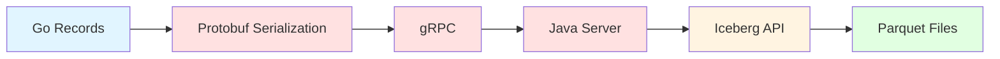
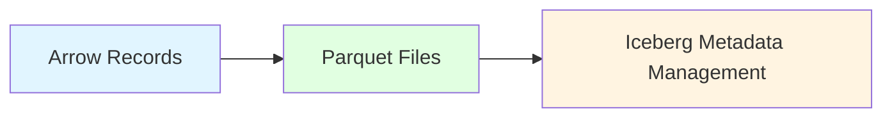

# OLake — Now an Arrow-Based Iceberg Ingestion Tool

At OLake, our target has always been pretty straightforward — to make the best ingestion tool in the market to replicate data from databases to Iceberg faster and reliably.

As we continued to optimize our writer engine — the part responsible for moving data into Apache Iceberg tables — we realized that our traditional serialization approach was hitting performance limits, especially when handling terabytes of data.

That's when we decided to turn to [**Apache Arrow**](https://arrow.apache.org/).

## What is Apache Arrow?

Now, for someone who doesn’t know what Apache Arrow is, what it does, let’s go this way.

  

> **"What if people never had to learn dozens of languages to communicate — what if they could share memories directly, mind to mind? Imagine how fast that would be."**

  

Apache Arrow tries to be that software for you. It gives programs a shared memory format so they can "understand" the same data without translating it, cutting out a lot of the slow serialization work and making multi-language data workflows super fast.

It gives you,

- *Columnar Memory Format*: In-memory columnar data format, designed for efficient data exchange between systems
- *Zero-Copy Reads*: Allowing multiple systems to read the same data without copying it
- *Language Agnostic*: Working across different programming languages (Go, Java, Python, etc.)
- *Native Parquet Integration*: Built-in support for writing Parquet files efficiently

## OLake's New Arrow-Writer Architecture

Our traditional implementation works something like this:

  
With the introduction of the Arrow writer in its beta release, we have:

This eliminates the expensive Go → Java bridge for data writes while using Java APIs only for metadata management.

### High-Level Architecture

On a very high level in our Arrow writer architecture, OLake, as an ingestion tool, runs on multiple threads in a highly parallel and concurrent environment, and continuously dumps your data in the form of Parquets into your object store and then finally generates the Iceberg table format on top of it.

As each thread finishes its chunk of data (writing them in the form of Parquets in your object store), we hit the Java API of Iceberg to take these Parquet files into consideration under its table format. This is similar to the *AddFiles( )* operation in iceberg-go — something we refer to as **REGISTER** in our OLake terminology.

### The Rolling Writer

Moving forward, we have the concept of a rolling writer (much similar to what we have in Iceberg).

A rolling writer automatically creates new files when reaching their target file size, with the data being written to bytes incrementally, not held entirely in memory.

### Performance Improvements

This new architecture has proved to be almost **2x faster** than our traditional writer for a full load operation, with our new ingestion throughput (rows/sec) skyrocketing from:

- **Previous**: 319,562 RPS
- **New Arrow-based**: ~639,328 RPS
- **Maximum memory usage**: ~74GB

You can check our [documentation on benchmarks](https://olake.io/docs/benchmarks) to see how we are performing these measurements.

## Now, why is Arrow So Fast?

The answer is, traditional systems must reshape data from rows to columns, which is indeed expensive. And, arrow data being already in columnar format just needs encoding and compression. This eliminates the O(n) restructuring cost.

Arrow exposes raw buffer pointers directly. No memory allocation or copying is required — just pointer arithmetic. Thus, the Parquet writer can read directly from Arrow's memory.

Arrow operates entirely on batches. OLake writes an entire [**RecordBatch**](https://arrow.apache.org/docs/python/data.html#record-batches) in one call — 10,000 rows processed in microseconds.

Every chunk of data coming from the source side is broken down into 10,000-size mini batches as an **arrow.RecordBatch**. A Record Batch is a single, in-memory, columnar block of data — basically, a set of columns (arrays) that all share the same schema and the same number of rows.

We can simply think of it as a table slice, where the columns are fields and the rows are the number of records in that slice.

Now, comes the point of **Reference Counting**. This allows us to track overall memory usage as objects are retained and released. The Arrow record-batch lives in memory. Reference counting is like a little sticky note that says how many threads are still using it.

- If a thread is using it, it calls **rec.Retain()**, which increases the reference count by 1
- If the thread no longer needs it, it calls **rec.Release()**, which decreases the reference count by 1

This plays a significant part as it tracks when memory buffers are no longer needed.

### Implementation Details

We, being a golang project, we use the **arrow-go** library, the latest **v18** version. By default we are setting:

- **Target file size for data file**: 350 MB
- **Target file size for delete file**: 64 MB (similar to what we have in Iceberg)
- **Compression**: zstd
- **Compression level**: 1
- **Maximum row group size**: 8 MB
- **Encryption**: Currently disabled
- **Statistics**: Enabled
- **Dictionary encoding**: Disabled (this prevents memory bloat for high-cardinality columns)

:::note
These properties are currently hard-coded but will be made configurable in the coming versions of OLake.
:::

### For a Non-Partitioned Table

Each thread is associated with a chunk of data and is dedicated a rolling data writer of its own.

### For a Partitioned Table

We implement a **fan-out strategy**. Every chunk of data is distributed across multiple partition keys generated over the provided partition columns and transform information. Currently, OLake supports all the partition transforms provided by Iceberg.

Every partition key is thus dedicated a rolling data writer of its own.

### The Equality Delete Writer

OLake, being an ingestion tool, our aim was to ingest faster. Thus, right now, we support writing CDC in the form of equality delete files.

An [**Equality Delete File**](https://iceberg.apache.org/spec/?h=equality#equality-delete-files) is simply a Parquet file that tells a query engine to mark a row deleted by one or more column values. It is different from a [**Positional Delete File**](https://iceberg.apache.org/spec/?h=equality#position-delete-files), which would also mention the Parquet file location along with the position of rows to skip.

Nevertheless, in case of CDC, OLake writes the equality delete files into Iceberg. The delete files are nothing but in the form of Parquets itself, thus, writing them directly into object storage was never a big deal. We use the same concept of rolling writer strategy, but this time to write delete files into Iceberg.

Thus, for deletes/updates we track them separately using **_olake_id** , as equality field, with the maximum file size a delete file can go up to is 64 MB.

An equality delete file is associated with values of a particular column, but the query engine doesn't know exactly which column we are talking about in the Parquet file. To match the schema mapping of columns, we use the concept of **field-id**.

While defining the schema of an Iceberg table, we associate a unique field-id with every column. We store the field-id of the column in the metadata of the Parquet, for any query engine to know exactly which column in the Iceberg table schema we are referring to.

### Partitioned Table Delete Logic

For a partitioned table, in order to apply an equality delete file to a data file:

1. The data file's partition (both the spec ID and the partition values) should be equal to the delete file's partition, OR
2. The delete file's partition spec should be unpartitioned

An equality delete with an unpartitioned spec acts as a **global equality delete file** that applies across all partitions.

For CDC, in the beta release of the Arrow-writer in OLake:
- **Delete operations**: Generate unpartitioned spec equality delete files for both partitioned and unpartitioned tables
- **Update operations**: Write the equality delete files to their required locations for both partitioned and unpartitioned tables

:::note
We aim to change this after the beta release to have partitioned equality delete files (one per affected partition) for delete operations as well.
:::

## The Sequence Number Paradigm

[**Sequence Number**](https://iceberg.apache.org/spec/#sequence-numbers) in Iceberg is a monotonically increasing long value that tracks the order of commits in an Iceberg table. You can think of it as a logical timestamp that establishes a total ordering of all changes made to the table.

Since we are creating equality delete files from the OLake side and "registering" them into Iceberg using Apache Iceberg Java API, we handle this with care.

As we commit in the Iceberg table, it creates a new snapshot for the table with a new sequence number. For any data file or delete file, initially, their sequence numbers are "null" in their Parquet file manifests, but eventually, they acquire the snapshot sequence number as their sequence number.

Thus, for a delete file to be applied to a data file, the basic law that always has to be kept under consideration is:

  

> **"The data file's data sequence number should be strictly less than the delete's data sequence number"**

  

You can read more about this in [**Scan Planning**](https://iceberg.apache.org/spec/?h=equality#scan-planning) feature of Iceberg.

## Wrapping Up

With so many improvements and optimizations in OLake in the arrow-writer side, we have many advantages over our traditional java-writer approach:

- Low CPU overhead from Protobuf serialization
- Almost null java heap pressure from deserializing records
- Direct memory to disk writes
- No serialization overhead

Along with that, we also come up with many other performance benefits of arrow like having bitmap for identifying nulls, its optimized cache locality logic, highly fast SIMD operations, etc.

Yet, the only issue we see with the current architecture is the use of **recordBuilders** in arrow. Though it doesn’t prove to be that problematic, we have plans to completely get rid of it and optimize more on the arrow-writer side in the upcoming releases.

You can follow our documentation on how to sync your data into your Iceberg Table using OLake’s beta version of arrow writer.

  
  
  

Happy Engineering! Happy Iceberg!
