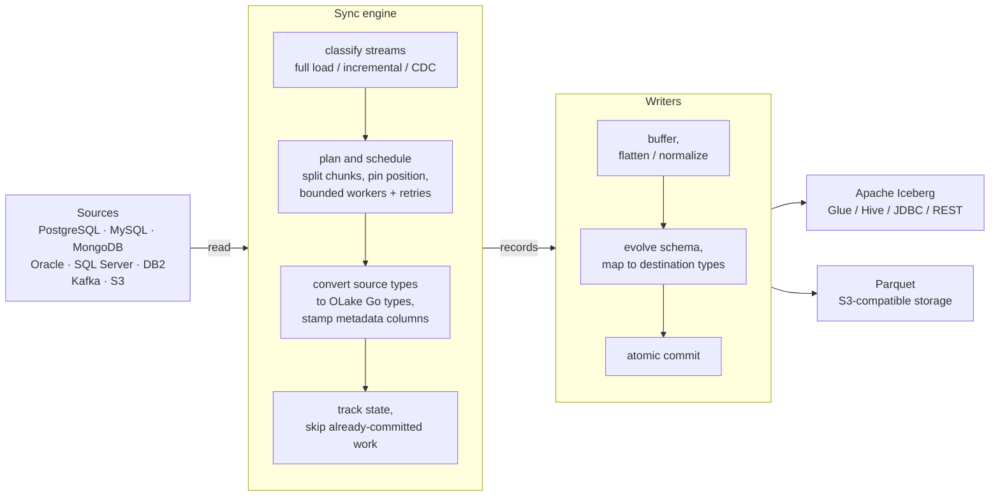
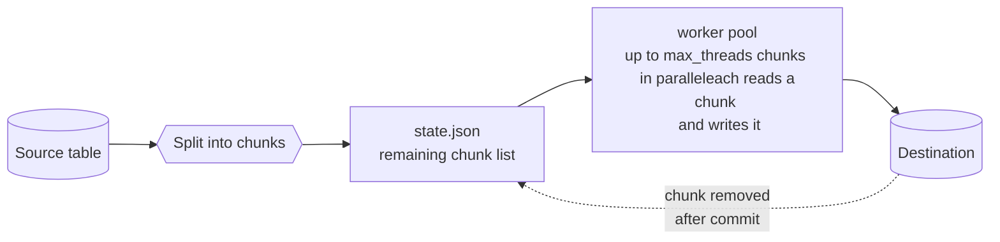
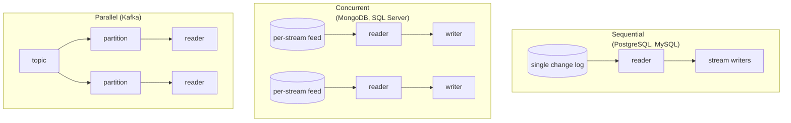
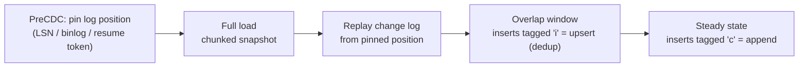
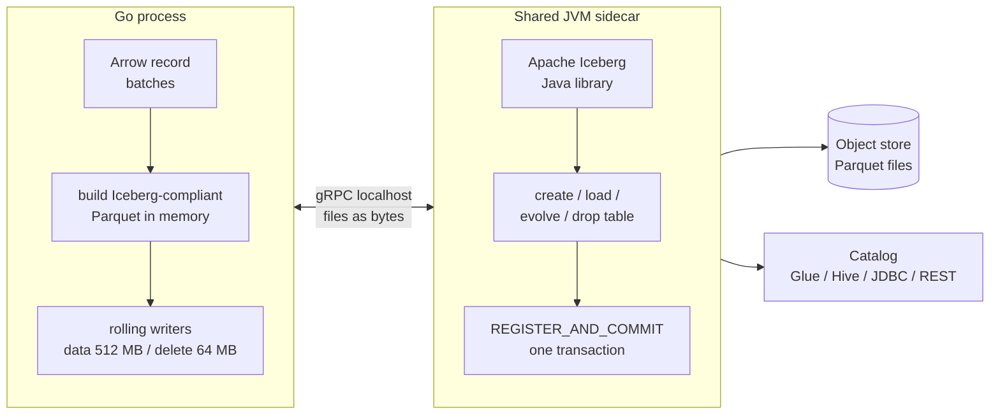
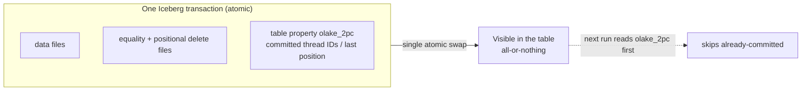

import BlogCTA from '@site/src/components/BlogCTA';

# Deep dive into OLake Go architecture


## TL;DR

- **OLake Go** is an open-source, single-binary ingestion engine that replicates PostgreSQL, MySQL, MongoDB, Oracle, SQL Server, DB2, Kafka, and S3 into Apache Iceberg (or Parquet on object storage), with no Spark, Flink, Kafka, or Debezium in the pipeline.
- One **sync engine** drives all eight sources. A source is just a small driver interface; scheduling, retries, state, and exactly-once are written once and shared.
- **Full loads are chunked**, which makes them run in parallel and resume after a crash by re-running only the unfinished chunks.
- **CDC** tails each database's native log (Postgres WAL, MySQL binlog, MongoDB change streams, SQL Server CDC tables) and hands off from the initial load without losing or duplicating rows.
- **Progress lives in `state.json` and in the Iceberg table itself**, so recovering from a crash means rereading a file, not rebuilding a running server.

[OLake Go](https://github.com/datazip-inc/olake) is an open source ingestion engine that replicates data from transactional databases, Kafka, and S3 into Apache Iceberg tables, or as plain Parquet files on S3-compatible object storage. It is written in Go and runs as a single process: no Kafka cluster in the middle, no Spark or Flink job doing the writing, no Debezium server tailing your database.

Moving operational data into a lakehouse sounds like a solved problem until you try to do it at scale. The first full load of a multi-terabyte table has to be split into parallel work, and it has to survive a crash at 80 percent without starting over. After the full load, changes have to keep flowing with low lag, which means speaking each database's native change protocol: logical replication in Postgres, the binlog in MySQL, change streams in MongoDB.

Schemas drift while all of this is running. And the destination does not deduplicate for you: Apache Iceberg is a table format over object storage, so a guarantee like "this row lands exactly once" has to be engineered, not assumed.

OLake Go's architecture is a set of specific answers to those problems, and this post walks through them:

- the **sources**, and the small interface every one implements
- the **sync modes**, full refresh, incremental, and CDC, and how the engine runs them
- **chunking**, which makes full loads parallel and resumable
- **CDC**, and how it hands off from the initial load without losing or duplicating rows
- **state management**, which lets any interrupted sync pick up where it stopped
- the **write path** into Iceberg tables or Parquet, and how its commits stay atomic
- **exactly-once delivery** and **schema evolution**, the guarantees that make it safe to point at a production database

## How OLake Go is shaped

At the highest level, a sync is three stages connected by an in-process pipeline:

1. A **driver** reads from the source. There is one driver per source type, and each knows how to discover schemas, split tables into chunks, and tail its database's change log.
2. The **sync engine** orchestrates: it decides what each stream needs (full load, incremental catch-up, or CDC), schedules chunks across parallel workers, enforces connection limits against the source, retries failures, and tracks state.
3. **Writers** land the data. Each reader gets a buffered writer thread, and the destination (Iceberg or Parquet) turns batches of records into files and atomic commits.

<div style={{ margin: '2.5rem 0' }}>



</div>

Everything ships as one container image per source, and every image exposes the same command surface: `spec`, `check`, `discover`, `sync`, and `clear-destination`. To know more about what each command and its flags do, read the [commands and flags documentation](https://olake.io/docs/community/commands-and-flags).

A sync is fully described by JSON files passed as flags: the source config, the destination config, a `streams.json` selecting which streams to sync and how (sync mode, partitioning, filters, normalization), and a `state.json` carrying whatever the previous run learned. The process reads them, does its work, updates `state.json`, and exits:

```sh
docker run -v "$PWD:/mnt/config" olakego/source-postgres:latest sync \
  --config /mnt/config/source.json \
  --destination /mnt/config/destination.json \
  --catalog /mnt/config/streams.json \
  --state /mnt/config/state.json
```

While it runs, OLake Go writes a `stats.json` every two seconds with active writer threads, records synced, throughput, memory usage, and an estimated time remaining.

Nothing persists in the process between runs. A sync loads `state.json`, does its work, writes the updated state back, and exits, so there is no always-on server holding pipeline progress in memory. Everything needed to resume lives in `state.json` and the destination table, which is what makes recovering from a crash a matter of rereading a file rather than rebuilding a server's internal state. The rest of this blog follows a record through the pipeline, starting with the sources.

## The sources

OLake Go ships **eight sources** across three kinds of systems: six transactional databases (**PostgreSQL, MySQL, MongoDB, Oracle, SQL Server, DB2**), one event stream (**Apache Kafka**), and one object store (**S3**, including S3-compatible stores like MinIO).

What each source can do follows from what the underlying system exposes. All six databases handle [full load](#chunking-and-parallel-full-loads) and [incremental](#incremental-sync); PostgreSQL, MySQL, MongoDB, Kafka and SQL Server add [CDC](#change-data-capture). S3 does full load and incremental over files.

There is no generic database abstraction sitting between OLake Go and these systems. Every driver uses its database's native client and wire protocol, which is what makes features like reading the Postgres replication stream or decoding the MySQL binlog possible at all. Kafka is consumed through consumer groups, with JSON and Avro message decoding and Confluent Schema Registry support.

There are operational conveniences built in as well. The relational drivers can connect through an **SSH tunnel** for databases in private networks, and MongoDB reads default to `secondaryPreferred`, so a heavy full load leans on replicas instead of the primary.

### How discovery works per source

Discovery is the one phase where the differences between sources show up most clearly, because each system describes its own data differently:

- **Relational databases** have real catalogs, so the drivers query them directly (`information_schema` and its equivalents) and get exact column types, nullability, and primary keys.
- **MongoDB** has no schema to ask for. The driver samples up to 10,000 documents from each end of the collection (newest and oldest, using `$natural` order) and resolves a schema from what it finds, so both old and recent document shapes are represented.
- **S3** infers the schema from the first file of each stream, using the configured format parser (CSV, JSON, or Parquet).
- **Kafka** samples recent messages from every partition of a topic and derives the schema from their decoded payloads.

Discovery is its own phase, run by the `discover` command, not something every sync repeats. Each stream is inspected independently and some inspections are heavy (MongoDB samples thousands of documents per collection), so `discover` schedules the per-stream schema work across a worker group whose size is capped by `--max-discover-threads`, 50 by default:

```go
// drivers/abstract/abstract.go (trimmed)
// cap the parallelism at --max-discover-threads
a.GlobalConnGroup = utils.NewCGroupWithLimit(ctx, maxDiscoverThreads)

// inspect every stream concurrently, one ProduceSchema call each
utils.ConcurrentInGroupWithRetry(a.GlobalConnGroup, streams, a.driver.MaxRetries(),
    func(ctx context.Context, _ int, stream types.StreamID) error {
        streamSchema, err := a.driver.ProduceSchema(ctx, stream)
        if err != nil {
            return err
        }
        streamMap.Store(streamSchema.ID(), streamSchema)
        return nil
    })
```

A thousand tables inspect in seconds rather than serially, and the merged result is written to `streams.json`.

A later `sync` trusts that file for which streams to read and does not repeat the catalog inspection. Schema changes are still picked up, just by a different path: a new column or a widened type arrives in the data during the sync itself, and the Iceberg table is evolved to match on the fly, without anyone re-running `discover` (covered in [schema and type handling](#schema-and-type-handling)).

### What a source driver actually is

A driver in OLake Go is a deliberately small component. It implements one Go interface, and nothing else:

```go
type DriverInterface interface {
    // discovery
    GetStreamNames(ctx context.Context) ([]types.StreamID, error)
    ProduceSchema(ctx context.Context, stream types.StreamID) (*types.Stream, error)
    // full load
    GetOrSplitChunks(ctx context.Context, pool *destination.WriterPool, stream types.StreamInterface) (*types.Set[types.Chunk], error)
    ChunkIterator(ctx context.Context, stream types.StreamInterface, chunk types.Chunk, processFn BackfillMsgFn) error
    // incremental
    FetchMaxCursorValues(ctx context.Context, stream types.StreamInterface) (any, any, error)
    StreamIncrementalChanges(ctx context.Context, stream types.StreamInterface, cb BackfillMsgFn) error
    // cdc
    CDCSupported() bool
    ChangeStreamConfig() (sequential bool, parallel bool, concurrent bool)
    PreCDC(ctx context.Context, streams []types.StreamInterface) error
    StreamChanges(ctx context.Context, identifier int, metadataState map[string]any, processFn CDCMsgFn) (any, error)
    PostCDC(ctx context.Context, identifier int) error
    // plus setup, config, and connection-limit plumbing
    ...
}
```

A driver only answers source-specific questions: what streams exist, how to split a table into [chunks](#chunking-and-parallel-full-loads), how to read one chunk, how to tail the change log.

Everything else lives in the shared **sync engine**: scheduling chunks across workers, retrying failures, managing writer lifecycles, tracking state, and coordinating the handoff from full load to CDC. That split is what keeps eight sources maintainable in one codebase, and it is why a new source immediately inherits parallelism, resumability, exactly-once delivery, and every destination the moment its driver compiles.

Which of these driver methods the engine actually calls for a given stream depends on one setting: the stream's [sync mode](#sync-modes).

## Sync modes

Every stream carries its own sync mode in `streams.json`, so one sync can mix modes freely: a huge immutable events table on full refresh, a slowly changing dimension on incremental, and the hot transactional tables on CDC.

There are four modes:

- **`full_refresh`** reads the entire stream, every run. At the start of each run, OLake Go clears the stream's state and drops its data at the destination, so what lands is always a complete, current copy.
- **`incremental`** performs the full load once, then on every later run reads only rows whose cursor column (an `updated_at`, a sequence, a file's last-modified time) moved past the last saved value.
- **`cdc`** also performs the full load once, then tails the database's change log so inserts, updates, and deletes flow continuously with their exact operation type.
- **`strict_cdc`** skips the full load entirely and starts reading the change log from the current position, for cases where history is irrelevant or already loaded.

During discovery, OLake Go assigns each stream the best default its source supports, preferring CDC:

```go
if stream.SupportedSyncModes.Exists(types.CDC) && driver.CDCSupported() {
    stream.SyncMode = types.CDC
} else if stream.SupportedSyncModes.Exists(types.INCREMENTAL) {
    stream.SyncMode = types.INCREMENTAL
} else if stream.SupportedSyncModes.Exists(types.STRICTCDC) {
    stream.SyncMode = types.STRICTCDC
} else {
    stream.SyncMode = types.FULLREFRESH
}
```

The generated `streams.json` is where you override that choice per stream, along with normalization, partitioning, filters, and append behavior.

### What a record carries

Whatever the mode, OLake Go stamps a small set of metadata columns onto every record it moves:

| Column | Contents |
|---|---|
| `_olake_id` | Hash of the row's primary key values; the stable identity used for upserts |
| `_op_type` | What this record represents (table below) |
| `_olake_timestamp` | When OLake Go processed the record |
| `_cdc_timestamp` | When the source database committed the change (CDC streams only) |

The `_op_type` value tells the destination how to treat each record:

| `_op_type` | Emitted by | Meaning |
|---|---|---|
| `r` | Full load | Row read during a backfill scan |
| `c` | CDC | Insert captured from the change log |
| `i` | CDC | Insert that may duplicate a just-backfilled row; deduplicated on write, lands as `c` |
| `u` | CDC and incremental | New version of an existing row |
| `d` | CDC | Delete captured from the change log |

A sync run therefore starts with a simple classification: every selected stream lands in one of three buckets, full load, incremental, or CDC, and each bucket follows its own execution path through [the orchestrator](#the-orchestrator).

## The orchestrator

The orchestrator is the shared engine layer that turns those buckets into actual work. It is the same code for all sources, which is why behaviors like retries, connection limits, and resumability are identical whether you are syncing Postgres or MongoDB.

A `sync` starts by classifying the selected streams from `streams.json`. The only validation at this stage is of the catalog itself; a stream whose filter is malformed (too many conditions, a column that is not in the stream's schema, a value that does not parse) is skipped with a warning rather than failing the whole job. Before a single row is read, the [destination writer pool](#destinations-and-the-write-path) is built and its connection checked, so a bad destination config fails in seconds instead of after an hour of reading.

Then the buckets execute:

```go
// drivers/abstract/abstract.go (trimmed)
func (a *AbstractDriver) Read(ctx context.Context, pool *destination.WriterPool,
    backfillStreams, cdcStreams, incrementalStreams []types.StreamInterface) error {

    if len(cdcStreams) > 0 {
        if err := a.RunChangeStream(ctx, pool, cdcStreams...); err != nil { ... }
    }

    if len(incrementalStreams) > 0 {
        if err := a.Incremental(ctx, pool, incrementalStreams...); err != nil { ... }
    }

    for _, stream := range backfillStreams {
        a.GlobalCtxGroup.Add(func(ctx context.Context) error {
            return a.Backfill(ctx, nil, pool, stream)
        })
    }
    ...
}
```

CDC streams go first, because their initial full loads and the switch to log tailing are coordinated as one unit: the engine waits for every CDC stream's full load to finish before it starts consuming the change log. Incremental streams follow the same discipline, completing their first full load before cursor reads begin. Plain full-refresh streams fan out last, and all of the underlying read work, whatever the bucket, executes through one shared pool of bounded workers.

### Connection limits and retries

Underneath, two concurrency groups govern everything. A task group fans work out across streams, and a **connection group** bounds how much of that work may touch the source at once. The connection group's limit comes from `max_threads` in the source config, so the pressure OLake Go puts on a production database is a single dial you control. Every source-touching unit of work, whether it is one [chunk](#chunking-and-parallel-full-loads) of a full load or a stream's change-log session, is scheduled into that bounded group.

Each unit is also retried on its own. A failed chunk gets a fresh context and a fresh destination writer, then retries with exponential backoff (starting at 60 seconds and doubling per attempt) up to the configured retry count. Errors that retrying cannot fix, like a replication cursor that no longer matches the source, are tagged non-retryable and fail immediately with a message telling you what to do instead.

Interruptions are part of the design rather than an edge case. `SIGINT` and `SIGTERM` are wired into the root context, so a Ctrl-C, a `docker stop`, or a Kubernetes pod eviction cancels every reader and writer cleanly, and whatever was not yet committed simply runs again next time.

The one thing the orchestrator deliberately does not decide is how a table gets divided into parallel work in the first place. That is the chunking layer's job.

## Chunking and parallel full loads

A full load is where ingestion tools tend to break. Reading a multi-terabyte table through one cursor is slow, and worse, it is fragile: if the connection drops at hour six, a naive implementation starts again at row zero.

OLake Go avoids both problems by never treating a table as one long read. Before the first row moves, the driver splits the stream into **chunks**, and a chunk is just a boundary pair:

```go
type Chunk struct {
    Min any `json:"min"`
    Max any `json:"max"`
}
```

That small struct is the unit of everything in a full load: the unit of parallelism (chunks run concurrently), the unit of retry (a failed chunk reruns alone), and the unit of resume (finished chunks never run again).

<div style={{ margin: '2.5rem 0' }}>



</div>

Chunk boundaries are computed from cheap metadata rather than by scanning data: page counts and physical row locators, primary key ranges, or a small sample of keys, depending on what the source database exposes. Each source has its own strategy, from CTID ranges in Postgres to `splitVector` in MongoDB, and we have written a whole blog on exactly how each one works: [What makes OLake Go fast](https://olake.io/blog/what-makes-olake-fast). Boundaries are also chosen with the destination in mind, sizing each chunk to produce roughly one well-sized Parquet file rather than a spray of small ones.

The execution loop is compact enough to show whole:

```go
// planning: split once, save the full chunk list into state BEFORE reading
chunksSet := a.state.GetChunks(stream.Self())
if chunksSet == nil || chunksSet.Len() == 0 {
    chunksSet, _ = a.driver.GetOrSplitChunks(ctx, pool, stream)
    a.state.SetChunks(stream.Self(), chunksSet)
}

chunkProcessor := func(ctx context.Context, _ int, chunk types.Chunk) error {
    inserter, prevState, _ := pool.NewWriter(ctx, stream, ...)

    // on success, the chunk leaves the state file
    defer func() {
        a.state.RemoveChunk(stream.Self(), chunk)
    }()

    return a.driver.ChunkIterator(ctx, stream, chunk, func(ctx context.Context, data map[string]any) error {
        return inserter.Push(ctx, types.CreateRawRecord(data, olakeColumns))
    })
}

utils.ConcurrentInGroupWithRetry(a.GlobalConnGroup, chunks, a.driver.MaxRetries(), chunkProcessor)
```

The ordering here is what makes full loads resumable. The complete chunk list is persisted to `state.json` before any data is read, each chunk is removed from state only after it finishes, and chunks are processed through the bounded worker pool with each one writing through its own destination writer. Kill the process at any point, restart it, and the engine reads the surviving chunk list and processes only what is left.

There is one subtle failure window: a chunk's data was committed at the destination, but the process died before the state file recorded it. For Iceberg syncs, OLake Go closes this window at commit time. Every chunk writes under a stable thread ID, and each Iceberg commit records that ID in the table's own metadata, so a retried chunk is recognized and skipped instead of written twice. To see this guarantee traced end to end, check how [exactly-once delivery works during full refresh](https://olake.io/blog/exactly-once-delivery-iceberg#full-refresh).

This chunked full load runs first for every stream. Incremental and CDC then continue from there, reading only what has changed since. For CDC, the interesting part is what happens the moment that first load's last chunk finishes.

## Change data capture

Once a CDC stream's full load is done, OLake Go stops querying tables and starts reading the database's own change log. That is where inserts, updates, and deletes come from at that point, each carrying its operation type and the source's commit timestamp.

Every database exposes its change log differently, and OLake Go reads each one natively:

| Source | Change log | How OLake Go reads it |
|---|---|---|
| **PostgreSQL** | Write-ahead log (WAL) | Logical replication slot with the `pgoutput` plugin, scoped by a publication |
| **MySQL** | Binlog | Binlog replication protocol, tracking file and position (MariaDB included) |
| **MongoDB** | Oplog | Change streams, resumed via resume tokens |
| **SQL Server** | CDC capture tables | Polled in LSN ranges through the native CDC functions |

Each source has its own CDC prerequisites, and OLake Go validates them when the connection is set up, so a misconfiguration surfaces immediately instead of hours into a sync. The setup guide for each connector covers exactly what to enable: [PostgreSQL](https://olake.io/docs/connectors/postgres/overview), [MySQL](https://olake.io/docs/connectors/mysql/overview), [SQL Server](https://olake.io/docs/connectors/mssql), and [MongoDB](https://olake.io/docs/connectors/mongodb/cdc_setup).

### One log or many: the execution topologies

How CDC parallelizes depends on the shape of the source's log. Each driver declares one of three topologies, and the orchestrator adapts:

- **Sequential** (PostgreSQL, MySQL): the whole database has a single change log, so a single reader tails it and routes each event to the right stream's writer. More readers would not help; the log is one ordered sequence.
- **Concurrent** (MongoDB, SQL Server): every stream has its own change feed, so each stream's CDC starts the moment its own full load finishes, without waiting for the other streams.
- **Parallel** (Kafka): topic partitions are independent, so multiple readers consume simultaneously under one consumer group.

<div style={{ margin: '2.5rem 0' }}>



</div>

### What a CDC record carries

Change records get the same `_olake_*` metadata columns as any other record, but with one addition: each one also records the exact position in the source log that it came from, written as its own column in the destination table. That column is source-specific, because every log identifies a position differently:

| Source | Position column(s) |
|---|---|
| PostgreSQL | `_cdc_lsn` |
| MySQL | `_cdc_binlog_file_name`, `_cdc_binlog_file_pos` |
| MongoDB | `_cdc_resume_token` |
| SQL Server | `_cdc_start_lsn`, `_cdc_seqval` |
| Kafka | `_kafka_offset`, `_kafka_partition` |

The value is attached where the change is decoded and travels with the record to the destination:

```go
// pgoutput: every change is tagged with the LSN it was read at
insertFn(ctx, abstract.NewCDCChange(stream, p.txnCommitTime, "insert", values,
    map[string]any{CDCLSN: p.socket.ClientXLogPos.String()}, rowBytes))
```

The payoff is traceability that survives into the lakehouse: for any row in the destination, you can see precisely which log position produced it, enough to reason about ordering, debug a late change, or line a row up against the source's own log after the fact.

### The handoff from full load

The dangerous moment in any CDC pipeline is the transition from snapshot to log. Snapshot first and tail afterwards, and you lose everything that changed in between. OLake Go orders it the other way: before any full load begins, `PreCDC` pins the starting position, the slot's current LSN, the current binlog coordinates, or a fresh resume token. The full load runs, and then the log replays from the pinned position, so every change that happened mid-load arrives on top of the loaded data.

<div style={{ margin: '2.5rem 0' }}>



</div>

That replay means overlap: a row inserted during the load shows up twice, once from the chunk scan and once from the log. OLake Go resolves the overlap at the destination instead of trying to coordinate readers:

```go
// drivers/abstract/cdc.go
func mapChangeKindToOperationType(kind string, dedupInserts bool) string {
    switch kind {
    case "delete":
        return "d"
    case "update":
        return "u"
    default:
        if dedupInserts {
            return "i" // overlap window: delete-then-insert on write
        }
        return "c" // steady state: plain insert
    }
}
```

During the overlap window, inserts are tagged `i` and the destination treats them as upserts, so the second copy replaces the first. Once the first CDC round after the load is committed, the destination records that the window is closed, and from then on inserts flow through as plain `c` appends.

### Bounded sessions and careful acknowledgement

An OLake Go CDC session is not a daemon. The reader notes where the log ends when the session starts, streams changes until it reaches that position (or until nothing new arrives within the configured `initial_wait_time`), and then shuts down: writers flush and commit to the destination before any position is saved. Run it every five minutes and you have near-real-time tables; run it nightly and each run drains whatever accumulated.

Between sessions, the position lives in `state.json` as a bookmark, and every later run resumes from it by reading that file back at startup. What the bookmark contains depends on the source: an LSN for Postgres, binlog coordinates for MySQL (along with the generated server ID OLake Go uses to identify itself as a replica, so later runs reuse the same identity), and a resume token per stream for MongoDB, which is handed back to the change stream via `resumeAfter`.

Whatever the source, every driver follows the same discipline around that bookmark:

1. The very first CDC run pins the log's current position, before the full load starts.
2. A session ends by committing to the destination first and only then saving the bookmark; if either step fails, the other stands and the next run simply retries the window.
3. Some sources also track the reader's position on their side, and those get an acknowledgement step in between: Postgres advances its replication slot and Kafka commits its consumer group offsets, in both cases only after the destination commit, so the source never discards log data the lakehouse has not landed yet. Where such a server-side record exists, a resuming session also cross-checks the bookmark against it before reading, and refuses to stream from a wrong position.

#### Example: the full cycle in Postgres

To make this concrete, here is the whole cycle as the Postgres driver runs it. On the saving side, the first run pins the replication slot's position, and every session after that acknowledges the slot and then writes the bookmark:

```go
// first run only: pin the slot's current position as the starting bookmark
if globalState == nil || globalState.State == nil {
    p.state.SetGlobal(waljs.WALState{LSN: slot.CurrentLSN.String()})
}

// end of every session: acknowledge the slot first, then save the bookmark
if err := waljs.AcknowledgeLSN(ctx, p.client, socket, false); err != nil {
    return err // ack failed: state keeps its old value, next run retries this window
}
p.state.SetGlobal(waljs.WALState{LSN: finalLSN})
```

On the reading side, the next run loads that bookmark and checks it before trusting it: the saved LSN is compared against the slot's `confirmed_flush_lsn` on the server, and a mismatch fails the run with a non-retryable error telling you to run `clear-destination`, because streaming from the wrong position would silently duplicate or lose rows.

Once the bookmark checks out, the driver opens a dedicated replication connection and starts the log exactly there. It first asks the server where the WAL currently ends, which becomes this session's finish line, then starts replication from the slot's confirmed position:

```go
// where the WAL ends right now = this session's target
sysident, _ := pglogrepl.IdentifySystem(ctx, pgConn)

// resume exactly where the slot was last acknowledged
err := pglogrepl.StartReplication(ctx, socket.pgConn, socket.ReplicationSlot,
    socket.ConfirmedFlushLSN,
    pglogrepl.StartReplicationOptions{
        PluginArgs: []string{"proto_version '1'", "publication_names 'olake_publication'"},
    })

for {
    msg, _ := socket.pgConn.ReceiveMessage(msgCtx)
    switch {
    case isXLogData(msg):
        xld, _ := pglogrepl.ParseXLogData(...)
        socket.ClientXLogPos = xld.WALStart          // advance the in-memory position
        processPgoutputWAL(ctx, xld.WALData, insertFn) // decode, route to stream writers
    }

    if transactionCompleted && socket.ClientXLogPos >= socket.CurrentWalPosition {
        return nil // caught up to the finish line
    }
}
```

The decoding step is where `pgoutput` messages become records. Relation messages describe each table's shape and are cached so later change messages can be decoded against them, begin and commit messages mark transaction boundaries (the session only ever stops at a completed transaction, never mid-way through one), and each insert, update, or delete is converted and pushed to its stream's writer. One practical warning surfaces here too: if a table's replica identity is not `FULL`, unchanged TOAST column values can be missing from update events, and OLake Go logs exactly that so you can fix it on the source.

The acknowledgement order is the load-bearing detail: the slot's LSN advances only after the destination commit succeeds, which means Postgres keeps WAL around until the lakehouse truly has the data. A crash between commit and acknowledgement is also covered: the committed position stored in the destination is compared against the local state on the next run, and if the destination is ahead, the engine replays exactly up to that position before resuming normal streaming, so the slot, the state file, and the table converge. To trace this failure by failure, with worked examples for each source family, check how [exactly-once delivery works during CDC](https://olake.io/blog/exactly-once-delivery-iceberg#cdc).

## Incremental sync

CDC is not always on the table. Sometimes the database user cannot get replication permissions, sometimes the log is simply not enabled, and sometimes a table changes so predictably that tailing a log is overkill. Incremental sync covers those cases with nothing more than a column that moves forward: an `updated_at`, a sequence, a file's last-modified time.

Each incremental stream declares a **primary cursor** column and, optionally, a **secondary cursor** that takes over for rows where the primary cursor's value is NULL, so an unpopulated `updated_at` cannot make a row invisible to the sync. The first run records the cursor's current maximum as the bookmark, and then the usual [chunked backfill](#chunking-and-parallel-full-loads) runs with one extra condition on every chunk scan: `cursor <= max`.

That cap is there to prevent duplication. A row that arrives mid-load with a cursor value beyond the pinned maximum would otherwise be swept up by a chunk scan and then read a second time by the next incremental run, which fetches everything past the bookmark. With the cap, the boundary is clean: the full load owns every row up to the bookmark, later runs own everything after it, and no row can be delivered through both paths.

Every later run is a single bounded read: fetch rows where the cursor moved past the bookmark, and advance the bookmark to the highest value actually seen in the data. That maximum is not taken from a separate query; it is tracked row by row as records stream through, and it becomes the new bookmark only after the destination commit:

```go
// drivers/abstract/incremental.go (trimmed)
return a.driver.StreamIncrementalChanges(ctx, stream, func(ctx context.Context, record map[string]any) error {
    // every row nudges the in-memory maximum forward
    maxPrimaryCursorValue, maxSecondaryCursorValue = a.getMaxIncrementCursorFromData(
        primaryCursor, secondaryCursor, maxPrimaryCursorValue, maxSecondaryCursorValue, record)

    olakeColumns := map[string]any{
        constants.OlakeID: utils.GetKeysHash(record, stream.GetStream().SourceDefinedPrimaryKey.Array()...),
        constants.OpType:  "u",
        ...
    }
    return inserter.Push(ctx, types.CreateRawRecord(filteredData, olakeColumns))
})

// after the writer commits: the highest value seen becomes the new bookmark
a.state.SetCursor(stream.Self(), primaryCursor, a.FormatCursorValue(maxPrimaryCursorValue))
```

The comparison behind that maximum is type-aware, so timestamps, numbers, and ObjectIDs all order correctly rather than being compared as strings. And because every record is stamped with `_op_type` of `u`, the destination applies it as an [upsert](#destinations-and-the-write-path), replacing the previous copy of the row by its `_olake_id`, so a rerun of the same window updates rows in place instead of duplicating them. Streams configured append-only are the exception; they skip the replacement and simply append.

The bookmark is protected the same way CDC positions are: it is saved to `state.json` only after the destination commit, and a copy rides inside the commit itself, so a crash between committing and saving state is recovered from the destination on the next run. To walk that failure sequence step by step, check how [exactly-once delivery works for incremental syncs](https://olake.io/blog/exactly-once-delivery-iceberg#incremental). Cursor values are also normalized before saving, timestamps to a fixed UTC format and MongoDB ObjectIDs to hex, so a bookmark written by one run always compares cleanly in the next.

#### Example: incremental on Postgres

For a Postgres table with `updated_at` as the primary cursor, the two phases boil down to two shapes of query:

```sql
-- first run: chunked full load, capped at the pinned cursor maximum
SELECT * FROM "public"."orders"
WHERE ctid >= '(0,0)' AND ctid < '(262144,0)'
  AND ("updated_at" IS NULL OR "updated_at" <= $1);

-- every later run: only what moved past the bookmark
SELECT * FROM "public"."orders"
WHERE ("updated_at" > $1);

-- with a secondary cursor (say "created_at") declared, rows with a NULL
-- primary cursor are picked up through the fallback condition
SELECT * FROM "public"."orders"
WHERE ("updated_at" > $1 OR ("updated_at" IS NULL AND "created_at" > $2));
```

The same pattern holds across sources with different cursors doing the work: DB2 and Oracle run the equivalent SQL against their own dialects, and S3 uses each file's last-modified timestamp, so a later run only parses files added or changed since the previous one.

## State management

By now every sync mode has left something behind in state: chunk lists, cursor bookmarks, log positions, resume tokens. It is worth looking at this machinery directly, because it carries more of OLake Go's reliability story than any single algorithm.

State is an in-memory object first. All reader and writer goroutines in a sync share one `State` struct, guarded by a read-write lock, with each stream's entries in a concurrent map. The file on disk is its mirror: every mutation of the in-memory object, a chunk finishing, a cursor being pinned, a log position advancing, immediately rewrites `state.json`:

```go
// types/state.go: every mutation ends the same way
func (s *State) RemoveChunk(stream *ConfiguredStream, chunk Chunk) int {
    s.Lock()
    defer func() {
        s.LogState() // rewrite state.json now, not at the end of the run
        s.Unlock()
    }()
    ...
}
```

The division of labor matters: values that are still in flight, the running maximum of a cursor, the log position a reader is advancing through, live in plain driver memory and only enter the state object at commit points. That is why `state.json` never contains half-done progress; whenever the process dies, the file already reflects exactly the units of work that completed, and nothing else.

State comes in two scopes, matching how sources expose change data:

- **Stream state** is per-stream: pending chunks, incremental cursors, MongoDB resume tokens, SQL Server LSNs. Each entry is a small key-value map.
- **Global state** is shared: PostgreSQL and MySQL have one change log for the whole database, so its position is stored once, along with the set of streams riding on it.

### What each mode writes, and when

Laying the three modes side by side shows the same pattern at three different granularities:

| Mode | Before reading | While reading | At commit points |
|---|---|---|---|
| Full load | Complete chunk list stored | - | Each finished chunk removed from the list |
| Incremental | Cursor ceiling pinned | Maximum tracked in memory only | Cursor saved after the writer commits |
| CDC | Log position pinned (first run only) | Position tracked in memory only | Stream attached to global state after its load; position saved after commit and acknowledgement |

Two of those cells hide details worth seeing. First, the incremental pin: the cursor ceiling is written before the first chunk is read, but only when no chunks are pending from an earlier interrupted run:

```go
// drivers/abstract/incremental.go (trimmed)
} else if chunks := a.state.GetChunks(stream.Self()); chunks == nil || chunks.Len() == 0 {
    a.state.ResetCursor(stream.Self())
    maxPrimary, maxSecondary, err := a.driver.FetchMaxCursorValues(ctx, stream)
    ...
    a.state.SetCursor(stream.Self(), primaryCursor, a.FormatCursorValue(maxPrimary))
}
```

That guard exists because the remaining chunks of a resumed load were planned under the old ceiling. Fetching a fresh, higher maximum mid-way would let the finished chunks keep their old cap while the bookmark moved past it, and the rows in between would never be read by either path. A resumed load keeps its original ceiling; only a fresh load pins a new one.

Second, the CDC attach: when a stream's initial load completes, the engine records that fact by attaching the stream to the global state, and that membership is the proof the engine checks on every later run:

```go
// on load completion (drivers/abstract/cdc.go)
a.state.SetGlobal(nil, streamID)

// on every later run (types/state.go)
func (s *State) HasCompletedBackfill(stream *ConfiguredStream) bool {
    if s.Type == GlobalType {
        return s.Global.Streams.Exists(stream.ID())
    }
    ...
}
```

So "has this stream been backfilled" is never inferred from row counts or timestamps; it is a single set-membership lookup against state that was written in the same breath as the work completing.

A Postgres state file with one stream mid-load looks like this:

```json
{
  "type": "GLOBAL",
  "version": 6,
  "global": {
    "state": { "lsn": "0/1A2B3C4D" },
    "streams": ["public.orders", "public.users"]
  },
  "streams": [
    {
      "stream": "orders",
      "namespace": "public",
      "sync_mode": "",
      "state": {
        "chunks": [
          { "min": "'(262144,0)'", "max": "'(524288,0)'" },
          { "min": "'(524288,0)'", "max": "'(786432,0)'" }
        ]
      }
    }
  ]
}
```

Reading it top to bottom: this is a global-state source at state format version 6, the replication log has been consumed and acknowledged up to LSN `0/1A2B3C4D`, two streams are attached to that position, and `public.orders` still has two CTID chunks left to load. Streams whose state holds nothing are not serialized at all, and full refresh streams never store state in the first place, since their contract is to re-read everything anyway.

The `version` field is there for backward compatibility. Parsing behaviors change over time, timestamp strictness, timezone handling for MySQL, integer width mappings, and each state file pins the version it was created with, so an old pipeline keeps the exact semantics it started with instead of silently changing behavior after an upgrade. New state files are stamped with the latest version, currently 6.

When you do want to start over, `clear-destination` is the reset path: for the selected streams it drops the destination tables, clears their stream state, and detaches them from the global state, so the next sync treats them as brand new while every other stream keeps its position.

## Destinations and the write path

Everything so far has been about reading. This section follows the records the rest of the way: through the buffering pipeline every reader writes into, and then through the two destinations, Apache Iceberg and plain Parquet files.

### From reader to destination: the writer pipeline

Every reader, whether it is scanning a chunk, catching up a cursor, or tailing a change log, gets its own **writer thread** in front of the destination. The writer thread's job is to make sure writing never stalls reading:

```go
// destination/writers.go
func (wt *WriterThread) Push(ctx context.Context, record types.RawRecord) error {
    ...
    wt.buffer = append(wt.buffer, record)
    if len(wt.buffer) >= int(wt.batchSize) {
        buf := make([]types.RawRecord, len(wt.buffer))
        copy(buf, wt.buffer)
        wt.buffer = wt.buffer[:0]
        wt.group.Add(func(ctx context.Context) error {
            return wt.flush(ctx, buf)
        })
    }
    return nil
}
```

Records accumulate in an in-memory buffer, 10,000 records by default (`--destination-buffer-size`), and a full buffer is handed to a background flusher while the reader keeps pulling rows. Each flush then runs a fixed sequence: nested objects are flattened into columns across parallel workers, null fields are dropped, stream filters are applied, and the batch is compared against the schema the destination table currently has. If the batch introduces a new column or a wider type, [schema evolution](#schema-and-type-handling) runs under a per-stream lock before anything is written, so exactly one thread alters the table while its siblings wait.

### Iceberg: two runtimes, one destination

Writing to Iceberg is split deliberately between two runtimes. When a sync starts, OLake Go launches a single shared JVM as a sidecar process and talks to it over gRPC on localhost:

```go
// destination/iceberg/java_client.go (trimmed)
serverCmd = exec.Command("java",
    "-XX:+UseG1GC",
    "-XX:MaxRAMPercentage=75.0",
    "-XX:+ExitOnOutOfMemoryError",
    "-jar", config.JarPath, string(configJSON))
```

The JVM owns everything catalog-shaped: creating and loading tables (`GET_OR_CREATE_TABLE`), evolving schemas (`EVOLVE_SCHEMA`), dropping tables for `clear-destination` (`DROP_TABLE`), and committing transactions, each arriving as a typed gRPC request and executed through the official Apache Iceberg Java library. The catalog itself is just configuration handed to that library at startup:

```go
// destination/iceberg/java_client.go (trimmed)
switch config.CatalogType {
case GlueCatalog:
    serverConfig["catalog-impl"] = "org.apache.iceberg.aws.glue.GlueCatalog"
case JDBCCatalog:
    serverConfig["catalog-impl"] = "org.apache.iceberg.jdbc.JdbcCatalog"
    serverConfig["uri"] = config.JDBCUrl
case HiveCatalog:
    serverConfig["catalog-impl"] = "org.apache.iceberg.hive.HiveCatalog"
    serverConfig["uri"] = config.HiveURI
case RestCatalog:
    serverConfig["catalog-impl"] = "org.apache.iceberg.rest.RESTCatalog"
    serverConfig["uri"] = config.RestCatalogURL
}
```

That is what buys compatibility with Glue, Hive, JDBC, and REST catalogs (Nessie, Polaris, Lakekeeper, Unity, and S3 Tables ride the REST implementation) without reimplementing four catalog integrations and Iceberg's commit protocol in Go.

The data path is the part OLake Go took back. Originally every record traveled over gRPC and the JVM wrote the Parquet files; today one config flag decides which writer handles the bytes:

```go
// destination/iceberg/iceberg.go: "arrow_writes" in destination.json
if i.config.UseArrowWrites {
    i.writer, err = arrowwriter.New(ctx, i.options, i.partitionInfo, i.schema,
        i.stream, i.server, isUpsertMode(i.stream, i.options.Backfill))
    ...
} else {
    i.writer = legacywriter.New(i.options, i.schema, i.stream, i.server)
}
```

With `arrow_writes` enabled, the Go process builds the files itself and the JVM only registers and commits them; the legacy writer keeps the original record-streaming path alive when the flag is off.

<div style={{ margin: '2.5rem 0' }}>



</div>

### Building the files: the Arrow path

The Go side serializes batches into Arrow records and writes them out as Iceberg-compliant Parquet, correct field IDs and all, entirely in memory. Files roll on size, and the size check is precise rather than guessed, because the Parquet writer exposes how many compressed bytes the current row group already holds:

```go
// destination/iceberg/arrow-writer/writer.go
sizeSoFar := int64(rw.currentBuffer.Len()) + rw.currentWriter.RowGroupTotalBytesWritten()
targetSize := utils.Ternary(rw.fileType == fileTypeData, targetDataFileSize, targetDeleteFileSize).(int64)
if sizeSoFar < targetSize {
    return rw, nil
}
```

Data files target 512 MB and delete files 64 MB. Writers are also partition-aware: each record's partition values are computed from the stream's `partition_regex` (with Iceberg transforms like `day` or `identity`), and every partition key gets its own rolling writer, so files land already organized the way the table is partitioned. Finished files are shipped to the JVM as raw bytes over gRPC, and the JVM places them in object storage under paths it allocated. To see how this pipeline was designed, check the [Arrow writer architecture](https://olake.io/blog/olake-arrow-based-iceberg-ingestion#olake-gos-new-arrow-writer-architecture) post.

### Upserts: equality and positional deletes

Iceberg has no update statement; a row is replaced by writing a delete for its old version and inserting the new one. OLake Go decides per writer whether that machinery is even needed:

```go
// destination/iceberg/iceberg.go
func isUpsertMode(stream types.StreamInterface, backfill bool) bool {
    return utils.Ternary(stream.Self().StreamMetadata.AppendMode, false, !backfill).(bool)
}
```

Backfill writers append, because a fresh load has nothing to replace, and append-only streams always append. Everything else, CDC updates and deletes, incremental rows, overlap-window inserts, runs in upsert mode, where the writer produces two kinds of delete files alongside the data:

```go
// destination/iceberg/arrow-writer/writer.go (trimmed)
if w.upsertMode && (recordOpType == "d" || recordOpType == "u" || recordOpType == "i") {
    if _, exists := writer.olakeIDPosition[recordOlakeID]; !exists {
        // first sighting: equality delete removes whatever earlier syncs wrote
        writer.equalityDeletes = append(writer.equalityDeletes, recordOlakeID)
        writer.olakeIDPosition[recordOlakeID] = PositionalDelete{...}
    } else {
        // seen again in this thread: positionally delete the previous version,
        // keep only the latest occurrence
        prev := writer.olakeIDPosition[recordOlakeID]
        writer.positionalDeletes = append(writer.positionalDeletes, prev)
        writer.olakeIDPosition[recordOlakeID] = PositionalDelete{...}
    }
}
```

The two delete types split the work cleanly. An **equality delete** on `_olake_id` erases the row's previous version wherever an earlier sync put it. A **positional delete** handles repetition inside the current sync: when the same row changes many times in one CDC window, each occurrence positionally deletes the one before it, so only the final version survives, instead of a thousand versions of a hot row being left for query engines to reconcile.

### The commit

When a writer thread closes, it sends the JVM a single request naming every file it produced, ordered as equality deletes, then data files, then positional deletes, along with a small piece of driver state that will matter in the next section:

```go
// destination/iceberg/arrow-writer/writer.go (trimmed)
commitRequest := &proto.ArrowPayload{
    Type: proto.ArrowPayload_REGISTER_AND_COMMIT,
    Metadata: &proto.ArrowPayload_Metadata{
        ThreadId:     w.options.ThreadID,
        FileMetadata: orderedFiles,
    },
}
// e.g. {"lsn": "0/1A2B3C4D"} from a Postgres CDC session
commitRequest.Metadata.Payload = string(payloadBytes)
```

The JVM turns that into exactly one Iceberg transaction. Data, deletes, and metadata become visible together or not at all, which is the atomic foundation the [exactly-once guarantee](#exactly-once-delivery) is built on.

### The Parquet destination

The Parquet destination is the simpler sibling for when you want files rather than tables. It writes Parquet files to S3-compatible object storage, one file set per partition path using the same `partition_regex` mechanics, and when a thread closes the finished files are uploaded concurrently, multipart, so multi-gigabyte files are handled automatically. There is no transactional commit because plain files have nothing to commit to; what you gain instead is the cheapest possible way to land data for downstream tools that just read directories of Parquet.

## Exactly-once delivery

Several sections have pointed here. Chunks skip themselves on retry, CDC recovers a crash between commit and acknowledgement, incremental carries its bookmark inside the commit. All of those rely on one mechanism, and this section is where it comes together: OLake Go gets exactly-once delivery to Iceberg with no external coordinator, no transaction log of its own, by using the Iceberg table as its ledger.

### The ledger lives in the table

Every Iceberg commit OLake Go makes does two things in the same transaction: it adds the data and delete files, and it updates a single table property named `olake_2pc` that records what was just committed. Because an Iceberg commit is atomic, the data and the record of the data become visible together or not at all:

```java
// olake-iceberg-java-writer: IcebergTableOperator.commitThread (trimmed)
Transaction transaction = table.newTransaction();

// 1. stage the bookkeeping into olake_2pc
UpdateProperties updateProperties = transaction.updateProperties();
updateJsonState(table, updateProperties, threadId, payload);
updateProperties.commit();

// 2. stage the data (append, or row-delta when there are delete files)
rowDelta.commit();

// 3. one atomic swap makes all of it visible at once
transaction.commitTransaction();
```

There is no window where the files exist but the bookkeeping does not, or the reverse. That single guarantee is what the rest of the system leans on.

<div style={{ margin: '2.5rem 0' }}>



</div>

What goes into `olake_2pc` depends on the stream's sync mode. A writer that reached a position in a log records that position; a writer that completed a discrete unit of work records that unit as done:

```java
// olake-iceberg-java-writer: updateJsonState (trimmed)
if (payload != null && !payload.isEmpty()) {
    // a position was supplied: record the latest one reached
    rootNode.put(STATE_FIELD_LATEST_THREAD_ID, threadId);
    mergePayloadIntoRoot(rootNode, payloadNode);
} else {
    // no position: remember this thread id as a committed unit of work
    committedIds.add(threadId);
    rootNode.put(STATE_FIELD_DEDUP_INSERTS, true);
}
```

When the next run opens the table, that record comes back to the Go side in the table-load response, decoded into a small struct the drivers consult before doing any work:

```go
// types/metadata_state.go
type MetadataState struct {
    ID                      any      `json:"id,omitempty"`
    State                   any      `json:"state,omitempty"`
    FullRefreshCommittedIDs []string `json:"full_refresh_committed_ids,omitempty"`
    DedupInserts            *bool    `json:"dedup_inserts,omitempty"`
}
```

### Reading the ledger before working

Every recovery path in OLake Go asks the destination the same question before it starts, "what did you last durably record?", and trusts that answer over the local state file. The clearest case is the full-load window mentioned in [chunked backfill](#chunking-and-parallel-full-loads): a chunk committed to the table but died before `state.json` recorded it, so on restart it is still in the state file and runs again. Its writer checks the ledger first, and a chunk whose id is already committed is skipped no matter what the state file thinks:

```go
// drivers/abstract/backfill.go
if prevMetadataState != nil {
    if slices.Contains(prevMetadataState.FullRefreshCommittedIDs, threadID) {
        logger.Infof("Thread[%s]: chunk min[%v] max[%v] already committed, skipping", threadID, chunk.Min, chunk.Max)
        return nil
    }
}
```

Change streams recover against the recorded position instead of a chunk id: if the table is ahead of the local state, the run replays the log up to exactly the table's position before resuming, so nothing is reapplied and nothing is skipped. That inversion, treating the committed table as the source of truth rather than the process's own memory, is what lets a stateless binary promise exactly-once.

The full guarantee, walked through failure by failure with a worked example for full refresh, CDC, and incremental, is its own deep dive: [How OLake Go guarantees exactly-once delivery to Apache Iceberg](https://olake.io/blog/exactly-once-delivery-iceberg).

## Schema and type handling

A replication engine has to be opinionated about types, because the source and the destination rarely agree on them. Postgres has a `numeric`, MongoDB has no schema at all, Iceberg has its own set. OLake Go resolves this by mapping everything through one internal type system, so no driver ever has to know how any destination represents a type.

### One type system in the middle

Source values are first classified into a small set of OLake Go types, `Int32`, `Int64`, `Float64`, `String`, `Bool`, `Timestamp` at several precisions, `Object`, `Array`. Relational drivers derive these from the catalog's column types; schemaless sources derive them from the values themselves:

```go
// utils/typeutils/datatype.go
func TypeFromValue(v interface{}) types.DataType {
    ...
}
```

Because MongoDB and other schemaless sources are sampled during [discovery](#how-discovery-works-per-source), the same field can show up with different types across documents. OLake Go does not pick the first one it sees; it merges them toward the narrowest type that can hold both, so an `id` seen as `Int32` in one document and `Int64` in another resolves to `Int64`.

That merge follows one rule: two types combine into the closest type that can represent both of them. Internally the types are arranged as a tree, and merging two of them is a walk to their lowest common ancestor:

```
// Tree Representation of TypeWeights
//
//                              5 (String)
//                            /              \
//             3 (Float64)   /              \ 9 (TimestampNano)
//                         /  \             /
//             2 (Int64)  /    \4(Float32) / 8 (TimestampMicro)
//                       /                /
//            1 (Int32) /                / 7 (TimestampMilli)
//                     /                /
//           0 (Bool) /                / 6 (Timestamp)
```

Two integer widths meet at the wider integer, an integer and a float meet at float, and types on different branches meet at `String`, which sits at the root and can hold anything. The same rule governs discovery and, later, what happens when live data disagrees with the table it is being written to.

### Normalization: columns, or one JSON blob

Whether that type system is even applied to a stream is a per-stream choice called **normalization**, set in `streams.json`.

With normalization **off**, OLake Go does not inspect the record's shape at all. It serializes the entire source record to a single JSON string and stores it in one `data` column, alongside the `_olake_*` metadata columns:

```go
// destination/iceberg/iceberg.go: normalization disabled
dataBytes, _ := json.Marshal(record.Data)
records[idx].Data[constants.StringifiedData] = string(dataBytes)
```

With normalization **on**, OLake Go maps each top-level field of the record to its own column. A scalar value lands in a typed column, and a nested object or array is serialized to a JSON string and stored in that field's column:

```go
// utils/typeutils/flatten.go (trimmed)
switch v := value.(type) {
case bool, int, int64, float64, string, time.Time, json.Number:
    destination[outKey] = v      // scalar -> typed column
case []byte:
    destination[outKey] = string(v)
default:
    b, _ := json.Marshal(v)      // nested object/array -> JSON string column
    destination[outKey] = string(b)
}
```

So a document with an `address` object becomes a single `address` column holding `{"city":"..."}` as text. The practical difference between the two modes is smaller than it sounds: normalization gives every top-level field a real, typed, queryable column, while nested structures stay as JSON either way. Relational sources, whose columns are already flat, default to normalized.

Column names are the other thing this layer decides. Every source column name passes through a single resolver on its way to becoming a destination column, and the stream's configuration picks the strategy:

```go
// types/stream_configured.go
func (s *ConfiguredStream) ResolveColumnName(key string) string {
    if s.StreamMetadata.UseSourceColumnNames {
        return key                 // keep the source name verbatim
    }
    return utils.Reformat(key)     // lowercase, non-alphanumeric -> "_"
}
```

By default names are reformatted, lowercased with any non-alphanumeric character turned into an underscore, so `Order-ID` becomes `order_id` and stays valid across query engines that quote identifiers differently. Because the choice runs through this one function, a stream that sets `use_source_column_names` has its original names preserved everywhere they are used: the table schema, the partition columns, and the written records all resolve names through the same call, so the two strategies never disagree.

### Evolution: when the data outgrows the table

Schemas drift while a sync is running. A new column appears, or a column that was always an `int` shows up as a value too large to be one. OLake Go handles this in flight rather than failing, and the decision uses the same lattice.

During each flush, the batch's types are compared against the table's current schema. A change is allowed only if it is a safe promotion, and a promotion is exactly an upward move in the lattice:

```go
// destination/iceberg/iceberg.go
var promotionTransitions = map[string]map[string]bool{
    "int":   {"long": true},
    "float": {"double": true},
}
```

If a field needs promoting (`int` to `long`, `float` to `double`) or a genuinely new column appears, the table is evolved before the batch is written. Because many writer threads can hit this at once, evolution runs under a per-stream lock, so exactly one thread alters the table while the others wait and then continue against the updated schema:

```go
// destination/writers.go (trimmed)
if evolution {
    wt.streamArtifact.mu.Lock()
    newSchema, err := wt.writer.EvolveSchema(flushCtx, wt.streamArtifact.schema, threadSchema)
    if err == nil && newSchema != nil {
        wt.streamArtifact.schema = newSchema
    }
    wt.streamArtifact.mu.Unlock()
}
```

Conflicting types that are not clean promotions, an `int` column that starts receiving strings, converge to their common ancestor exactly as they did in discovery: the column widens to `String` rather than the sync breaking. The reasoning behind evolving in place, and the full set of promotions Iceberg permits, are covered in the [schema evolution docs](https://olake.io/docs/features/schema).

## Wrapping up

For all the moving parts, OLake Go keeps circling back to a few ideas.

A **single engine** sits behind every source. Each driver only answers questions about its own database, and the shared engine owns scheduling, retries, state, and the write path, so eight sources behave identically and a ninth costs almost nothing to add.

The **chunk** is the atom of a full load, the unit of parallelism, retry, and resume at once. Change capture reads each database's native log, pins its position before the snapshot so nothing is lost in the handoff, and advances the source only after the destination has the data.

And the **destination itself is the source of truth**. State on disk is an optimization; the committed Iceberg table, with its `olake_2pc` ledger, is what every recovery path trusts. That is what lets a plain stateless binary promise exactly-once delivery without a coordinator anywhere in sight.

And it does all of it as a single process, with no cluster to babysit between the database and the table. If this is the kind of system you like taking apart, the code is the best next read: start at the sync command and follow a record from a chunk all the way to the commit.

- Get started: [OLake Go quickstart](https://olake.io/docs/getting-started/quickstart)
- The code: [github.com/datazip-inc/olake](https://github.com/datazip-inc/olake)
- Contribute guide to OLake Go: [contributing guide](https://olake.io/docs/community/contributing)
- Ask us anything: [OLake Go Slack community](https://olake.io/slack)

## FAQ

### Q1. How does a full load survive a crash without starting over?

Before reading any rows, the driver splits the table into chunks and writes the full chunk list to `state.json`. A chunk is removed only after it commits, so a restart re-reads the chunks that are left and skips the finished ones. Even a chunk that committed to Iceberg but died before the state file updated is caught: its committed ID is recorded in the table and skipped on retry.

### Q2. How does CDC take over from the initial load without losing or duplicating rows?

OLake Go pins the log position before the full load starts, then replays the log from that position once the load finishes, so nothing that changed mid-load is missed. Rows that arrive through both paths are reconciled at the destination: during the overlap window inserts are treated as upserts keyed on `_olake_id`, so the second copy replaces the first instead of duplicating it.

### Q3. Why does it run a Java sidecar instead of writing Iceberg entirely in Go?

The Go process builds the Parquet files itself, but the Iceberg catalog integrations and commit protocol are delegated to the official Apache Iceberg Java library, run as a sidecar the engine launches and talks to over local gRPC. That keeps the hot data path in Go without reimplementing four catalog types and Iceberg's transaction logic there.

### Q4. How is exactly-once guaranteed without an external coordinator?

Every Iceberg commit writes the data files and a table property named `olake_2pc`, recording what was committed, in one atomic transaction. The table itself is the ledger: on the next run OLake Go reads `olake_2pc` and skips anything already committed. The [exactly-once delivery deep dive](https://olake.io/blog/exactly-once-delivery-iceberg) walks through it failure by failure.

### Q5. If a column is added to a source table mid-sync, do I need to re-run discover?

No. New columns and widened types are detected in the data during the sync, and the Iceberg table is evolved to match on the fly. You re-run `discover` to pick up new tables or change which columns are synced, not for column changes on tables that are already syncing.

<BlogCTA/>
