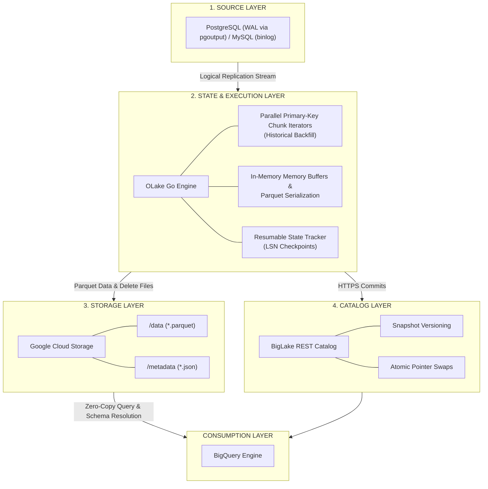

import BlogCTA from '@site/src/components/BlogCTA';


For years, streaming Change Data Capture (CDC) events from transactional databases into an analytical data lake required a massive, fragile ecosystem of distributed systems. Teams were forced to stitch together Debezium, Kafka, and Spark or Flink just to manage the relentless, high-velocity stream of transactional mutations without breaking downstream systems. This blog provides a pragmatic guide to bypassing that heavy middleware entirely.
 
We will deploy OLake Go, a lightweight ingestion engine, to stream high-volume CDC events directly from transactional databases into Apache Iceberg tables managed by Google Cloud BigLake. By leveraging BigLake’s native Iceberg REST Catalog endpoint, BigQuery can immediately query live transactional data with zero data movement and full ACID compliance.

 
Let's make this concrete by comparing the historical approach with our new architecture:
 
| Feature Category | Traditional CDC (Debezium + Kafka + Spark) | Modern Lakehouse CDC (OLake + BigLake) |
| --- | --- | --- |
| **Architecture Footprint** | Heavy (Multiple distributed clusters) | Lightweight (Single Go binary + Serverless Catalog) |
| **Schema Evolution** | Brittle, requires schema registry and manual DDL | Automatic on-the-fly metadata updates via REST |
| **Catalog Integration** | Often relies on Hive Metastore (HMS) | Native BigLake Iceberg REST Catalog endpoint |
| **Write Strategy** | Expensive full file rewrites (Copy-on-Write) | Lightweight Equality / Position Deletes (Merge-on-Read) |
 
## The CDC-to-Lakehouse Bottleneck
 
The core challenge data engineering teams face today is moving operational database changes—inserts, updates, and deletes—into a big data storage quickly and reliably.
 
For years, the standard approach to Change Data Capture (CDC) has relied on a complicated chain of distributed systems. This approach works, but it introduces massive infrastructure overhead and requires constant maintenance.
 
### The Old Way: Multi-Hop Architectures
 
Historically, moving data from a transactional database like Postgres into a data lake required stringing together multiple specialized tools.
 
A standard pipeline looks like this:
 
1. **Extraction:** A tool like Debezium reads the database write-ahead log (WAL).
2. **Buffering:** Debezium pushes these events into Apache Kafka to handle high data volumes.
3. **Processing:** A compute cluster running Apache Spark or Flink reads from Kafka, batches the records, and formats them.
4. **Storage:** The processor finally writes the data into cloud storage.
Think of this traditional pipeline like shipping a package using four different courier services. The first courier picks it up, hands it to a regional facility, which hands it to a sorting center, which finally passes it to a local delivery driver. Every time the package changes hands, there is a risk of it getting delayed, misrouted, or dropped.
 
In data engineering, these "dropped packages" show up as two major bottlenecks:
 
- **Schema Drift:** If a developer adds or removes a column in the upstream Postgres database, the change ripples through the pipeline. Often, this unexpected change crashes the downstream Spark job. Data engineers are then forced to manually update schema registries and rewrite table definitions before data can flow again.
- **The Small-File Problem:** Streaming continuous batches of rows directly into object storage creates thousands of tiny files. Query engines like BigQuery struggle to read thousands of small files efficiently. Over time, query performance drops, and storage costs rise.
> Every hand-off in a multi-hop pipeline is a potential point of failure.
 
### The New Way: Direct Ingestion via REST Catalog
 
The recent release of Google Cloud BigLake’s open Iceberg REST catalog provides a way to bypass these bottlenecks entirely.
 
Instead of routing data through Kafka and Spark, engineering teams can now use a single tool to handle extraction, formatting, and the final commit to the data lake. By using the Apache Iceberg table format combined with a serverless catalog like BigLake, you eliminate the intermediary processing clusters.
 
If the old way was a multi-courier network, the new way is a dedicated, direct delivery truck.
 
The ingestion tool reads the database changes and communicates directly with the BigLake catalog to update the table in one clean, atomic step. This removes the infrastructure overhead, handles schema changes automatically via the REST API, and prevents the small-file problem by intelligently managing how updates are written. You stop managing pipelines, and start materializing data.
 
## The New Ingestion Paradigm
 
The lakehouse model promises the cost efficiency of object storage paired with the transactional guarantees of a relational database. To fulfill that promise without introducing fragile streaming infrastructure, we rely on two core technologies: OLake Go and Google BigLake.
 
Let's systematically deconstruct both technologies and examine how they enable a direct materialization model.
 
### What is OLake Go?
 
OLake Go is an open-source data extraction and ingestion engine designed specifically to write transactional data directly into open lakehouse formats, primarily Apache Iceberg.
 
Earlier ingestion engines relied heavily on Java runtimes that required distributed worker nodes and large memory allocations just to manage steady-state data movement. OLake takes a fundamentally different engineering path: it is compiled and executed as a single, lightweight Go binary.
 
Let's dissect its most critical architectural components:
 
#### Single-Process Architecture
 
Because OLake Go compiles down to a native Go executable, it completely bypasses the resource overhead of the Java Virtual Machine (JVM). It starts instantly, maintains a predictable and minimal memory footprint, and eliminates the stop-the-world garbage collection pauses that often stall streaming workers under sudden throughput spikes.
 
#### Native Parallel Chunking
 
When synchronizing historical data, reading an entire table in a single query locks database resources and risks query timeouts. OLake Go solves this by slicing the table into smaller, discrete chunks and reading them in parallel. For relational tables with a usable primary key, OLake Go uses those keys to define the chunk boundaries. If a primary key is missing, the engine automatically falls back to database-specific internal row identifiers—such as `CTID` in PostgreSQL or `ROWID` in other systems. It queries these chunks concurrently using non-locking read operations, saturating network bandwidth while keeping production database load entirely predictable.
 
#### Direct CDC Log Tailing and Atomic Iceberg Commits
 
For live synchronization, OLake Go hooks directly into database replication primitives—such as the PostgreSQL Write-Ahead Log (WAL) using `pgoutput`, or the MySQL binary log (binlog).
 
Instead of routing those log events through an external message broker, OLake Go packages the incoming mutations directly into compressed Parquet files and constructs the required Apache Iceberg metadata in memory. It commits these updates directly to the destination catalog in atomic transactions.
 
### What is Google BigLake?
 
To understand BigLake, we must clarify what it is not: BigLake is not a storage volume. It does not hold your physical data files, and it does not replace Google Cloud Storage (GCS).
 
BigLake is a serverless metadata, governance, and table management layer that operates on top of open object storage.
 
Let's examine how BigLake structures the lakehouse:
 
#### The Open Apache Iceberg REST Catalog Standard
 
The core of BigLake’s open architecture is its native implementation of the Apache Iceberg REST Catalog specification. This specification provides an open, HTTP-based standard for how client engines discover table schemas, inspect file manifests, and execute snapshot commits. Because BigLake exposes this standard REST endpoint, any compatible client, including OLake Go, can interact with the catalog without requiring a self-hosted metastore or proprietary connector.
 
#### Serverless Transaction Management
 
BigLake acts as the central arbiter for data consistency. When an ingestion engine commits a new batch of data, BigLake verifies snapshot lineage and executes an atomic commit. This ensures that concurrent operations never corrupt table state and that read queries always see an isolated, consistent view of the data.
 
#### Unified Governance and Fine-Grained Security
 
BigLake applies Google Cloud’s security framework directly to open Iceberg tables stored in GCS. Security teams can enforce column-level access controls through Policy Tags and define row-level security filters in a single location. These policies remain strictly enforced whether the data is queried through BigQuery or accessed by external compute frameworks.
 
> GCS stores your raw files. BigLake turns those files into a secure, transactional table.
 
### The Paradigm Shift
 
Bringing OLake Go and BigLake together marks a decisive shift in how we structure CDC ingestion.
 
#### Direct Materialization Model
 
In this new paradigm, data follows an uninterrupted, straight-line path from transaction log to queryable table:
 
1. **Extraction:** OLake Go tails committed transactions directly from the database replication slot.
2. **Buffer and Format:** OLake Go structures incoming inserts, updates, and deletes into Parquet data and delete files in memory.
3. **Storage Write:** OLake Go uploads the Parquet files directly to designated paths in the GCS bucket.
4. **Catalog Commit:** OLake Go sends a single, lightweight HTTPS request to the BigLake Iceberg REST Catalog to append the new snapshot to the table ledger.
5. **Consumption:** BigQuery reads the updated table manifest through BigLake and immediately exposes the fresh records to analytical queries.


#### Operational and Architectural Benefits
 
This streamlined architecture delivers immediate operational advantages:
 
- **Minimal Infrastructure Surface Area:** You run and monitor a single stateless container instead of managing Kafka brokers, schema registries, and distributed stream processors.
- **Predictable Operational Costs:** You pay only for basic container compute, object storage, and serverless catalog requests, eliminating the continuous baseline cost of idle streaming clusters.
- **Direct Table Materialization:** Transactional changes become queryable Parquet files within seconds, without intermediate serialization or multi-hop data movement.
> Traditional architectures moved data across systems. The modern lakehouse materializes data directly where it lives.
 
## Designing the OLake Go - BigLake Stack
 
In legacy environments, storage, compute, and metadata coordination were tightly coupled. Ingestion workers wrote directly to shared storage directories without a central transaction coordinator. If a worker crashed halfway through writing a batch, half-written temporary files remained scattered across storage buckets. Downstream query engines had no reliable way to tell which files were complete and which were broken scraps from an interrupted job. Data engineers tried to fix this by adding file locks, coordination daemons, and scheduled cleanup scripts, but these workarounds were fragile and often failed when workloads scaled.
 
The modern lakehouse solves this problem by strictly separating the system into four decoupled layers: the Source Layer, the State and Execution Layer, the Storage Layer, and the Catalog Layer. By giving each tier one specific responsibility, the pipeline prevents partial writes from corrupting data and allows each component to scale independently.



### The Source Layer
 
The source layer extracts database mutations without adding heavy query overhead to the active production database. Earlier ingestion setups relied on batch polling, repeatedly running SQL queries to find rows where an update timestamp had changed. That approach wasted database CPU cycles, missed updates when high-volume writes shared the exact same millisecond timestamp, and completely failed to capture deleted rows.
 
Think of log tailing like reading the continuous carbon-copy audit tape inside a cash register. Instead of stopping the cashier every few minutes to count the cash drawer and guess what was sold, the reader simply unrolls the duplicate paper tape that prints automatically whenever a purchase, refund, or cancellation occurs.
 
OLake Go connects to the database as a dedicated replication consumer. In PostgreSQL, it binds directly to a logical replication slot using the built-in `pgoutput` plugin. As transactions commit, PostgreSQL writes the raw row changes into its Write-Ahead Log (WAL). OLake Go reads this continuous binary stream directly, decoding inserts, updates, and deletes in memory. Because it reads the transaction log rather than querying tables, OLake Go extracts changes without competing with production queries for database locks or buffer pool memory.
 
> The database processes application traffic. OLake Go tails the log without touching production tables.
 
### The State & Execution Layer
 
The execution layer coordinates data throughput, parallel reads, and crash recovery. When an ingestion engine starts on a database with millions of existing rows, running a single massive select query to copy historical data creates long-running transactions that consume excessive database memory and risk network timeouts.
 
Think of OLake Go's chunking engine like a team of movers clearing out a large warehouse. If a single worker tries to haul the entire inventory out the door at once, the operation slows down and boxes get dropped. Instead, the supervisor divides the floor into specific numbered aisles, letting several workers pack and carry standardized boxes in parallel while checking off completed sections on a shared clipboard.
 
OLake Go handles initial table loads by splitting large tables into discrete ranges. It queries these chunks concurrently using lightweight, non-locking read operations, saturating network bandwidth while keeping database resource consumption predictable.
 
For ongoing CDC streams, OLake Go tracks its position using the database Log Sequence Number (LSN). OLake Go buffers incoming row mutations in memory, converts them into compressed Parquet files, and writes those files to storage. It only commits the snapshot to the catalog once a batch reaches its size or time threshold. Crucially, OLake Go acknowledges the LSN back to PostgreSQL only after the catalog confirms a successful commit. If the host machine loses power midway through a sync, the unacknowledged replication slot holds the exact resume point, guaranteeing that no transactions are skipped when the service restarts.
 
> State is processed in memory, but anchored to the database transaction log.
 
### The Storage Layer
 
The storage layer provides long-term, durable storage for all table files. In earlier data systems, updating a record meant overwriting files in place, which caused read errors whenever a query attempted to scan a file at the exact moment an update was modifying it.
 
Think of Google Cloud Storage as a large container yard. The yard operators do not open the shipping containers, inspect the cargo, or check expiration dates. Their sole job is to guarantee that once a standardized container is placed on the concrete pad, it stays protected, durable, and immediately available for an authorized crane to lift.
 
OLake Go stores all data in a dedicated Google Cloud Storage (GCS) bucket organized into two subdirectories: data files and metadata files. The data directory holds compressed columnar Parquet files along with delete files that track removed or updated rows. The metadata directory contains JSON metadata files, manifest lists, and manifest files that track table schemas, partition boundaries, and exact file paths.
 
Because Apache Iceberg enforces file immutability, OLake Go never updates or overwrites an existing Parquet file on GCS. Every write operation writes fresh data files or append-only delete files. Readers can scan historical snapshots without taking read locks, and writers can upload new files without blocking active queries.
 
> Storage holds the raw bytes. It never manages transaction logic.
 
### The Catalog Layer
 
The catalog layer is the central authority that turns loose Parquet files into a reliable, queryable table. Without a catalog, query engines must scan object storage directories and guess which files belong to the current state of a table. This directory-listing method is slow, expensive, and prone to inconsistent results when files are added or deleted mid-query.
 
Think of the BigLake REST Catalog as an air traffic control tower. Multiple aircraft approach the runway at the same time, including ingestion writers, analytical query engines, and background maintenance jobs. The control tower sets the landing order and updates the official flight board, ensuring that two planes never collide and that passengers only board flights that have safely landed and cleared inspection.
 
BigLake implements the open Apache Iceberg REST Catalog specification. It maintains a single atomic pointer to the current table metadata file. When OLake Go finishes uploading a batch of Parquet files to GCS, it sends an HTTPS commit request to BigLake containing the new snapshot details. BigLake performs an atomic pointer swap, moving the table from its previous version to the new version in one instantaneous step.
 
BigLake also handles conflict resolution. If an ingestion worker and an optimization job attempt to update the table at the same moment, BigLake checks whether their file changes overlap. If there is no conflict, both operations succeed. If there is an overlap, the losing job reloads the newest snapshot and safely reapplies its changes.
 
> BigLake owns the metadata pointer. Whoever controls the pointer controls the truth.
 
## Setting up the OLake Go - Biglake Pipeline
 
Theory without execution is just speculation. In the previous section, we established the physical and logical layers of the four-tier lakehouse architecture. Now, let us translate those architectural boundaries into a running, production-grade deployment.
 
Let's make this concrete by walking through every step required to provision Google Cloud Platform (GCP), deploy the containerized OLake Go engine on Linux, and configure your first live CDC pipeline through the OLake Go control plane.
 
In this demo, we assume that you have the Postgres database that you want to source to Google Cloud Lakehouse.
 
### Step 1: Provisioning the Google Cloud Platform Foundation
 
We begin by establishing the storage, metadata, and security layers inside Google Cloud Platform.
 
#### Provision the GCS Landing Zone
 
Google Cloud Storage provides the raw physical tier where all Parquet data files, delete vectors, delete files (equality and positional), and Iceberg metadata manifests reside.
 
1. Open your terminal with the Google Cloud SDK configured, or launch Google Cloud Shell.
2. Define your target project and regional variables:
   ```bash
   export PROJECT_ID="your-gcp-project-id"
   export REGION="us-central1"
   export BUCKET_NAME="gs://${PROJECT_ID}-lakehouse-data"
   ```
 
3. Create a standard GCS bucket in the same region where you run your analytical queries to eliminate cross-region egress latency:
   ```bash
   gcloud storage buckets create ${BUCKET_NAME} \
     --project=${PROJECT_ID} \
     --location=${REGION} \
     --uniform-bucket-level-access
   ```
 
#### Initialize the LakeHouse Iceberg REST Catalog
 
Next, we provision the metadata layer that tracks our Apache Iceberg tables and manages atomic commits. Google Cloud provides this as a managed, serverless REST catalog.
 
1. Enable the Google Cloud’s Lakehouse (formerly BigLake) and BigQuery APIs:
   ```bash
   gcloud services enable biglake.googleapis.com bigquery.googleapis.com --project=${PROJECT_ID}
   ```
 
2. Provision the Iceberg REST Catalog:
   ```bash
   gcloud biglake iceberg catalogs create olake_catalog \
     --project=${PROJECT_ID} \
     --primary-location=${REGION} \
     --catalog-type=lakehouse \
     --default-location=${BUCKET_NAME}
   ```
 
> Lakehouse maintains the master record of all valid table snapshots, guaranteeing ACID compliance for every write.
 
#### Configure Least-Privilege IAM Credentials
 
OLake Go requires programmatic authority to deposit Parquet files into your GCS bucket and register table updates in the BigLake Iceberg catalog.
 
1. Create a dedicated Service Account for the OLake engine.
   ```bash
   gcloud iam service-accounts create olake-ingestion-sa \
     --display-name="OLake CDC Engine Service Account" \
     --project=${PROJECT_ID}
   ```
 
2. Grant the Storage Object User role on the GCS bucket.
   ```bash
   gcloud storage buckets add-iam-policy-binding ${BUCKET_NAME} \
     --member="serviceAccount:olake-ingestion-sa@${PROJECT_ID}.iam.gserviceaccount.com" \
     --role="roles/storage.objectUser"
   ```
 
3. Grant the BigLake Admin role.
   ```bash
   gcloud projects add-iam-policy-binding ${PROJECT_ID} \
     --member="serviceAccount:olake-ingestion-sa@${PROJECT_ID}.iam.gserviceaccount.com" \
     --role="roles/biglake.admin"
   ```
 
4. Generate and download the Service Account key.
   ```bash
   gcloud iam service-accounts keys create ./olake-sa-key.json \
     --iam-account="olake-ingestion-sa@${PROJECT_ID}.iam.gserviceaccount.com" \
     --project=${PROJECT_ID}
   ```
 
### Step 2: Deploying the OLake Go Engine in Docker
 
With cloud resources provisioned, we deploy the OLake Go execution layer. While OLake Go can run as a bare-metal binary, running it in a containerized Docker environment provides an out-of-the-box management UI and background process orchestration.
 
#### Pull and Launch the Containerized Stack
 
On your Linux host machine, deploy the OLake Go stack using Docker Compose:
 
1. Ensure the Docker daemon and Docker Compose plugin are installed and running.
2. Download and execute the official OLake Go Compose manifest:
   ```bash
   curl -sSL https://raw.githubusercontent.com/datazip-inc/olake-ui/master/docker-compose-v1.yml | docker compose -f - up -d
   ```
 
3. Verify that the core engine, UI, and backend worker containers are active:
   ```bash
   docker ps
   ```
 
4. Open your web browser and navigate to `http://localhost:8000`. Log in using the default administrative credentials: 
   Username: `admin`, Password: `password`
#### Resolve the Container Network Boundary
 
A common pitfall on Linux systems occurs when connecting OLake inside its Docker container to a PostgreSQL instance running directly on the host machine. If you specify `localhost` or `127.0.0.1` in the OLake UI, the container tries to connect to itself and fails with a connection refused error.
 
To bridge this boundary:
 
1. Locate the default Docker bridge gateway IP address on your Linux host:
   ```bash
   ip -4 addr show docker0 | grep -oP '(?<=inet\s)\d+(\.\d+){3}'
   ```
 
   (This typically resolves to `172.17.0.1`).
2. Ensure your host PostgreSQL instance allows inbound connections by setting `listen_addresses = '*'` in `postgresql.conf`.
3. Add the Docker subnet to `pg_hba.conf` so the container can authenticate.
   ```text
   host    all             all             172.17.0.0/16           scram-sha-256
   ```
 
4. Restart PostgreSQL: `sudo systemctl restart postgresql`.
> In container networking, localhost points inward. Use the bridge gateway to reach the host.
 
### Step 3: Configuring the Ingestion Pipeline in the OLake UI
 
With both ends of the architecture running, we configure the Source, Destination, and Job through the OLake dashboard.
 
#### Source Configuration
 
Before connecting, ensure your target database has logical replication enabled (`SHOW wal_level;` returns `logical`). Inside your workload database, provision the replication structures.
 
```sql
-- Create the dedicated CDC replication slot
SELECT pg_create_logical_replication_slot('olake_cdc_slot', 'pgoutput');
 
-- Create the publication covering your target tables
CREATE PUBLICATION olake_publication FOR ALL TABLES;
```
 
In the OLake Go dashboard:
 
1. Navigate to **Sources** and click **Create Source**.
2. Select **PostgreSQL** from the connector list.
3. Provide an appropriate name for your source.
4. Fill in the connection parameters:
   - **Host:** `172.17.0.1` (the Docker bridge IP from Step 2)
   - **Port:** `5432`
   - **Database Name:** `<your-database>`
   - **Username / Password:** Your PostgreSQL credentials
   - **Update Method:** CDC
   - **Replication Slot:** `olake_cdc_slot`
   - **Publication:** `olake_publication`
5. Click **Test and Save**.
OLake Go verifies the replication slot's presence and updates its status to `CONNECTED`.
 
#### Destination Configuration
 
Next, we point OLake Go toward Google Cloud Storage and BigLake.
 
1. Navigate to **Destinations** and click **Create Destination**.
2. Select **Iceberg** from the connector list.
3. Provide an appropriate name for your destination.
4. Configure the destination parameters:
   - **Catalog Type:** Select **Big Lake**.
   - **Authentication Type:** GCP
   - **Catalog Name:** `olake_iceberg` (The namespace OLake Go registers your tables under)
   - **REST Catalog URI:** Paste your BigLake REST endpoint. It is mostly `https://biglake.googleapis.com/iceberg/v1/restcatalog`
   - **BigLake Catalog Path:** `gs://<BUCKET_NAME>`
   - **GCP Service Account JSON:** `<SERVICE_ACCOUNT_JSON>` (This JSON will be present in the file located at `./olake-sa-key.json`)
   - **GCP Auth Scopes:** `https://www.googleapis.com/auth/cloud-platform`
   - **GCP Project ID:** `<YOUR_GCP_PROJECT_ID>`
5. Click **Test and Save**.
OLake Go executes a handshake with the BigLake REST Catalog and tests write access to GCS. The status will display `CONNECTED`.
 
#### Job Orchestration
 
With both endpoints authenticated, we create the data sync pipeline.
 
1. Navigate to **Jobs** and click **Create Job**.
2. Provide an appropriate **Job Name**.
3. Select **Source Connector** as **Postgres**.
4. Select your configured PostgreSQL source
5. Select **Destination Connector** as **Apache Iceberg**.
6. Select your configured Google Cloud Lakehouse Iceberg destination.
7. Select an appropriate **Frequency** for the job.
8. Under table selection, choose the tables you wish to replicate.
9. Select the synchronization mode: **Full Refresh + CDC**.
10. Leave the other settings as default.
11. Click **Run**.
:::note
Note: OLake Go also have an option to select the type of delete files to be written. When the user selects the Upsert mode, they have an option to select either equality or positional delete files. If the end user wants faster query performance, they can opt for positional delete.
:::
 
OLake Go starts immediately. Under the hood, it spins up parallel primary-key iterators to read the existing historical data, writes baseline Parquet files to GCS, and commits the initial snapshot to BigLake. Once the historical backfill completes, the engine seamlessly switches to tailing the PostgreSQL WAL via `olake_cdc_slot`, pushing transactional mutations to GCS and committing new Iceberg snapshots in real time.
 
### Step 4: Verification and Zero-Copy Querying in BigQuery
 
The ultimate payoff of this modern lakehouse stack is that analytical query engines can immediately read live transactional changes without needing data transformation pipelines or manual table refreshes.
 
1. Open the **BigQuery Studio** in the Google Cloud Console.
2. In the **Explorer** panel on the left, expand your Google Cloud project.
3. Locate and expand the `olake_catalog` entry. You will see your replicated tables appear under their database namespace.
4. Open the SQL Query editor and execute a standard GoogleSQL query against your live Iceberg table.
When the SQL query runs, BigQuery contacts the BigLake REST Catalog to inspect the latest committed Iceberg snapshot. It then scans the exact Parquet data files in GCS, applies any outstanding delete files in memory via Merge-on-Read, and returns the query results in milliseconds.
 
No data was copied into proprietary storage, no Kafka cluster was maintained, and no Spark job was run. Thus, we have set up the OLake Go - BigLake pipeline that streams the CDC from Postgres to Google Cloud Lakehouse (BigLake).
 
## Day-Two Operations: Tuning and Maintenance
 
Before deploying a system to production, you must plan for how it will behave months after the initial launch. In older data lake systems, performance degraded slowly over time. Because streaming engines wrote hundreds of tiny files every minute, query engines eventually choked trying to read them all. Data teams had to write custom cleanup scripts, schedule weekend maintenance windows, and write jobs to delete old files to keep storage costs under control.
 
The modern lakehouse solves this by treating maintenance as a native metadata operation. By understanding how Apache Iceberg manages files over time, you can automate these processes and keep both performance high and costs low.
 
### Solving the Small File Problem
 
When OLake Go streams live transactional changes, it frequently flushes small batches of records into Google Cloud Storage to keep data fresh. Over a few weeks, a single table might accumulate tens of thousands of small Parquet files. When BigQuery tries to scan the table, opening and reading all those tiny files slows down the query.
 
File compaction is the process of taking those small Parquet files and rewriting them into large, optimized blocks. Because BigLake and Iceberg decouple the metadata from the storage, you do not need to pause your pipeline to fix this. Instead, you rely on a built-in maintenance engine called OLake Fusion. OLake Fusion runs a background compaction job that quietly reads the small files and rewrites them into large ones. Once the large files are ready, BigLake simply updates its pointer to use the new files. The data remains constantly available to queries while OLake Fusion handles the optimization in the background.
 
### Snapshot Expiration and Storage Costs
 
Every time OLake Go commits a batch of updates, BigLake creates a new table snapshot. This provides a feature called "time travel," allowing you to query exactly what the table looked like at any point in the past. However, if you keep every single snapshot forever, your Google Cloud Storage bill will grow continuously because the physical files tied to those old snapshots are never deleted.
 
Apache Iceberg allows you to configure snapshot expiration policies. You can tell the catalog to retain history for exactly seven days. When a background expiration job runs, it removes snapshots older than seven days from the ledger. More importantly, it safely deletes the underlying physical Parquet files in Google Cloud Storage that are no longer referenced by any active snapshot. This keeps your cloud storage bill flat, even as millions of transactions flow through the system.
 
## Conclusion
 
We began by looking at the heavy, complex pipelines that dominated data engineering for the last decade. Moving transactional data into a query engine used to require message brokers, distributed processing clusters, and constant manual oversight. Every component added latency, increased cloud costs, and created a new point of failure.
 
By moving to a direct materialization model with OLake Go and Google BigLake, we have removed those intermediate steps entirely. The combination of a single-process ingestion engine and a serverless metadata catalog fundamentally changes how data teams operate.
 
Instead of polling a database, OLake Go tails the transaction log directly, ensuring no deletes are missed and no database resources are wasted. Instead of translating schemas manually, OLake Go discovers new columns and updates the Iceberg catalog dynamically. Instead of waiting for batch jobs to finish, BigQuery reads the live storage files directly using the REST Catalog as its guide.
 
This architecture allows small engineering teams to operate at the same scale as massive enterprises. You no longer need a dedicated team just to keep Kafka running. You configure the source, authorize the destination, and let the components manage the state.

<BlogCTA />