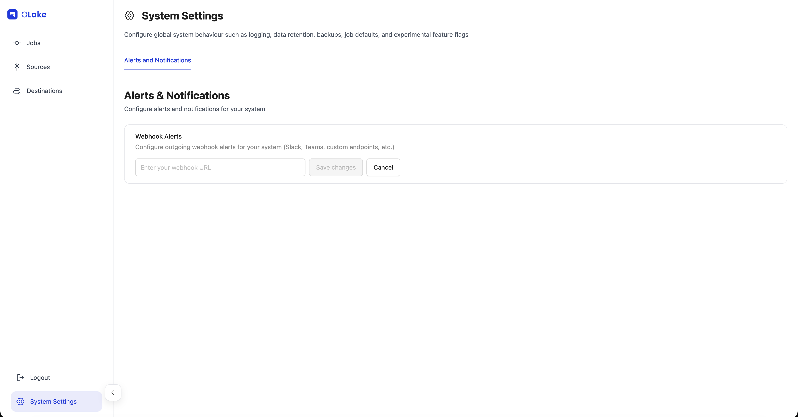

# Alerts and Notifications

OLake provides system-level alerting capabilities that notify you when jobs fail. You can configure webhook alerts to receive notifications in Slack, Microsoft Teams, or any other platform that supports webhooks.

## Configuring Webhook Alerts

### Setting Up Webhook URL

1. Navigate to the **System Settings** page from the left sidebar in OLake UI
2. Click on the **Alerts and Notifications** tab

  

3. In the **Webhook Alerts** section, enter your webhook URL in the input field
4. Click **Save** to enable alerts
5. To update the webhook URL, click **Clear** to remove the existing URL, then enter a new webhook URL and click **Save**

:::info Single Webhook Configuration
Only one webhook URL can be configured per system. You cannot use multiple channels (e.g., both Slack and Teams) simultaneously.
:::

## Alert Message Format

When a job fails, OLake sends a POST request to your webhook URL with a JSON payload containing:

  

### Alert Components

- **Title**: "Sync Failure Detected!" to indicate a job failure
- **Job ID**: Numeric identifier for the failed job
- **Job Name**: The descriptive name you assigned to the job
- **Error Message**: Error log from the failed sync
- **Last Run Time**: The timestamp when the job was executed

:::note System-Level Configuration
Alerts and notifications are configured at the system level, meaning all jobs will send alerts to the same webhook URL. This ensures you receive notifications for all job failures across your OLake instance.
:::

