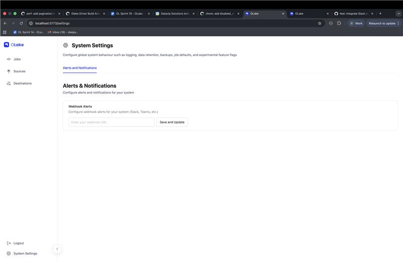
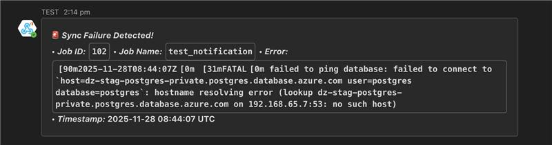

# Alerts and Notifications

OLake provides system-level alerting capabilities that notify you when jobs fail. You can configure webhook alerts to receive notifications in Slack, Microsoft Teams, or any other platform that supports webhooks.

## Overview

When a job fails, OLake automatically sends an alert to your configured webhook endpoint with the following information:

- **Job ID**: The unique identifier of the failed job
- **Job Name**: The name of the job that failed
- **Error Message**: The detailed error message from the failed sync
- **Timestamp**: The time at which the job started 

## Configuring Webhook Alerts

### Setting Up Webhook URL

1. Navigate to the **System Settings** page from the left sidebar in OLake UI
2. Click on the **Alerts and Notifications** tab

  

3. In the **Webhook Alerts** section, enter your webhook URL in the input field
4. Click **Save and Update** to enable alerts

## Alert Message Format

When a job fails, OLake sends a POST request to your webhook URL with a JSON payload containing:

  

### Alert Components

- **Title**: "Sync Failure Detected!" to indicate a job failure
- **Job ID**: Numeric identifier for the failed job
- **Job Name**: The descriptive name you assigned to the job
- **Error Message**: Error log from the failed sync
- **Timestamp**: UTC timestamp when the job started

:::note System-Level Configuration
Alerts and notifications are configured at the system level, meaning all jobs will send alerts to the same webhook URL. This ensures you receive notifications for all job failures across your OLake instance.
:::

