# Create Your First Pipeline

This guide is for end-users who want to replicate data between the various sources and destinations OLake supports. With OLake, you can configure a [source](/docs/connectors/overview), set up a [destination](/docs/writers/overview), and create a job to move data between them either through the **OLake UI** or the **OLake CLI** (command-line).

By the end of this tutorial, you'll have a complete replication workflow running in OLake.

<Tabs queryString="job">

  <TabItem value="olake-ui" label="OLake UI" default>

    ## Prerequisites

    ###  What is a Job?
    A job in OLake is a pipeline that defines how data should be synchronized from a **source** (where your data comes from) to a **destination** (where your data goes). 

    Sources and destinations can be:
    - **New** - configured during job creation.
    - **Existing** - already set up and reused across multiple jobs.

    ### Two ways to create a Job

    #### 1. Job-first workflow (guided setup):
    Start from the **Jobs** page and set up everything in one flow.
    1. Go to **Jobs** in the left menu and click **Create Job**.
    1. Configure the **source**.
    1. Configure the **destination**.
    1. Configure streams, schedule, and save.

    #### 2. Resource-first workflow (prepare resources in advance):
    Set up your source and destination first, then link them in a job.
    1. Create a source from the **Sources** page.
    1. Create a destination from the **Destinations** page.
    1. Go to **Jobs → Create Job**, and select the existing source and destination.
    1. Configure streams, schedule, and save.

    :::tip
    The two methods achieve the same result. Choose **Job-first** if you want a guided setup in one go. 
    Choose **Resource-first** if your source and destination are already configured, or if you prefer to prepare them in advance.
    :::

    <br/>

    ## Tutorial: Creating a Job
    In this guide, we'll use the **Job-first workflow** to set up a job from configuring the source and destination to running it. If you prefer video, check out our [video walkthrough](#create-your-first-job-video-tutorial).

    First things first, every job needs a source and a destination before it can run. 
    For this demonstration, we'll use **Postgres** as the source and **Iceberg with Glue catalog** as the destination. 
    For other supported options, check out [source](/docs/connectors/overview) and [destination](/docs/writers/overview).

    Let's get started!

    ### 1. Create a New Job
    Navigate to **Jobs** section and select **+ Create Job** button in the top right corner. This opens the Job creation wizard, starting with the **source configuration** step.
    <div className="w-full lg:w-[90%] mx-auto">
        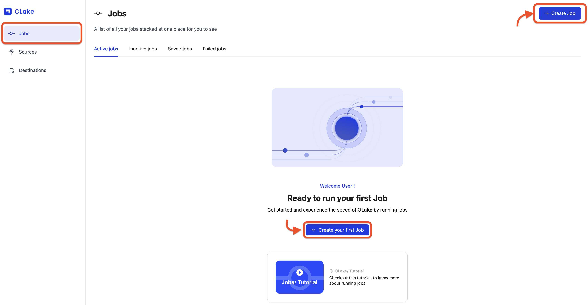
    </div>
    
    ### 2. Configure Source

    Since we're following the **Job-first workflow**, select the **Set up a new source** option.

    For this guide, choose **Postgres** from the connector dropdown, and keep the **OLake version** set to the latest stable version. 

    If you want to use a different source connector, check out the full list of supported sources in the [Sources section](/docs/connectors/overview) of our documentation.

    <div className="w-full lg:w-[90%] mx-auto">
        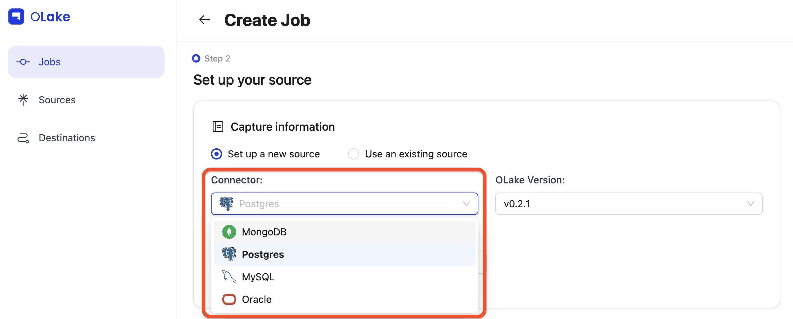
    </div>

    Give your source a descriptive name, then fill in the required Postgres connection details in the Endpoint Config form.
    <div className='w-full lg:w-[90%] mx-auto'>
      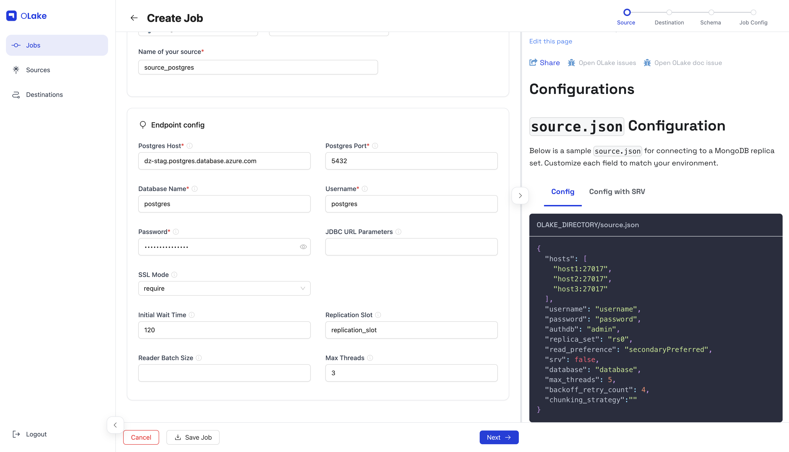
    </div>

    Once the test connection succeeds, OLake shows a success message and takes you to the destination configuration step. 

    :::note
    If you plan to enable CDC (Change Data Capture), make sure a replication slot already exists on your Postgres database. 
    You can learn how to check or create one in our [Replication Slot Guide](/docs/connectors/postgres/setup/generic).
    :::

    ### 3. Configure Destination

    Similarly, here we'll be using **Iceberg** with **AWS Glue Catalog** as the destination.  
    If you want to use a different destination connector, check out the full list of supported destinations in the **Destinations** section of our documentation. 

    For this guide, select **Apache Iceberg** from the connector dropdown, and keep the **OLake version** set to the latest stable version.

    <div className='w-full lg:w-[90%] mx-auto'>
      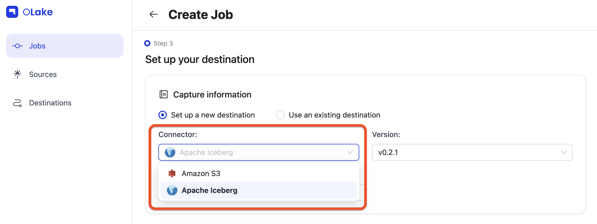
    </div>

    Choose the catalog as **AWS Glue** from the Catalog dropdown.

    <div className='w-full lg:w-[90%] mx-auto'>
      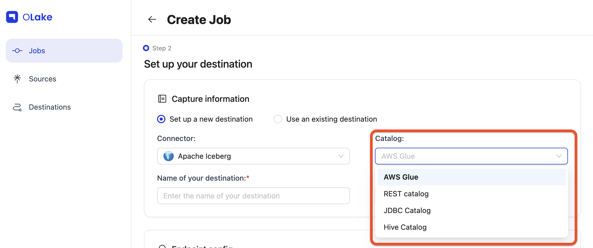
    </div>

    Give your destination a descriptive name, then fill in the required connection details in the Endpoint Config form.

    <div className='w-full lg:w-[90%] mx-auto'>
      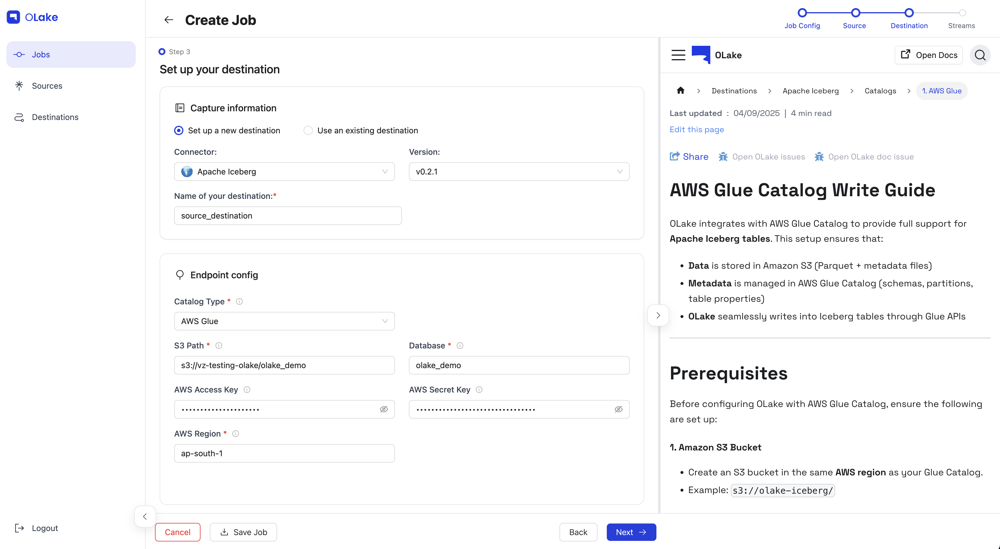
    </div>

    Once the test connection succeeds, OLake shows a success message and takes you to the streams configuration step. 

    ### 4. Configure Streams

    The **Streams** page is where you select which streams to replicate to the destination.
    Here, you can choose your preferred [sync mode](/edit/later/after/new/doc) and configure [partitioning](/docs/writers/parquet/partitioning) as well as other stream-level settings here.

    <div className='w-full lg:w-[90%] mx-auto'>
      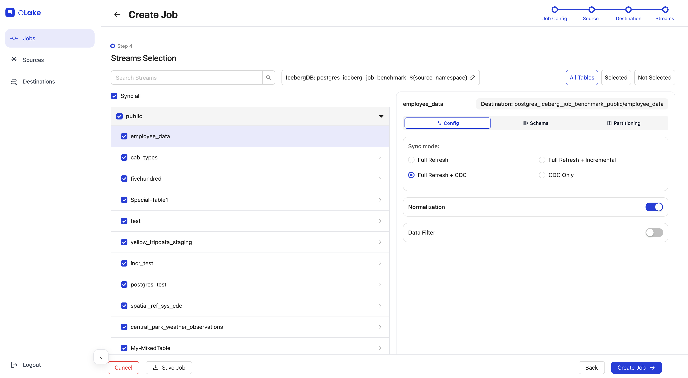
    </div>

    For this guide, we'll configure the following:
    - Replicate the `fivehundred` stream (name of the table).
    - Use **Full Refresh + CDC** as the sync mode.
    - Enable **data Normalization**.
    - Replicate only data where `dropoff_datetime` >= `2010-01-01 00:00:00` (basically data from 2010 onward).
    - Partition the data by the **year** extracted from a timestamp column in the selected stream.
    - Run the sync every day at 12:00 AM.


    Let's start by selecting the `fivehundred` stream (or any stream from your source) by checking its checkbox to include it in the replication.
    Click the stream name to open the stream-level settings panel on the right side.
    In the panel, set the **sync mode** to **Full Refresh + CDC**, and enable **Normalization** by toggling the switch on.

    <div className='w-full lg:w-[90%] mx-auto'>
      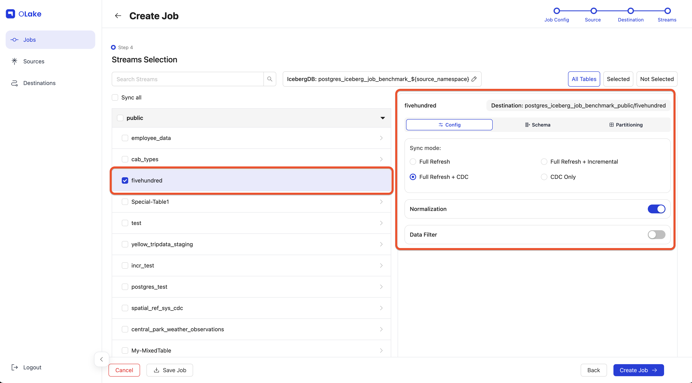
    </div>

    To learn more about sync modes, refer to our [Sync Modes Guide](/edit/later/after/new/doc) in the documentation.

    To partition the data, click the **Partitioning** tab and configure it based on the required details.
    In our case, the `fivehundred` stream has a timestamp column named `dropoff_datetime`, which we will partition by **year**. Learn more about partitioning in the [Partitioning Guide](/docs/writers/parquet/partitioning).

    <div className='w-full lg:w-[90%] mx-auto'>
      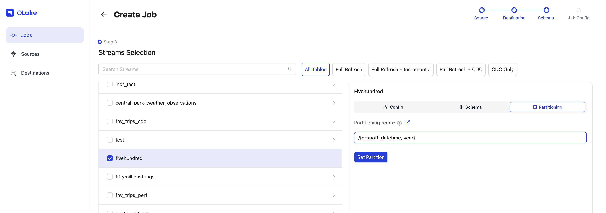
    </div>

    To replicate only data from 2010 onward, we'll use a **Data Filter** to filter the data based on the `dropoff_datetime` column. 
    Make sure the **Value** provided is in the same format as the column schema.

    <div className='w-full lg:w-[90%] mx-auto'>
      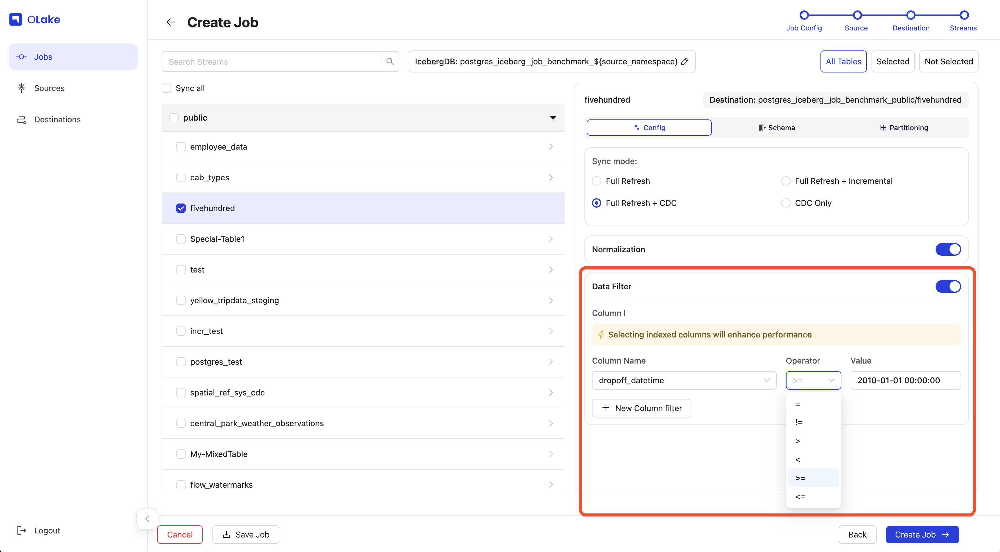
    </div>

     After completing all configurations, click **Next** to proceed to the final step: **Job Config**.

    ### 5. Schedule Job

    Give your job a descriptive name. For this guide, set the **Frequency** dropdown to **Every Day** and choose **12:00 AM** as the **Time**.

    <div className='w-full lg:w-[90%] mx-auto'>
      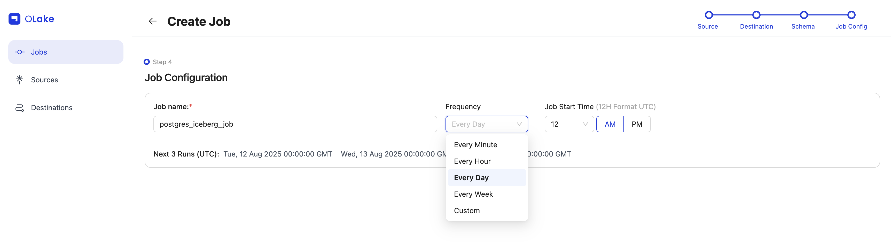
    </div>

    Once configured, click **Create Job** in the bottom-right corner. Tada! you've successfully created your first job!

    <div className='w-full lg:w-[90%] mx-auto'>
      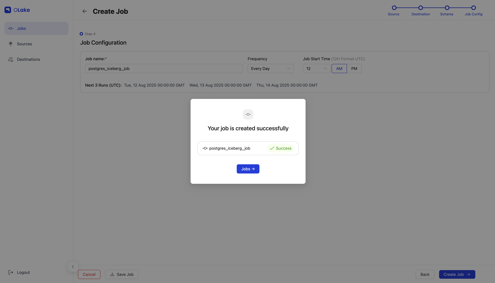
    </div>

    The sync will start at the next scheduled time. You can also start it manually by going to the **Jobs** section, finding your job, clicking the options menu, and selecting **Sync Now**.

    <div className='w-full lg:w-[90%] mx-auto'>
      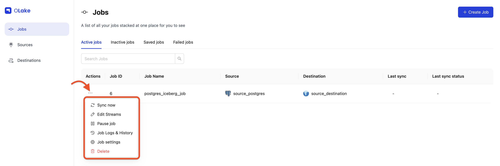
    </div>

    You can verify the sync status by checking the badge at the right end of the job row. Possible statuses include **Running**, **Failed**, and **Completed**. 
    You can also monitor the sync logs by selecting [**Job Logs and History**](/docs/getting-started/create-first-job?job=olake-ui#4-job-logs--history) from the job options menu.

    - Job running:
      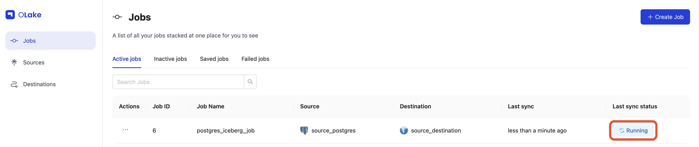

    - Job completed:
      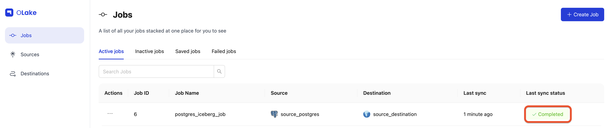

    Yay! The sync is complete, and our data has been replicated to Iceberg exactly as we configured it.

    <div className='w-full lg:w-[90%] mx-auto'>
      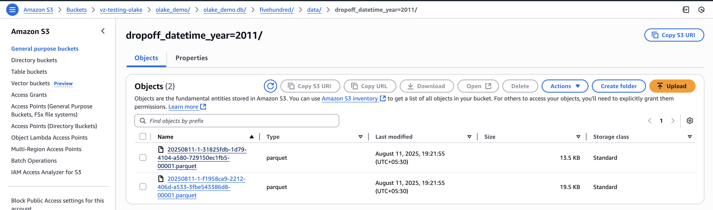
    </div>

    <br/>

    ### 6. Manage Your Job 
    Once your job is created, you can manage it from the **Jobs** page using the **Actions** menu **(⋮)**

    Here's what each option does:

    #### 1. Sync Now
    Run the job immediately without waiting for the next scheduled time.

    #### 2. Edit Streams
    Use this option to modify which streams are included in your job and adjust their replication settings.
    When you click **Edit Streams** you'll be redirected to the **Stream Configuration** page.

    Here you can:

    - **Add new streams** from your source.
    - **Change the sync mode** for selected streams.
    - **Adjust partitioning** or **Normalization** for newly added streams.
    - You can also navigate to **Source** and **Destination** settings using the stepper at the top-right of the page. 

    <div className='w-full lg:w-[90%] mx-auto'>
      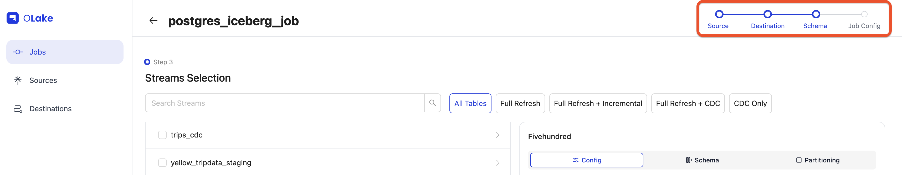
    </div>

    - By default, source and destination editing is locked click **Edit** to unlock them.

    <div className='w-full lg:w-[90%] mx-auto'>
      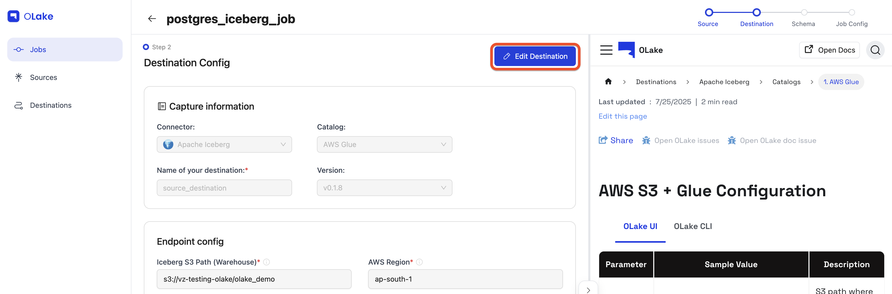
    </div>

    :::note
    You cannot directly change the **Normalization**, **data filter**, or **partition scheme** for existing streams. To update these:
    1. Unselect the stream.
    1. Save the job.
    1. Reopen **Edit Streams** and re-add the stream with the updated settings
    :::

    #### 3. Pause Job
    Stops the job from running until resumed. Paused jobs appear under **Inactive Jobs**. Resume them anytime from the **Inactive Jobs** tab.

    <div className='w-full lg:w-[90%] mx-auto'>
      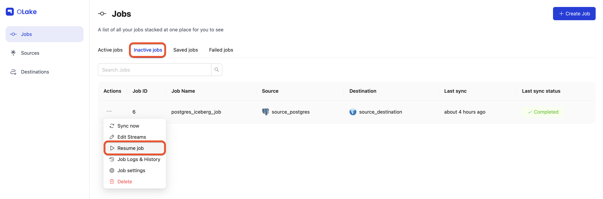
    </div>

    #### 4. Job Logs & History
    This page lets you view and monitor a job's sync history and logs. You'll see a list of all current and past job runs.
    To view logs for a specific run, click **View Logs** in the Actions column.

    <div className='w-full lg:w-[90%] mx-auto'>
      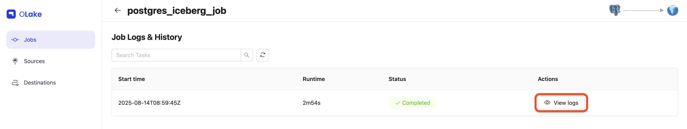
    </div>

    Once you click **View Logs**, you'll see the logs for the selected job run.

    <div className='w-full lg:w-[90%] mx-auto'>
      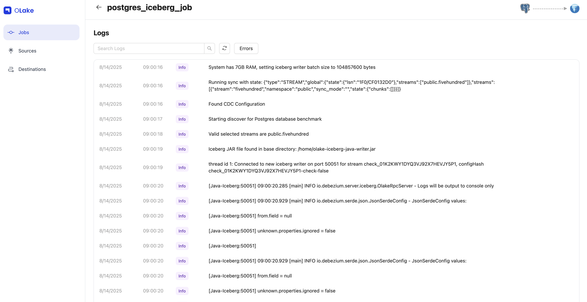
    </div>

    #### 5. Job settings
    Here, you can edit the job's name, frequency, and other configuration settings.
    You can also pause or delete the job.

    When a job is deleted, its associated source and destination are automatically moved to the inactive state, provided they are not being used by any other job.

    <div className='w-full lg:w-[90%] mx-auto'>
      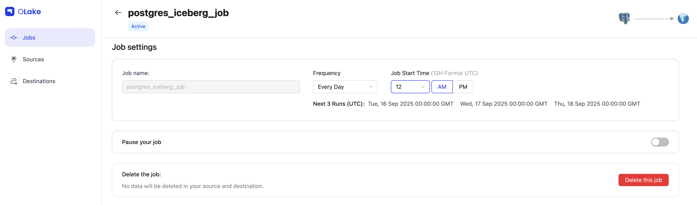
    </div>

    ## Create Your First Job (Video Tutorial)
    {/*  */}

    <div className="w-[100%] my-8">
        <video 
        controls 
        className="max-w-4xl w-full rounded-lg shadow-lg"
        preload="metadata"
        >
            <source src="/img/docs/getting-started/create-your-first-job/create-your-first-job-video.mp4" type="video/mp4" />
            Your browser does not support the video tag.
        </video>
    </div>

  </TabItem>

  <TabItem value="olake-cli" label="OLake CLI">

    ## Prerequisites
    To follow this tutorial, you'll need **Docker** installed and running on your machine. 
    You can find all available OLake Docker images on our [Docker Hub](https://hub.docker.com/u/olakego).

    ### How OLake Replication Works:

    1.  **Configure source and destination** – Define where data is pulled from (source) and where it should land (destination).
    2.  **Discover streams** – Run the `discover` command to generate a `streams.json` file listing all available tables (streams) from your source.
    3.  **Edit stream configuration** – Select the tables you want to replicate, and enable features like normalization, filters, or partitioning.
    4.  **Run the sync** – Execute the `sync` command to replicate data from the source to the destination using your stream settings.
    5.  **Monitor sync status** – Track progress, speed, and metrics in the generated `stats.json` file.

    ## Tutorial: Perform Your First Data Replication

    In this tutorial, you'll run your first end-to-end replication with the **OLake CLI (Docker)**. We'll demonstrate using **Postgres** as the source and **Iceberg (Glue catalog)** as the destination. For other supported connectors, see [Sources](/docs/connectors/overview) and [Destinations](/docs/writers/overview).

    Our example setup will:  
    - Replicate the `fivehundred` table  
    - Use **Full Refresh + CDC** sync mode  
    - Enable **data normalization**  
    - Filter rows where `dropoff_datetime >= "2010-01-01 00:00:00"`  
    - Partition data by **year** from the `dropoff_datetime` column 

    Let's get started!

    <br/>

    ### 1. Setup Source and Destination

    First, create configuration files for your source and destination. We'll keep them under `/path/to/config/` in this example.


    #### Source
    Create `/path/to/config/source.json` and fill in your Postgres connection details:

    ```json title="source.json"
    {
        "host": "dz-stag.postgres.database.azure.com",
      "port": 5432,
      "database": "postgres",
      "username": "postgres",
      "password": "XXX",
      "jdbc_url_params": {},
      "ssl": {
          "mode": "require"
      },
      "update_method": {
          "replication_slot": "replication_slot",
          "intital_wait_time": 120
      },
      "default_mode": "cdc",
      "max_threads": 6
    }
    ```

    See the [Source Guide](/docs/connectors/overview) for details on supported options.

    :::note
        If you plan to enable CDC (Change Data Capture), make sure a replication slot already exists on your Postgres database. 
        You can learn how to check or create one in our [Replication Slot Guide](/docs/connectors/postgres/setup/generic).
    :::

    #### Destination
    Create `/path/to/config/destination.json` with your **Iceberg + Glue** configuration:

    ```json title="destination.json"
    {
      "type": "ICEBERG",
      "writer": {
        "iceberg_s3_path": "s3://vz-testing-olake/olake_cli_demo",
        "aws_region": "XXX",
        "aws_access_key": "XXX",
        "aws_secret_key": "XXX",
        "iceberg_db": "olake_cli_demo",
        "grpc_port": 50051,
        "sink_rpc_server_host": "localhost"
      }
    } 
    ```
    - For more destination types, check the [destination guide](/docs/writers/overview).

    ### 2. Discover Streams
    Next, run the **discover** command to fetch all available tables (streams) from your source. This generates a `streams.json` file in your config directory.


    ```bash
    docker run --pull=always  \
        -v "/path/to/config:/mnt/config" \
        olakego/source-postgres:latest \
        discover \
        --config /mnt/config/source.json
    ```

    You can monitor the discover process by checking the logs in the terminal.

    - Discover start:
    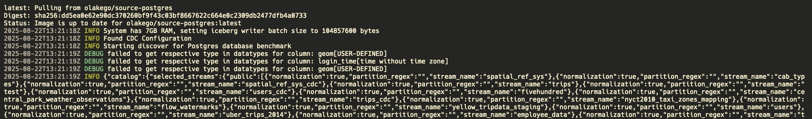     

    - Discover completed: 
    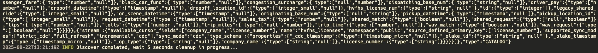       

    :::info
    Logs are also written to a file in the path `/path/to/config/logs/sync_[YYYY-MM-DD]_[HH-MM-SS]/olake.log`
    :::

    After completion, check `streams.json` in `/path/to/config/`. It contains all streams detected from your Postgres database along with their supported sync modes.

    ### 3. Edit Stream Configuration

    Since we have multiple stream level configurations, we'll need to update the `streams.json` file to include the required configurations.
    - **Select streams** – Since we are replicating only the `fivehundred` stream, remove all the other streams from the `"selected_streams"` property. 
    - **Enable normalization** – set `"normalization": true`.  
    - **Filter data** – set `"filter": "dropoff_datetime >= \"2010-01-01 00:00:00\""` to only replicate rows from the year 2010 onward.  
    - **Partition data** – set `"partition_regex": "/{dropoff_datetime, year}"` to partition by year.  
    - **Set sync mode** – under the `fivehundred` stream in `streams`, change `"sync_mode"` to `"cdc"`.

    ```json title="streams.json"
    {
        "selected_streams": {
            "public": [
                {
                    "partition_regex": "/{dropoff_datetime, year}",            
                    "stream_name": "fivehundred",
                    "normalization": true,                                     
                    "filter": "dropoff_datetime >= \"2010-01-01 00:00:00\""    
                }
            ]
        }
    }
    ```

    - To set the sync mode as **Full Refresh + CDC**, navigate to the `fivehundred` stream in the `streams` property and set the `sync_mode` property to `cdc`. You can see the supported sync modes for each stream
    in the `supported_sync_modes` property.  

    To learn more about sync modes, refer to our [Sync Modes Guide](/edit/later/after/new/doc).


    ```json title="streams.json"
    {
      "streams": [
            {
                "stream": {
                    "name": "fivehundred",
                    "namespace": "public",
                    "type_schema": {
                        "properties": {
                            // ...other columns
                            "dropoff_datetime": {
                                "type": [
                                    "timestamp",
                                    "null"
                                ]
                            },
                            // ...other columns
                        }
                    },
                    "supported_sync_modes": [
                        "strict_cdc",
                        "full_refresh",
                        "incremental",
                        "cdc"
                    ],
                    "source_defined_primary_key": [],
                    "available_cursor_fields": [
                        "id",
                        "pickup_datetime",
                        "rate_code_id"
                        // ...other fields
                    ],
                    "sync_mode": "cdc"
                }
            }
        ]
    }
    ```

    ### 4. Run the Sync
    Once the `streams.json` file is ready, we can start the sync process. Run the `sync` command using Docker and mount the config directory. This will begin transferring data from the source (Postgres) to the destination (Iceberg). 

    You can monitor the sync process directly in the terminal logs. At the start, you'll see the job initialization messages, and once completed, you'll see a confirmation that the records were written to the destination.

    - Sync started:
    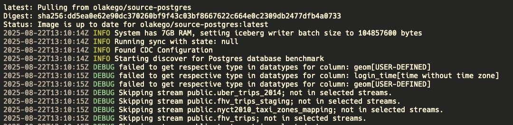

    - Sync completed:
    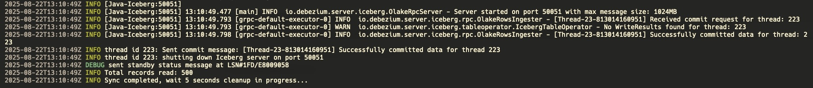

    ### 5. Monitor Sync Status
    The **sync** process will create a `stats.json` file in the same directory as the `streams.json`

    ```json title="stats.json"
    {
        "Estimated Remaining Time": "0.00 s",
        "Memory": "367 mb",
        "Running Threads": 0,
        "Seconds Elapsed": "34.01",
        "Speed": "14.70 rps",
        "Synced Records": 500
    }
    ```

    Tada! you've successfully replicated your data from Postgres to Iceberg using the OLake CLI. You can verify the data replicated to the destination 
    in accordance with the configuration you set in the `streams.json` file.

    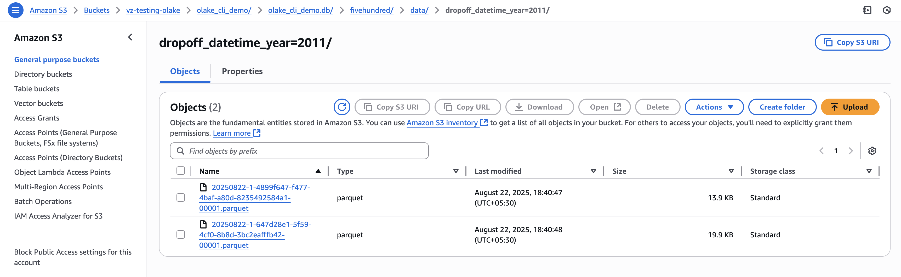

    ### 6. State file
    When a sync starts, OLake creates a `state.json` file in your config directory. This file tracks the progress and current state of the sync.

    The `state.json` file is used for:  
    - **Resuming syncs** – if a sync stops unexpectedly, OLake can restart from the last checkpoint without duplicating or losing data. 
    - **Change Data Capture (CDC)** – after the initial sync, OLake stores the last acknowledged LSN (Log Sequence Number for Postgres) in the state file.  
      On subsequent runs, OLake resumes streaming changes from this LSN to ensure continuous replication.

    To resume a sync or run CDC sync, pass the `state.json` file with the `--state` flag:  

    ```bash
    docker run --pull=always  \
        -v "/path/to/config:/mnt/config" \
        olakego/source-postgres:latest \
        sync \
        --config /mnt/config/streams.json \
        --catalog /mnt/config/catalog.json \
        --destination /mnt/config/destination.json \
        --state /mnt/config/state.json 
    ```

    Learn more about the state file in our [State File Guide](/docs/connectors/postgres/config#statejson-configuration) (Postgres).

  </TabItem>

</Tabs>

## Troubleshooting
Please check our connector specific guide in case you encounter any issues.

**Sources:**    
1. [Postgres](/docs/connectors/postgres/troubleshooting)
2. [MySQL](/docs/connectors/mysql/troubleshooting)
3. [Oracle](/docs/connectors/oracle/troubleshooting)
4. [MongoDB](/docs/connectors/mongodb/troubleshooting)

**Destinations:**   
1. [Iceberg](/docs/writers/iceberg/troubleshooting)
2. Parquet (WIP)