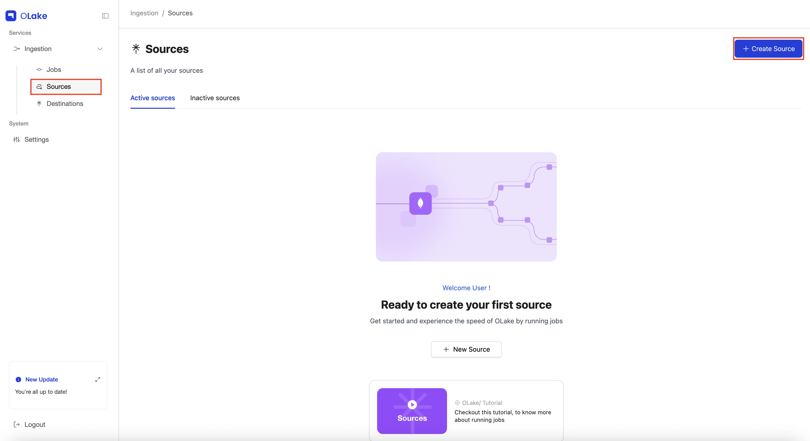
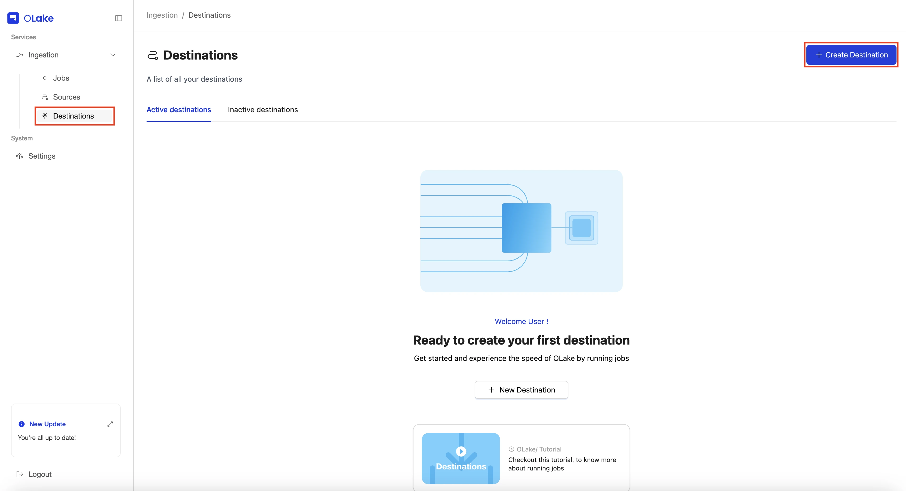
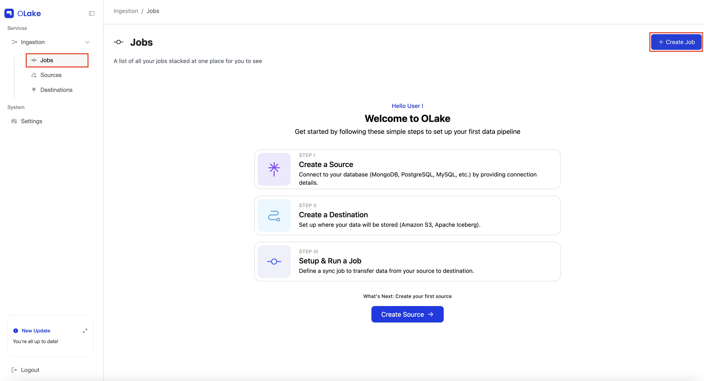
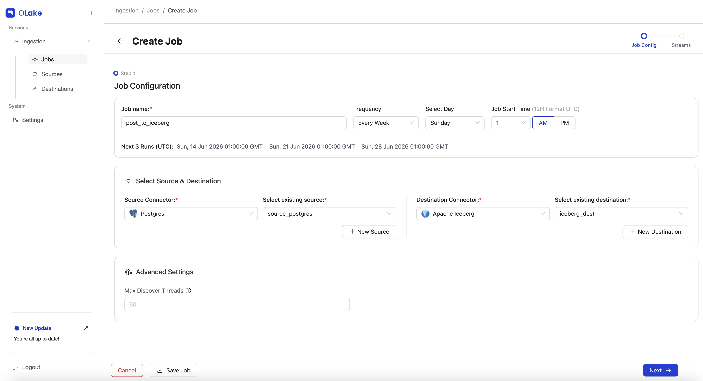
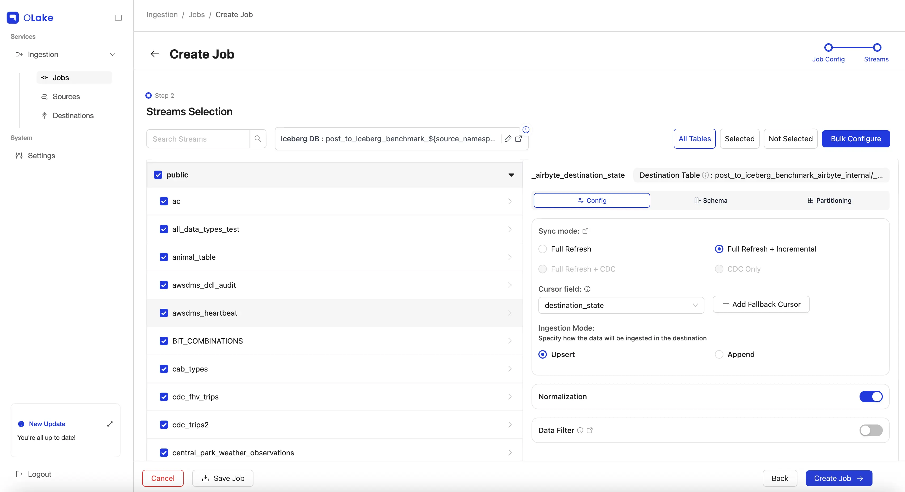
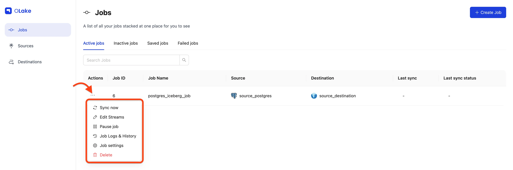
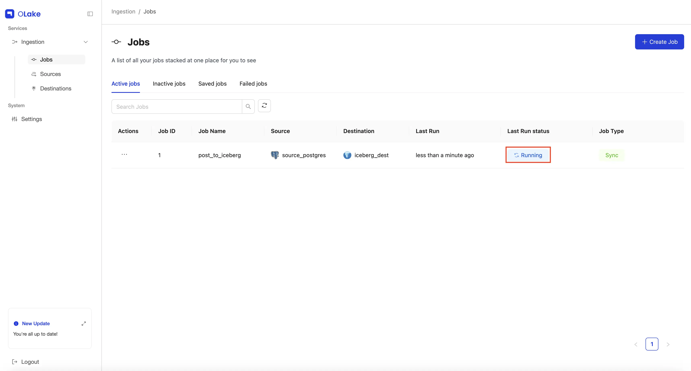
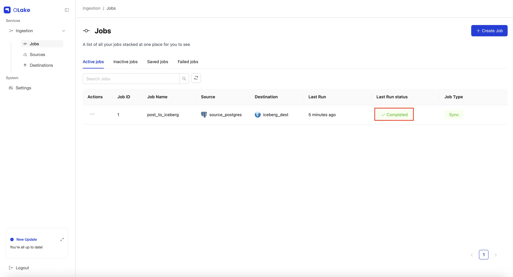
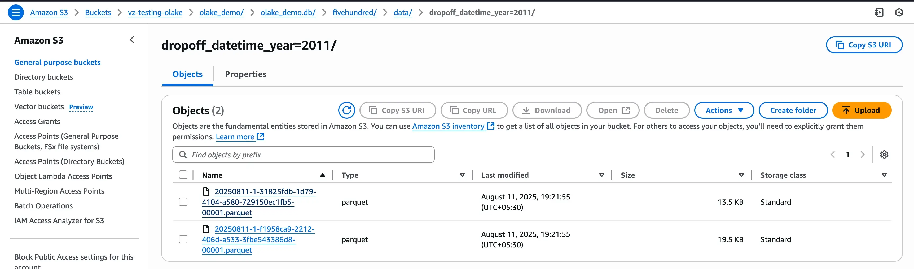

# Get Started With First Job!

This guide is for end-users who want to replicate data between the various sources and destinations that OLake supports. Using the OLake UI, you can configure a **source**, set up a **destination**, and create a **job** to move data between them.

By the end of this tutorial, you’ll have a complete replication workflow running in OLake.

## Prerequisites

Follow the [Quickstart Setup Guide](/docs/getting-started/quickstart) to ensure the [OLake UI](/docs/install/olake-ui/) is running at [localhost:8000](http://localhost:8000)

### What is a Job?

A job in OLake is a pipeline that defines how data should be synchronized from a **source** (where your data comes from) to a **destination** (where your data goes).

Sources and destinations can be:

- **New** - configured during job creation.
- **Existing** - already set up and reused across multiple jobs.

### Two ways to create a Job

#### 1. Job-first workflow:

Start from the **Jobs** page and set up everything in one flow.

1. Go to **Jobs** in the left menu and click **Create Job**.
1. Configure **job name & schedule**
1. If the **source** is already configured select the source connector and existing source. Otherwise, configure a new **source**.
1. If the **destination** is already configured select the destination connector and existing destination. Otherwise, configure a new **destination**.
1. Configure streams and save.

#### 2. Resource-first workflow:

Set up your source and destination first, then link them in a job.

1. Create a source from the **Sources** page.
1. Create a destination from the **Destinations** page.
1. Go to **Jobs → Create Job**, and Configure job name & schedule
1. select the existing source and destination.
1. Configure streams and save.

:::tip
The two methods achieve the same result. Choose **Job-first** if you want a guided setup in one go.
Choose **Resource-first** if your source and destination are already configured, or if you prefer to prepare them in advance.
:::

<br />

## Tutorial: Creating a Job

In this guide, we'll use the **Resource-first workflow** to set up a job from configuring the source and destination to running it. 

First things first, every job needs a source and a destination before it can run.
For this demonstration, we'll use [**Postgres**](/docs/connectors/postgres) as the source and [**Apache Iceberg**](/iceberg/why-iceberg) with [**Glue Catalog**](/docs/writers/iceberg/catalog/glue/) as the destination.

Let's get started!

### 1. Create a New Source

Navigate to **Sources** section and select **+ Create Source** button in the top right corner. 



### 2. Configure Source

For this guide, choose **Postgres** from the connector dropdown, and keep the **OLake version** set to the latest stable version.

<div className='mx-auto w-full lg:w-[80%]'>
  
</div>

Give your source a descriptive name, then fill in the required Postgres connection details in the Endpoint Config form.

<div className='mx-auto w-full lg:w-[80%]'>
  
</div>

Once the test connection succeeds, OLake shows a success message, and by clicking on destinations button it takes you to the destination configuration step.

You can find the configuration and troubleshooting guides for all supported source connectors below.

| Sources  | Config                                            |
| -------- | ------------------------------------------------- |
| MySQL    | [Config](/docs/connectors/mysql#configuration)    |
| Postgres | [Config](/docs/connectors/postgres#configuration) |
| MongoDB  | [Config](/docs/connectors/mongodb#configuration)  |
| Oracle   | [Config](/docs/connectors/oracle#configuration)   |
| MSSQL    | [Config](/docs/connectors/mssql#configuration)    |
| Kafka    | [Config](/docs/connectors/kafka#configuration)    |
| DB2 LUW  | [Config](/docs/connectors/db2#configuration)    |
| S3       | [Config](/docs/connectors/s3#configuration)    |

:::note
If you plan to enable CDC (Change Data Capture), make sure a replication slot already exists on your Postgres database.
You can learn how to check or create one in our [Replication Slot Guide](/docs/connectors/postgres/setup/generic).
:::

### 3. Create a New Destination

Navigate to **Destination** section and select **+ Create Destination** button in the top right corner. 



### 4. Configure Destination

Similarly, here we'll be using **Iceberg** with **AWS Glue Catalog** as the destination.

For this guide, select **Apache Iceberg** from the connector dropdown, and keep the **OLake version** set to the latest stable version.

<div>
  
</div>

Choose the catalog as **AWS Glue** from the Catalog Type dropdown.

<div className='mx-auto w-full lg:w-[80%]'>
  
</div>

Give your destination a descriptive name, then fill in the required connection details in the Endpoint Config form.

<div className='mx-auto w-full lg:w-[80%]'>
  
</div>

Once the test connection succeeds, OLake shows a success message and by clicking on create job button it takes you to the job configuration step. 

You can find the configuration and troubleshooting guides for all supported destination connectors below.

- **Parquet S3**
  | Destinations | Config |
  |------------------|----------------------------------------------------------------------|
  | Parquet | [Config](/docs/writers/parquet/config) |

- **Iceberg**
  | Catalogs | Config |
  |------------------|-------------------------------------------------------------------------------------|
  | AWS Glue Catalog | [Config](/docs/writers/iceberg/catalog/glue#configuration) |
  | Hive Catalog | [Config](/docs/writers/iceberg/catalog/hive#configuration) |  
  | JDBC Catalog | [Config](/docs/writers/iceberg/catalog/jdbc#configuration) |
  | REST Catalog | [Config](/docs/writers/iceberg/catalog/rest?rest-catalog=generic#configuration) |
  | Nessie Catalog | [Config](/docs/writers/iceberg/catalog/rest?rest-catalog=nessie#configuration) |
  | LakeKeeper | [Config](/docs/writers/iceberg/catalog/rest?rest-catalog=lakekeeper#configuration) |
  | S3 Tables | [Config](/docs/writers/iceberg/catalog/rest?rest-catalog=s3-tables#configuration) |
  | Polaris | [Config](/docs/writers/iceberg/catalog/rest?rest-catalog=polaris#configuration) |
  | Unity | [Config](/docs/writers/iceberg/catalog/rest?rest-catalog=unity#configuration) |

### 5. Create a New Job

Navigate to **Jobs** section and select **+ Create Job** button in the top right corner. 



### 6. Configure Job 

Give your job a descriptive name. For this guide, set the **Frequency** dropdown to **Every Minute**.

Next we have to select the source and destination that we created in the previous steps. First we need to select the **source connector** from the dropdown and then select the **source**. Similarly for the destination we have to select the **destination connector** from the dropdown and then select the **destination**.

Once you have selected the source and destination, click on the **Next** button to continue. At this stage, the system validates both configurations. You can proceed to the Streams section only after both validations succeed and a success status is displayed.



### 7. Configure Streams

The **Streams** page is where you select which streams to replicate to the destination and configure stream-level properties for each selected stream. For more details, please check the [Stream Properties](/docs/understanding/terminologies/olake/#streams-properties).
Here, you can choose your preferred [sync mode](/docs/understanding/terminologies/olake#2-sync-modes) and configure [partitioning](/docs/writers/parquet/partitioning) and [Destination Database](/docs/understanding/terminologies/olake#7-tablecolumn-normalization--destination-database-creation) as well as other stream-level settings here.

<div className='mx-auto w-full lg:w-[80%]'>
  
</div>

For this guide, we'll configure the following:

- Replicate the `fivehundred` stream (name of the table).
- Use [**Full Refresh + CDC**](/docs/features/#2-sync-modes-supported) as the sync mode.
- Enable **data Normalization**.
- Modify Destination Database name (if required).
- Replicate only data where `dropoff_datetime` >= `2010-01-01 00:00:00` (basically data from 2010 onward).
- Partition the data by the **year** extracted from a timestamp column in the selected stream.
- Run the sync every day at 12:00 AM.

Let's start by selecting the `fivehundred` stream (or any stream from your source) by checking its checkbox to include it in the replication.
Click the stream name to open the stream-level settings panel on the right side.
In the panel, set the **sync mode** to [**Full Refresh + CDC**](/docs/features/#2-sync-modes-supported), and enable **Normalization** by toggling the switch on.

<div className='mx-auto w-full lg:w-[80%]'>
  
</div>

To learn more about sync modes, refer to our [Sync Modes Guide](/docs/understanding/terminologies/olake#2-sync-modes) in the documentation.

To partition the data, click the **Partitioning** tab and configure it based on the required details.
In our case, the `fivehundred` stream has a timestamp column named `dropoff_datetime`, which we will partition by **year**. Learn more about partitioning in the [Partitioning Guide](/docs/writers/parquet/partitioning).

<div className='mx-auto w-full lg:w-[80%]'>
  
</div>

To replicate only data from 2010 onward, we'll use a **Data Filter** to filter the data based on the `dropoff_datetime` column.
Make sure the **Value** provided is in the same format as the column schema.

<div className='mx-auto w-full lg:w-[80%]'>
  
</div>

:::note Only for CLI
Introduced support for filtering columns with special characters in CLI. Column names with underscores work normally without any escape sequence. For column names with other special characters, use the following format:
```
filter = "\"id-with#special!char\" = 1"
```
:::

To edit the **Destination Database** name, select the edit icon beside the [Destination Database](/docs/understanding/terminologies/olake#7-tablecolumn-normalization--destination-database-creation) (Iceberg DB or S3 Folder) and make the changes.

<div className='mx-auto w-full lg:w-[80%]'>
  
</div>

Once configured, click **Create Job** in the bottom-right corner. Tada! you've successfully created your first job!

<div className='mx-auto w-full lg:w-[80%]'>
  
</div>

The sync will start at the next scheduled time. You can also start it manually by going to the **Jobs** section, finding your job, clicking the options menu, and selecting **Sync Now**.

<div className='mx-auto w-full lg:w-[80%]'>
  
</div>

You can verify the sync status by checking the badge at the right end of the job row. Possible statuses include **Running**, **Failed**, and **Completed**.
You can also monitor the sync logs by selecting [**Job Logs and History**](/docs/getting-started/creating-first-pipeline#5-job-logs--history) from the job options menu.

- Job running:
  

- Job completed:
  

Yay! The sync is complete, and our data has been replicated to Iceberg exactly as we configured it.

<div className='mx-auto w-full lg:w-[80%]'>
  
</div>

<br />

### 8. Manage Your Job

Once your job is created, you can manage it from the **Jobs** page using the **Actions** menu **(⋮)**

To know more about job level features, refer to the [Job Level Features](/docs/getting-started/job-level-properties) guide.

