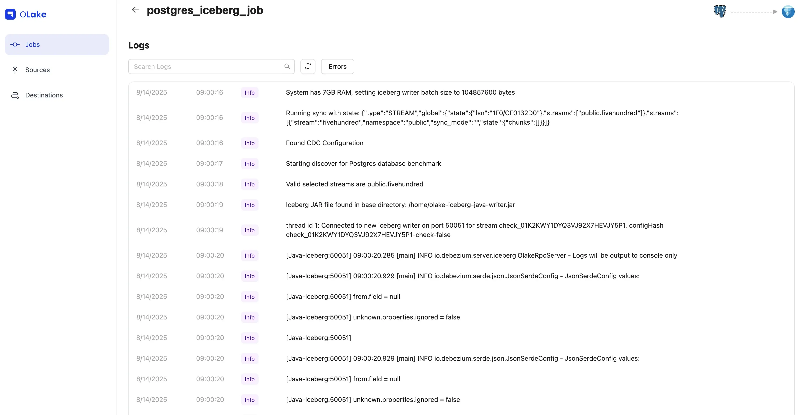

# Job Level Features

Once your job is created in OLake, you can manage and control it using various job-level features available through the **Actions** menu **(⋮)** on the Jobs page. These features allow you to trigger immediate syncs, modify stream configurations, pause or cancel running jobs, reset destination data, monitor sync history, and adjust job settings. This guide covers all the job-level operations you can perform to manage your data pipelines effectively.

### 1. Sync Now

Run the job immediately without waiting for the next scheduled time.

### 2. Edit Streams

Use this option to modify which streams are included in your job and adjust their replication settings.
When you click **Edit Streams** you'll be redirected to the **Stream Configuration** page.

Here you can:

- **Add new streams** from your source.
- **Change the sync mode** for selected streams.
- **Adjust partitioning** or **Normalization** for newly added streams.
- You can also navigate to **Source** and **Destination** settings using the stepper at the top-right of the page.

  

- By default, source and destination editing is locked click **Edit** to unlock them.

  

:::note
You cannot directly change the **Normalization**, **data filter**, or **partition scheme** for existing streams. To update these:

1. Unselect the stream.
1. Save the job.
1. Reopen **Edit Streams** and re-add the stream with the updated settings
   :::

### 3. Pause Job

Stops the job from running until resumed. Paused jobs appear under **Inactive Jobs**. Resume them anytime from the **Inactive Jobs** tab.

  

### 4. Cancel Job

Stops a currently running sync safely. Available only while a sync is in "Running" status.

#### What the Cancel Button Does:
- When the cancel button is clicked, it sends a cancellation signal to the running sync
- The sync stops gracefully at a safe checkpoint (no partial/corrupted data)
- Performs cleanup (closes connections, releases resources)
- Marks the sync run as "Canceled"
- Saves progress only if the **sync mode generates a state file**

:::tip Important to Know!
Cancellation takes up to 1 minute to complete. If the sync finishes before cancellation completes, the status will show "Completed" instead of "Canceled" - whichever happens first determines the final status.
:::

#### What Happens to Your Data?
#### i. Data already synced before cancellation:

  ✅ Stays in the destination 
  ✅ Not rolled back or deleted 
  ✅ Remains in a consistent state (no partial records) 

#### ii. Data being processed during cancellation:

- The system completes the current batch/record being processed
- Stops before starting new work
- Prevents incomplete writes

Whether your sync resumes from where it stopped depends on if it generates a state file:
| Sync Mode | State File? | What Happens on Restart? |
|-----------|-------------|--------------------------|
| Full Refresh | ❌ No | Reloads entire dataset each time as it does not track position because no state file is generated. |
| Full Refresh + CDC | ✅ Yes | Generates a state file for both Full Refresh and CDC syncs. Hence, resumes from the last saved state. |
| Full Refresh + Incremental | ✅ Yes | Generates a state file for both Full Refresh and Incremental syncs. Hence, resumes from the last saved state. |
| Strict CDC | ✅ Yes | Generates a state file whenever the CDC syncs runs. Hence, resumes from the last saved state. |

After cancellation completes, you can start the job again with **Sync Now** or wait for the next scheduled run. The next run resumes from the last saved state if a state file exists, or starts fresh if not.

### 5. Clear Destination

This feature enables users to erase the selected streams from a specific job or sync from the destination. It removes all data that was synced for that particular job, making it ideal when stream-level settings (such as normalization, partitioning, or filters) are misconfigured. Users can clear the destination, reconfigure their job settings, and initiate a fresh sync to rebuild a clean, correct snapshot without manual file or table deletion.

It can be considered a reset mechanism for a job’s destination outputs.

:::info Available from v0.3.0
The Clear Destination feature is stable and available from OLake version **v0.3.0** onwards.
:::

:::::caution This action is destructive
Clear Destination deletes already‑synced data for the job's enabled streams at the destination. It cannot be canceled once it starts.
:::::

To trigger Clear Destination, navigate to the **Job Settings** page and click the **Clear Destination** button. This action can be initiated from the Actions menu **(⋮)** next to your job.

  

:::note Active Jobs Only
Clear Destination is only available for active jobs. Inactive or paused jobs cannot trigger Clear Destination until they are resumed.
:::

#### How it works in OLake

- Job‑level behavior: Clear Destination affects only the specific job it is triggered for. Multiple jobs can run Clear Destination simultaneously
- Stream‑aware: Only the job's enabled streams are cleared other streams remain unaffected
- Exclusive while running: Job Settings or Edit Streams cannot be modified until the clear destination process completes
- Not cancellable: Once started, it will run until completion and cannot be stalled mid way
- Scheduling: The sync schedule will be paused and resumed after the clear destination process completes; other jobs will run as scheduled normally
- Running job protection: If a sync is running, cancellation of that particular job is required before starting a clear destination 

:::tip Best Practice for Kafka
When using Clear Destination with Kafka source, the behavior depends on whether a consumer group ID is provided:

**Scenario 1: Consumer Group ID is blank (OLake-managed)**

- After Clear Destination is executed, when you sync again, the entire data will be backfilled. A full refresh will take place and all data will be captured from the beginning.

**Scenario 2: Consumer Group ID is provided by the user**

- After Clear Destination, if you use the same consumer group ID as before, the entire backfill will not work which can lead to loss of data because Kafka tracks the consumer group's offset position.
- **Important**: If you perform Clear Destination and want the entire data to be read again, you must provide a new, unique consumer group ID by modifiying the source configuration or create a new job with a new consumer group ID.

:::

#### Scenarios to Trigger Clear Destination

#### 1) Click Clear Destination in Job Settings
- What happens: Selecting Clear Destination opens a confirmation modal. After confirmation, the Clear Destination job starts and the UI redirects to Job Logs & History to monitor progress. If a sync with respect to that job is currently running, it must be canceled first.
- Example: Job "daily_orders" has enabled streams `orders` and `customers`. Clear Destination is initiated → both streams are cleared at the destination. The next run (scheduled or Sync Now) rebuilds both streams using the latest configuration.

#### 2) Stream-level property changes in previously syncing streams
When stream settings that have already synced are changed, OLake clears only the affected streams so they can be rebuilt consistently. If a job is running, OLake auto‑cancels the current run after confirmation and starts Clear Destination for those streams.

- Normalization changes
  - Example: Normalization is enabled so destination naming changes from raw to standardized table/column names. OLake clears the affected stream(s); the next run writes with normalized names.

- Filter changes
  - Example: A filter for the last 12 months (`order_date >= 2024-01-01`) is added. OLake clears that stream; the next run writes only filtered rows.

- Sync Mode changes
  - Example: A stream is switched from Incremental to Full Refresh. OLake clears that stream so the next run writes a complete snapshot that matches the new mode.

- Primary Cursor value changes
  - Example: The cursor is changed from `updated_at` to `id`. OLake drops the existing table and creates a new one as per new cursor.

- Fallback Cursor Modification
  - Adding, removing, or changing a Fallback Cursor value will lead to dropping of the existing table and creation of a new one, as OLake tracks both primary and fallback cursors.

- Partition changes
  - Example: Partitioning is changed from day to month to reduce file counts, or an existing partition is deleted. OLake clears the stream; the next run writes new partitions based on the updated configuration.

- Destination DB name change
  - Example: The destination DB is renamed from `sales_raw` to `sales_curated`. In this case, all the selected streams are dropped from the old destination database, and subsequent syncs write to the new database.

- Append/Upsert mode change
  - Example: The mode is switched from append to upsert to deduplicate by a primary key. OLake clears the stream; the next run reconstructs with upsert semantics.

- Enabling New Streams or Re-enabling Disabled Streams
  - Enabling new streams: When new streams are enabled and added to a job, OLake triggers Clear Destination for those new streams, but since there is no data in the destination yet, no data is deleted.
  - Re-enabling disabled streams: If a stream is disabled and then re-enabled, OLake clears those streams from the destination and rebuilds them, as the source data state may have changed during the disabled period. If the re-enabled streams also have modified properties (such as normalization, partitioning, or filters), they are rebuilt with the updated configuration.

Result: Only the modified streams are dropped and rebuilt at the next run; other enabled streams are unaffected.

:::::tip Full Refresh vs Clear Destination
- Full Refresh streams are dropped and rebuilt on every sync by design. 
- Clear Destination is a one‑time reset that can be triggered (for all enabled streams from Job Settings, or only affected streams when editing). Both can co‑exist in the same job.
:::::

What happens next:
- OLake drops the affected streams from the destination so they can be rebuilt by the next run
- If the job is running, OLake auto‑cancels the current run after confirmation and initiates Clear Destination for the affected streams
- If the job is idle, the clear is queued; once it completes, the next run (scheduled or “Sync Now”) rebuilds with the new settings

#### What appears in the UI

- Job Settings page: A Clear Destination button opens a confirmation modal. If a run is active, cancellation is required before proceeding
- Edit Streams: Changing any previously syncing stream prompts a confirmation; if a run is active, OLake auto‑cancels it after confirmation and begins the clear for the affected streams
- Job Logs & History: A `Job Type` column indicates whether a run is a **Sync** or **Clear Destination** so progress and outcomes can be followed. This information is also visible on the Jobs home page to provide users with at-a-glance visibility of the job type.

#### Step‑by‑step Workflow 

1. Clear Destination is triggered.
2. OLake checks if the job is currently running. If running, cancellation of the job is required first.
3. OLake deletes destination data for the job’s enabled streams (or only affected streams).
4. Clear completes → The job becomes editable again; the next run rebuilds the destination with the corrected settings.

### 6. Job Logs & History

This page lets you view and monitor a job's sync history and logs. You'll see a list of all current and past job runs.
To view logs for a specific run, click **View Logs** in the Actions column.

  

Once you click **View Logs**, you'll see the logs for the selected job run.

  

### 7. Job settings

Here, you can edit the frequency, and other configuration settings.
You can also pause or delete the job.

When a job is deleted, its associated source and destination are automatically moved to the inactive state, provided they are not being used by any other job.

  

### Video Tutorial

  

    <iframe
      width='100%'
      height='400'
      src='https://www.youtube.com/embed/W1mWz2Sp2VQ'
      title='OLake - Creating Your First Pipeline'
      frameBorder='0'
      allow='accelerometer; autoplay; clipboard-write; encrypted-media; gyroscope; picture-in-picture; web-share'
      allowFullScreen
      className='w-full rounded-lg'
    />
  

